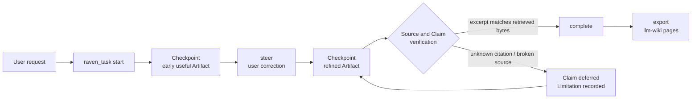

# dsh-raven-research

English | [中文](README.zh.md)

[](https://github.com/wxxb789/dsh-raven-research/actions/workflows/ci.yml)
[](https://github.com/topics/dsh-plugin)
[](https://github.com/deepseek-ai/deepseek-harness)
[](https://www.typescriptlang.org/)
[](https://nodejs.org/)
[](LICENSE)
[](https://github.com/wxxb789/dsh-raven-research/stargazers)

**Raven turns a [DeepSeek Harness](https://github.com/deepseek-ai/deepseek-harness) session into one progressive,
source-grounded Task for deep research, general writing, academic writing, and learning — with early useful
checkpoints, mid-run steering, and citations verified against the bytes actually retrieved.**

It is a host-only native [Cordis](https://github.com/cordiverse/cordis) plugin: no second agent runtime, no model
host, no vector store, no database. The Harness agent keeps researching and writing with its normal tools, while
Raven maintains the continuing Task identity, the visible intermediate artifacts, user steering, source/claim
traceability, and the final completion checks.

> **Status:** v1, developer preview. Pinned and tested against DeepSeek Harness `0.1.0-rc.7`, which is itself an RC
> and changes fast. Raven does not claim compatibility with untested Harness versions.

- [Why Raven](#why-raven)
- [Features](#features)
- [How it works](#how-it-works)
- [Quick start](#quick-start)
- [Configuration](#configuration)
- [Prompts that trigger a Raven Task](#prompts-that-trigger-a-raven-task)
- [Keeping work after the session: llm-wiki export](#keeping-work-after-the-session-llm-wiki-export)
- [Compatibility](#compatibility)
- [Architecture](#architecture)
- [Development](#development)
- [FAQ](#faq)
- [v1 limits](#v1-limits)

## Why Raven

A substantial research or writing request usually disappears into a long batch pipeline: you wait, you get one wall
of text, and the citations are whatever the model remembered. Raven changes the shape of that work.

| Plain long-running agent run | With Raven |
| --- | --- |
| Silence until a final dump | An early useful outline, draft, or findings set as a **Checkpoint**, then incremental refinement of the same Artifact |
| A correction restarts the work | A correction becomes a **Steering Revision** on the same Task; prior evidence and Checkpoints survive |
| Citations are remembered strings | Citations resolve to **inspected Sources**; excerpts are matched against retrieved bodies |
| Three reprints of one wire story read as three confirmations | Claims sharing a declared `sourceFamily` are marked as **not independent corroboration** |
| One dead link fails the whole run | Failed dependencies **defer only the affected Claims**; independently verified work still completes honestly |
| State dies with the tool call | The Task book is **rebuilt from the session log** and survives stop/resume |

Normal `discover → read → analyze → draft → verify → refine` movement stays autonomous. Raven asks only when an
unresolved choice changes the public outcome, evidence floor, audience, deliverable, significant cost, or an
external/destructive/sensitive side effect.

## Features

- **Progressive delivery.** A Checkpoint is useful on its own and is published while the Task is still running, so
  you can redirect the work before the expensive part.
- **Steering instead of restarts.** `steer` applies a user correction to the live Task and preserves prior evidence.
- **Citations checked against retrieved bytes.** Artifacts cite stable Source IDs with `[@source-id]`. Raven matches
  bounded excerpts against retrieved bodies, renders recorded URLs mechanically, and rejects unknown citations,
  unregistered URLs, cross-host redirects, and broken or mismatched Sources. A mismatch reports the nearest
  retrieved passage so the anchor can be repaired instead of retried blindly.
- **Independence-aware Claim trace.** Every Completion appends a trace mapping material Claim IDs and text to Source
  IDs, marking Claims whose Sources share one `sourceFamily` so reprints of a single originating record cannot read
  as several confirmations.
- **Honest partial results.** Withdrawn Claims force the asserting prose to be edited in the same Checkpoint; a
  dropped citation may not leave a bare assertion standing. Unverifiable evidence refuses publication rather than
  silently downgrading to "unchecked".
- **Session-durable Task book.** Direct tool calls carry the Task record as `tool/result.meta`; calls made inside a
  Code Mode `run_code` program get no result card, so Raven publishes the same record as a
  `dsh-raven-research/task-state` session event. Either path restores the book on resume.
- **Failure-path recovery context.** A failed call reaches the model with a `<raven_task_recovery>` note attached
  through the tool-owned content finalizer — the one hook that still runs for invalid arguments and cancellations.
- **First-class settings namespace.** Registering the plugin exposes `raven-research` to every configuration surface
  a Harness deployment composes; there is nothing to add to the Harness itself.
- **Durable export.** `export` emits a valid [llm-wiki](docs/adr/0002-llm-wiki-repo-format.md) repository — artifact
  page, immutable `raw/` source pages with verification receipts, and an appendable `log.md` — that the agent writes
  with ordinary file tools. Raven never touches the filesystem itself.

## How it works



The `raven_task` tool is model-facing. Its `start`, `checkpoint`, `steer`, `complete`, `status`, `stop`, `resume`,
and `export` actions are internal lifecycle operations on one user Task — not workflows a user has to manage.

## Quick start

Raven is not on npm yet. Build and pack it from a checkout:

```bash
git clone https://github.com/wxxb789/dsh-raven-research.git
cd dsh-raven-research
pnpm install --frozen-lockfile
pnpm build
pnpm pack
```

Install the resulting tarball into the DeepSeek Harness deployment's Node resolution graph with pnpm. Once the
package is published, the equivalent dependency is `dsh-raven-research@0.1.0`.

Then create or copy a **user-authored** agent preset and append the row from
[`examples/agent-row.cordis.yml`](./examples/agent-row.cordis.yml):

```yaml
- id: raven-research
  name: dsh-raven-research
```

Do not edit a shipped Harness preset. Raven publishes no process service, so this row needs no isolate realm. It
consumes the preset's scoped `tools` and `systemPrompt` registries and obtains `web` dynamically when source
reopening is available.

Raven takes two peer dependencies, both supplied by the Harness deployment: `@deepseek-ai/dsh-settings` and
`@deepseek-ai/schemastery`.

## Configuration

Raven owns the `raven-research` settings namespace. Registering it is what exposes it: a Harness that composes a
settings provider serves the namespace to every configuration surface.

| Field | Default | Effect |
| --- | --- | --- |
| `sourceVerification` | `remote` | `structural-only` withholds every remote check. No Source can then be confirmed, so a Checkpoint that records Sources is refused with the policy named. Set it only where the network is genuinely out of reach. |
| `sourceCheckTimeoutMs` | `0` | Deadline for one remote Source check, in milliseconds. `0` means no deadline. An exceeded deadline reports that one Source as unverifiable instead of holding the Checkpoint open. |

No setting can lower a Task's evidence floor. Withholding checks makes evidence unverifiable, which refuses
publication; it never turns unchecked Sources into confirmed ones.

The composition entry in `cordis.yml` is the `base` layer. A value stored in the user's `settings.yaml` overrides it
and takes effect on the next Source check, with no restart; if the settings service goes away, the composition entry
becomes authoritative again.

A browser card for this namespace is deferred: the client module system requires a `dsh.client` bundle in the
loader's lazy-CJS factory format, and the preset that emits it is not published outside the Harness repository.

## Prompts that trigger a Raven Task

There is no launch phrase and no separate Raven UI — users talk to the Harness agent normally.

```text
Research the strongest primary-source evidence for and against this policy. Show me
an early findings outline, keep working, and refine it into a decision memo.
```

```text
Turn these notes into an 800-word essay for engineering managers. Draft early so I
can redirect the emphasis.
```

```text
Develop a literature-review section from these papers. Preserve disagreement and do
not invent references.
```

```text
Teach me closures with one mental model, two worked examples, and a self-check.
```

## Keeping work after the session: llm-wiki export

After Completion, `action=export` returns page bytes for an [llm-wiki](docs/adr/0002-llm-wiki-repo-format.md)
repository: an artifact page under `wiki/queries`, one immutable `wiki/raw` page per Source carrying the verified
excerpt and its verification receipt (`capture: excerpt-only`), and one appendable `wiki/log.md` entry. Pass
`init=true` to also seed `SCHEMA.md`, `index.md`, and `log.md` for a repository with no wiki yet. The result is a
valid llm-wiki readable by Obsidian and that skill's own tooling. Write the returned bytes exactly — each raw-page
digest covers its own body, so editing after export invalidates it.

## Compatibility

Raven v1 is pinned and tested against:

- DeepSeek Harness `0.1.0-rc.7`;
- Harness checkout commit `99f6f02fecdb7dff40c3fbc9470f5907c29f74ca`;
- Node.js `^22.19.0 || >=24.0.0`; and
- pnpm `11.21.0`.

## Architecture

Raven ships as one dependency-light ESM package with:

- one Cordis plugin;
- one `raven_task` model tool;
- one compact system-prompt section;
- a pure TypeScript Task engine;
- compact same-session replay through official `tool/result.meta`; and
- one internal `SourceVerifier` seam with Harness-web and deterministic test adapters.

It deliberately excludes a GUI, model host, vector store, custom scheduler, general agent framework, and
Raven-owned database. Long-running goals, subagents, workflows, files, and persistence remain Harness
responsibilities.

Design evidence and decisions:

- [`docs/design/architecture.md`](./docs/design/architecture.md)
- [`docs/adr/0001-one-task-one-tool.md`](./docs/adr/0001-one-task-one-tool.md)
- [`docs/adr/0002-llm-wiki-repo-format.md`](./docs/adr/0002-llm-wiki-repo-format.md)
- [`docs/acceptance.md`](./docs/acceptance.md)
- [`docs/reverse-engineering/assessment.md`](./docs/reverse-engineering/assessment.md)
- [`docs/reverse-engineering/hermes-research-skills.md`](./docs/reverse-engineering/hermes-research-skills.md)
- [`docs/reverse-engineering/hermes-r-round-references.md`](./docs/reverse-engineering/hermes-r-round-references.md)
- [`docs/reverse-engineering/hermes-nana-wiki.md`](./docs/reverse-engineering/hermes-nana-wiki.md)
- [`CONTEXT.md`](./CONTEXT.md)

## Development

```bash
pnpm install --frozen-lockfile
pnpm check
pnpm test:pack
```

The repository uses a TypeScript-first modern toolchain: TypeScript 6 for strict type checking, tsdown for ESM and
declaration builds, Vitest for unit/integration/acceptance tests, Oxlint with warnings denied, and pnpm with a
frozen lockfile and an explicit `esbuild` build allowlist.

Verify the real Harness Loader, prompt registry, tool registry, execution pipeline, and Cordis disposal against the
intended checkout:

```powershell
$env:DSH_CHECKOUT = 'Q:\repos\deepseek-harness'
pnpm test:dsh
```

For a release-equivalent local gate:

```powershell
$env:DSH_CHECKOUT = 'Q:\repos\deepseek-harness'
pnpm check:release
```

### Acceptance coverage

The Vitest suite covers all four Outcomes and verifies that Raven:

- exposes a useful intermediate research Artifact before final verification;
- refines the same Task after a mid-run user correction;
- proceeds through normal stages without a confirmation action;
- rejects unknown references and recorded excerpts absent from retrieved source bytes;
- reopens cited URLs before grounded Checkpoints and again at Completion;
- preserves independent results across partial source failures;
- requires Completion bytes to equal the latest post-steer Checkpoint;
- distinguishes Completion from tool/worker termination; and
- stops and resumes without losing the Task, evidence, or Artifact.

`pnpm test:pack` creates an isolated staging project with no `lib/`, links only the pinned development toolchain,
exercises the real `prepack` lifecycle without mutating the repository build, checks the exact six-file allowlist,
and installs the tarball with an isolated pnpm home/store in a second external consumer before import, apply, and
model-tool execution.

## FAQ

**Does Raven replace the Harness agent, or add another model?**
Neither. Raven adds one task abstraction and one tool. The existing Harness agent does the research and writing
with its own tools and its own model.

**Do I need a vector database, an index, or an embedding pipeline?**
No. Raven has no store of its own. Sources are recorded by stable identity and re-opened over the Harness `web`
capability when verification runs.

**Does it work without web access?**
Yes, for non-grounded writing and learning. Without a composed Harness `web` capability, external Claims are not
published as supported: they remain deferred, and a grounding-required Task with zero valid Claims stays active
rather than being labeled complete.

**Does it work in Code Mode (`run_code`)?**
Yes. A call from inside a `run_code` program receives no result card, so Raven publishes the same Task record as a
`dsh-raven-research/task-state` session event, and resume still restores the book.

**How is this different from a "deep research" pipeline?**
A pipeline hides its middle and hands you one final report. Raven publishes the middle as steerable Checkpoints on
one continuing Task, and gates Completion on excerpt-level verification rather than on the run having finished.

**Does excerpt matching prove the Claim is true?**
No. Raven verifies URL reachability and literal presence of the bounded excerpt after whitespace/HTML presentation
normalization. Literal presence is not semantic entailment; the agent remains responsible for Claim judgment.

**Is it on npm?**
Not yet. Build and pack from a checkout — see [Quick start](#quick-start).

**Which DeepSeek Harness versions are supported?**
Only the pinned RC listed under [Compatibility](#compatibility). The Harness is in developer preview and ships
breaking changes.

## v1 limits

- Excerpt verification is literal, not semantic (see FAQ).
- The four Outcomes select grounding defaults and explicit prompt policy inside the existing Harness agent; Raven
  embeds no second model and no deterministic prose generator, so content quality remains model-dependent.
- Natural-language correction detection is performed by the Harness model using Raven's pre-step context. The plugin
  supplies the deterministic same-Task `steer` transition; it does not guess corrections with a rule-based text
  classifier.
- Without a composed Harness `web` capability, external Claims stay deferred.
- State is durable within the owning Harness session, including multiple stopped or completed Task identities and
  later resume of an older Task. Cross-session projects, reusable corpora, and spaced-repetition storage are out of
  scope; `export` is the supported way to keep work.
- Raven renders progress through ordinary tool results and chat; v1 has no custom browser UI.

## Contributing

Issues and pull requests are welcome. Run `pnpm check` before opening a PR; the release-equivalent gate is
`pnpm check:release` with `DSH_CHECKOUT` pointing at a Harness checkout.

If Raven saves you a rewrite, a ⭐ helps other DeepSeek Harness users find it — and browse
[`dsh-plugin`](https://github.com/topics/dsh-plugin) for the rest of the ecosystem.

## License

[MIT](LICENSE)

---

**Keywords:** DeepSeek Harness plugin · dsh-plugin · Cordis plugin · AI research agent · deep research · agentic
research · source grounding · citation verification · evidence-based writing · academic writing assistant ·
learning assistant · retrieval-augmented generation · hallucination mitigation · TypeScript · Node.js
