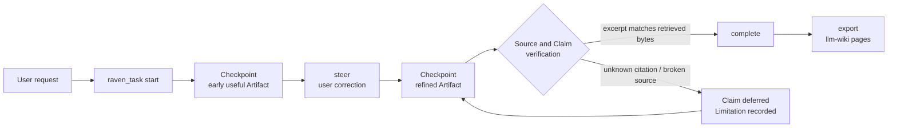

<div align="center">


# dsh-raven-research

**One progressive, source-grounded Task for deep research, writing, and learning —
inside [DeepSeek Harness](https://github.com/deepseek-ai/deepseek-harness).**

Early checkpoints you can steer mid-run · citations verified against the bytes actually retrieved · no second agent runtime.

[](https://github.com/wxxb789/dsh-raven-research/actions/workflows/ci.yml)
[](https://github.com/topics/dsh-plugin)
[](https://github.com/deepseek-ai/deepseek-harness)
[](https://www.typescriptlang.org/)
[](https://nodejs.org/)
[](LICENSE)
[](https://github.com/wxxb789/dsh-raven-research/stargazers)

English · [中文](README.zh.md)

[**TL;DR**](#tldr) · [**Install**](#install) · [**Usage**](#usage) · [**How it works**](#how-it-works-under-the-hood) · [**Configuration**](#configuration) · [**FAQ**](#faq)

</div>

> [!IMPORTANT]
> **v1 developer preview.** Pinned and tested against DeepSeek Harness `0.1.0-rc.7`, which is itself an RC and ships
> breaking changes. Not published to npm yet — [install from a checkout](#install).

## TL;DR

- **What it is:** a DeepSeek Harness (`dsh`) plugin that adds one progressive, evidence-aware Task abstraction for
  deep research, general writing, academic writing, and learning.
- **Why it matters:** you get a useful Checkpoint early, you steer it mid-run instead of restarting, and every
  citation is checked against the bytes actually retrieved — not against what the model remembers.
- **How it is built:** one host-only [Cordis](https://github.com/cordiverse/cordis) plugin, one model-facing
  `raven_task` tool, one compact prompt section. No second agent runtime, no model host, no vector store, no
  database. The Harness agent keeps researching and writing with its normal tools.
- **Install:** `pnpm build && pnpm pack`, add the tarball to your Harness deployment, append one row to a
  user-authored agent preset. See [Install](#install).
- **Use:** talk to the Harness agent normally — no launch phrase, no separate UI. See [Usage](#usage).
## Why Raven

A substantial research or writing request usually disappears into a long batch pipeline: you wait, you get one wall
of text, and the citations are whatever the model remembered. Raven changes the shape of that work.

| Plain long-running agent run | With Raven |
| --- | --- |
| Silence until a final dump | An early useful outline, draft, or findings set as a **Checkpoint**, then incremental refinement of the same Artifact |
| A correction restarts the work | A correction becomes a **Steering Revision** on the same Task; prior evidence and Checkpoints survive |
| Citations are remembered strings | Citations resolve to **inspected Sources**; excerpts are matched against retrieved bodies |
| Three reprints of one wire story read as three confirmations | Claims sharing a declared `sourceFamily` are marked as **not independent corroboration** |
| One dead link fails the whole run | Failed dependencies **defer only the affected Claims**; independently verified work still completes honestly |
| State dies with the tool call | The Task book is **rebuilt from the session log** and survives stop/resume |

Normal `discover → read → analyze → draft → verify → refine` movement stays autonomous. Raven asks only when an
unresolved choice changes the public outcome, evidence floor, audience, deliverable, significant cost, or an
external/destructive/sensitive side effect.

## Features

- **Progressive delivery.** A Checkpoint is useful on its own and is published while the Task is still running, so
  you can redirect the work before the expensive part.
- **Steering instead of restarts.** `steer` applies a user correction to the live Task and preserves prior evidence.
- **Citations checked against retrieved bytes.** Artifacts cite stable Source IDs with `[@source-id]`. Raven matches
  bounded excerpts against retrieved bodies, renders recorded URLs mechanically, and rejects unknown citations,
  unregistered URLs, cross-host redirects, and broken or mismatched Sources. A mismatch reports the nearest
  retrieved passage so the anchor can be repaired instead of retried blindly.
- **Independence-aware Claim trace.** Every Completion appends a trace mapping material Claim IDs and text to Source
  IDs, marking Claims whose Sources share one `sourceFamily` so reprints of a single originating record cannot read
  as several confirmations. Genuinely conflicting Claims are recorded as contested rather than silently resolved.
- **Honest partial results.** Withdrawn Claims force the asserting prose to be edited in the same Checkpoint; a
  dropped citation may not leave a bare assertion standing. Unverifiable evidence refuses publication rather than
  silently downgrading to "unchecked".
- **Session-durable Task book.** Works from a direct tool call and from inside a Code Mode `run_code` program, and
  survives stop/resume — see [One Task book, two durability paths](#one-task-book-two-durability-paths).
- **First-class settings namespace.** Registering the plugin exposes `raven-research` to every configuration surface
  a Harness deployment composes; there is nothing to add to the Harness itself.
- **Durable export.** `export` emits a valid [llm-wiki](docs/adr/0002-llm-wiki-repo-format.md) repository — artifact
  page, immutable `raw/` source pages with verification receipts, and an appendable `log.md` — that the agent writes
  with ordinary file tools. Raven never touches the filesystem itself.

## Install

Raven is **not on npm yet**, so install it from a checkout. Everything below happens outside the Harness repository:
you never edit a Harness checkout or a shipped preset.

### Requirements

| Requirement | Version |
| --- | --- |
| DeepSeek Harness | `0.1.0-rc.7` (checkout `99f6f02fecdb7dff40c3fbc9470f5907c29f74ca`) |
| Node.js | `^22.19.0 \|\| >=24.0.0` |
| pnpm | `11.21.0` |
| Peer dependencies | `@deepseek-ai/dsh-settings`, `@deepseek-ai/schemastery` — supplied by the Harness deployment |

### 1. Build and pack

```bash
git clone https://github.com/wxxb789/dsh-raven-research.git
cd dsh-raven-research
pnpm install --frozen-lockfile
pnpm build
pnpm pack        # -> dsh-raven-research-0.1.0.tgz
```

### 2. Add the tarball to your Harness deployment

Run this from the deployment root; the package only has to be resolvable in that Node resolution graph:

```bash
pnpm add /path/to/dsh-raven-research-0.1.0.tgz
```

The tarball installs with no runtime dependency of its own; the deployment supplies the two peers. Once the package
is published, the equivalent dependency is `dsh-raven-research@0.1.0`.

### 3. Enable it in a user-authored agent preset

Create or copy a **user-authored** agent preset, then append the row from
[`examples/agent-row.cordis.yml`](./examples/agent-row.cordis.yml) to its `cordis.yml`:

```yaml
- id: raven-research
  name: dsh-raven-research
  # Optional base layer for the raven-research settings namespace:
  # config:
  #   sourceVerification: remote
  #   sourceCheckTimeoutMs: 30000
```

> [!WARNING]
> **Never edit a shipped Harness preset** — copy it first. Raven publishes no process service, so this row needs no
> isolate realm. It consumes the preset's scoped `tools` and `systemPrompt` registries and obtains `web` dynamically
> when source reopening is available.

### 4. Verify

Start the Harness and ask the agent for something substantive (see [Usage](#usage)). Raven is live when a
`raven_task` call appears in the transcript and a Checkpoint arrives before the final answer.

## Upgrade

```bash
cd dsh-raven-research
git pull
pnpm install --frozen-lockfile
pnpm check          # lint, typecheck, test, build
pnpm pack
```

Then re-add the fresh tarball from the deployment root:

```bash
pnpm add /path/to/dsh-raven-research-<version>.tgz
```

pnpm keys a local tarball by its integrity hash, so new bytes are picked up even when the version string is
unchanged; if a deployment still serves the old build, run `pnpm install --force`.

Two things to check before upgrading:

- **Harness pin.** Compare `dshRaven.harnessVersion` in `package.json` with the Harness you actually run. Raven is
  pinned to one RC and does not claim compatibility with untested versions.
- **Settings.** `raven-research` values stored in the user's `settings.yaml` survive the reinstall; the preset
  `config:` block is only the base layer.

> [!WARNING]
> An in-flight Task lives in the session, not on disk. Finish it or `export` it before swapping the build.

## Uninstall

1. Remove the `- id: raven-research` row from your agent preset's `cordis.yml`.
2. Remove the package from the deployment:

   ```bash
   pnpm remove dsh-raven-research
   ```

3. Optional: drop the `raven-research` section from the user's `settings.yaml`.

Every Raven registration — the `raven_task` tool, the prompt section, the `agent/pre-step` listener, and the settings
section — is disposer-backed and owned by its Cordis fiber, so unloading removes all of it and leaves no orphaned
tool or prompt text (`pnpm test:dsh` exercises exactly that disposal path against a real Harness Loader). Restart
the Harness if your deployment does not reload the preset on change.

Nothing else is left behind: Raven owns no database, no cache, and no files. Task state lives in the Harness session
log, and anything you exported is a plain llm-wiki repository you already own.

## Usage

There is no launch phrase and no separate Raven UI — users talk to the Harness agent normally, and the model drives
the Task lifecycle.

```text
Research the strongest primary-source evidence for and against this policy. Show me
an early findings outline, keep working, and refine it into a decision memo.
```

```text
Turn these notes into an 800-word essay for engineering managers. Draft early so I
can redirect the emphasis.
```

```text
Develop a literature-review section from these papers. Preserve disagreement and do
not invent references.
```

```text
Teach me closures with one mental model, two worked examples, and a self-check.
```

Steering is just the next message — "focus on cost, not adoption", "make it more sceptical", "cite only primary
sources" — and it lands on the same Task instead of starting a new one.

### The `raven_task` actions

`raven_task` is model-facing. These are internal lifecycle operations on one user Task, not workflows a user has to
manage:

| Action | What it does |
| --- | --- |
| `start` | Opens one Task with an Outcome (`research`, `general-writing`, `academic-writing`, `learning`) and a grounding level (`required`, `optional`, `none`). |
| `checkpoint` | Publishes a user-visible Artifact version with new Sources, Claims, and recorded failures, and verifies grounded evidence. |
| `steer` | Applies a user correction to the same Task, preserving prior evidence and Checkpoints. |
| `complete` | Validates citation identity, material Claim links, matched excerpts, Source reachability, and the exact Artifact fingerprint against the latest post-steer Checkpoint. |
| `status` | Reports the current Task book. |
| `stop` | Ends the Task with a recorded reason; explicitly not Completion. |
| `resume` | Reopens a stopped Task — including an older one — without losing evidence or Artifact. |
| `export` | Returns llm-wiki page bytes for the agent to write with ordinary file tools. |

### Keeping the result after the session: llm-wiki export

After Completion, `action=export` returns page bytes for an [llm-wiki](docs/adr/0002-llm-wiki-repo-format.md)
repository: an artifact page under `wiki/queries`, one immutable `wiki/raw` page per Source carrying the verified
excerpt and its verification receipt (`capture: excerpt-only`), and one appendable `wiki/log.md` entry. Pass
`init=true` to also seed `SCHEMA.md`, `index.md`, and `log.md` for a repository with no wiki yet. The result is a
valid llm-wiki, readable by Obsidian and by that skill's own tooling. Write the returned bytes exactly — each
raw-page digest covers its own body, so editing after export invalidates it.

## How it works (under the hood)



### What the plugin registers

Raven exports plain Cordis plugin metadata (`name`, `inject = ['tools', 'systemPrompt']`, a Schemastery `Config`,
and `apply`) and keeps `apply` thin. It registers:

- one `raven_task` model tool through `ctx.tools`;
- one compact static section through `ctx.systemPrompt`;
- one `agent/pre-step` listener that puts the live Task book in front of the model before each step; and
- the `raven-research` settings section, gated behind `ctx.inject` so a deployment without a settings service simply
  never runs that wiring.

`web` is deliberately not injected: it is fetched dynamically from the context when a Source has to be reopened, so
a deployment without it still loads and still writes. Every registration returns a disposer owned by the calling
fiber, which is what makes [uninstall](#uninstall) clean.

### One Task book, two durability paths

Raven keeps one Task book per session and rebuilds it from the session log rather than from storage of its own:

- A **direct tool call** carries the Task record as durable result metadata (`tool/result.meta`, kind
  `dsh-raven-research/task-state`).
- A call made **inside a Code Mode `run_code` program** is a nested sub-call with no result card, so the Harness
  computes no presentation metadata for it. Raven therefore publishes the same record itself as a
  `dsh-raven-research/task-state` session event.

Either path restores the book when a session resumes, so a Task advanced from inside a program is not silently lost.

### The failure path carries the Task too

A failed call has to reach the model with the Task it must correct against, but the registry's own error text cannot
know a Task is open. Raven attaches a `<raven_task_recovery>` note through the tool-owned content finalizer — the
one hook that also runs for invalid arguments and cancellations, where the output projection never runs at all.

### The verification pipeline

Grounded Checkpoints and Completion run recorded Sources through an internal `SourceVerifier` seam (a Harness-web
adapter in production, a deterministic adapter in tests):

1. Reopen the recorded URL over the Harness `web` capability, bounded by `sourceCheckTimeoutMs`.
2. Reject a redirect that leaves the recorded source identity, so a parked or aggregated host cannot silently stand
   in for a citation.
3. Normalize HTML presentation to text, then match the bounded excerpt literally; a mismatch reports the nearest
   retrieved passage instead of a bare failure.
4. Treat a truncated retrieval as **unverifiable**, never as fabrication — a body the fetch contract cut off is a
   retrieval limit, not missing evidence.
5. Report a per-Source timeout as unverifiable instead of holding the whole Checkpoint open.

Completion then re-checks citation identity, material Claim links, Source reachability, and the exact Artifact
fingerprint, and appends the independence-aware Claim trace.

### Package surface and non-goals

Raven ships as one dependency-light ESM package: one Cordis plugin, one model tool, one prompt section, a pure
TypeScript Task engine, compact same-session replay through official `tool/result.meta`, and one `SourceVerifier`
seam.

It deliberately excludes a GUI, model host, vector store, custom scheduler, general agent framework, and
Raven-owned database. Long-running goals, subagents, workflows, files, and persistence remain Harness
responsibilities.

<details>
<summary><b>Design evidence and decisions</b></summary>

<br>

- [`docs/design/architecture.md`](./docs/design/architecture.md)
- [`docs/adr/0001-one-task-one-tool.md`](./docs/adr/0001-one-task-one-tool.md)
- [`docs/adr/0002-llm-wiki-repo-format.md`](./docs/adr/0002-llm-wiki-repo-format.md)
- [`docs/acceptance.md`](./docs/acceptance.md)
- [`docs/reverse-engineering/assessment.md`](./docs/reverse-engineering/assessment.md)
- [`docs/reverse-engineering/hermes-research-skills.md`](./docs/reverse-engineering/hermes-research-skills.md)
- [`docs/reverse-engineering/hermes-r-round-references.md`](./docs/reverse-engineering/hermes-r-round-references.md)
- [`docs/reverse-engineering/hermes-nana-wiki.md`](./docs/reverse-engineering/hermes-nana-wiki.md)
- [`CONTEXT.md`](./CONTEXT.md)

</details>

## Configuration

Raven owns the `raven-research` settings namespace. Registering it is what exposes it: a Harness that composes a
settings provider serves the namespace to every configuration surface.

| Field | Default | Effect |
| --- | --- | --- |
| `sourceVerification` | `remote` | `structural-only` withholds every remote check. No Source can then be confirmed, so a Checkpoint that records Sources is refused with the policy named. Set it only where the network is genuinely out of reach. |
| `sourceCheckTimeoutMs` | `0` | Deadline for one remote Source check, in milliseconds. `0` means no deadline. An exceeded deadline reports that one Source as unverifiable instead of holding the Checkpoint open. |

> [!NOTE]
> No setting can lower a Task's evidence floor. Withholding checks makes evidence unverifiable, which refuses
> publication; it never turns unchecked Sources into confirmed ones.

The composition entry in `cordis.yml` is the `base` layer. A value stored in the user's `settings.yaml` overrides it
and takes effect on the next Source check, with no restart; if the settings service goes away, the composition entry
becomes authoritative again.

A browser card for this namespace is deferred: the client module system requires a `dsh.client` bundle in the
loader's lazy-CJS factory format, and the preset that emits it is not published outside the Harness repository.

## Compatibility

Raven v1 is pinned and tested against:

- DeepSeek Harness `0.1.0-rc.7`;
- Harness checkout commit `99f6f02fecdb7dff40c3fbc9470f5907c29f74ca`;
- Node.js `^22.19.0 || >=24.0.0`; and
- pnpm `11.21.0`.

DeepSeek Harness is currently an RC and ships breaking changes. Raven does not claim compatibility with untested
Harness versions.

## Development

```bash
pnpm install --frozen-lockfile
pnpm check
pnpm test:pack
```

The repository uses a TypeScript-first modern toolchain: TypeScript 6 for strict type checking, tsdown for ESM and
declaration builds, Vitest for unit/integration/acceptance tests, Oxlint with warnings denied, and pnpm with a
frozen lockfile and an explicit `esbuild` build allowlist.

Verify the real Harness Loader, prompt registry, tool registry, execution pipeline, and Cordis disposal against the
intended checkout:

```powershell
$env:DSH_CHECKOUT = 'Q:\repos\deepseek-harness'
pnpm test:dsh
```

For a release-equivalent local gate:

```powershell
$env:DSH_CHECKOUT = 'Q:\repos\deepseek-harness'
pnpm check:release
```

### Acceptance coverage

<details>
<summary><b>The Vitest suite covers all four Outcomes and verifies that Raven …</b></summary>

<br>

- exposes a useful intermediate research Artifact before final verification;
- refines the same Task after a mid-run user correction;
- proceeds through normal stages without a confirmation action;
- rejects unknown references and recorded excerpts absent from retrieved source bytes;
- reopens cited URLs before grounded Checkpoints and again at Completion;
- preserves independent results across partial source failures;
- requires Completion bytes to equal the latest post-steer Checkpoint;
- distinguishes Completion from tool/worker termination; and
- stops and resumes without losing the Task, evidence, or Artifact.

</details>

`pnpm test:pack` creates an isolated staging project with no `lib/`, links only the pinned development toolchain,
exercises the real `prepack` lifecycle without mutating the repository build, checks the exact six-file allowlist,
and installs the tarball with an isolated pnpm home/store in a second external consumer before import, apply, and
model-tool execution.

## FAQ

**Does Raven replace the Harness agent, or add another model?**
Neither. Raven adds one task abstraction and one tool. The existing Harness agent does the research and writing
with its own tools and its own model.

**Do I need a vector database, an index, or an embedding pipeline?**
No. Raven has no store of its own. Sources are recorded by stable identity and reopened over the Harness `web`
capability when verification runs.

**Does it work without web access?**
Yes, for non-grounded writing and learning. Without a composed Harness `web` capability, external Claims are not
published as supported: they remain deferred, and a grounding-required Task with zero valid Claims stays active
rather than being labeled complete.

**Does it work in Code Mode (`run_code`)?**
Yes — see [One Task book, two durability paths](#one-task-book-two-durability-paths).

**How is this different from a "deep research" pipeline?**
A pipeline hides its middle and hands you one final report. Raven publishes the middle as steerable Checkpoints on
one continuing Task, and gates Completion on excerpt-level verification rather than on the run having finished.

**Does excerpt matching prove the Claim is true?**
No. Raven verifies URL reachability and literal presence of the bounded excerpt after whitespace/HTML presentation
normalization. Literal presence is not semantic entailment; the agent remains responsible for Claim judgment.

**Is it on npm?**
Not yet. Build and pack from a checkout — see [Install](#install).

**Which DeepSeek Harness versions are supported?**
Only the pinned RC listed under [Compatibility](#compatibility).

**How do I remove it cleanly?**
Drop one preset row and one dependency — see [Uninstall](#uninstall). Raven leaves no database, cache, or files
behind.

## v1 limits

- Excerpt verification is literal, not semantic (see FAQ).
- The four Outcomes select grounding defaults and explicit prompt policy inside the existing Harness agent; Raven
  embeds no second model and no deterministic prose generator, so content quality remains model-dependent.
- Natural-language correction detection is performed by the Harness model using Raven's pre-step context. The plugin
  supplies the deterministic same-Task `steer` transition; it does not guess corrections with a rule-based text
  classifier.
- Without a composed Harness `web` capability, external Claims stay deferred.
- State is durable within the owning Harness session, including multiple stopped or completed Task identities and
  later resume of an older Task. Cross-session projects, reusable corpora, and spaced-repetition storage are out of
  scope; `export` is the supported way to keep work.
- Raven renders progress through ordinary tool results and chat; v1 has no custom browser UI.

## Contributing

Issues and pull requests are welcome. Run `pnpm check` before opening a PR; the release-equivalent gate is
`pnpm check:release` with `DSH_CHECKOUT` pointing at a Harness checkout.

If Raven saves you a rewrite, a ⭐ helps other DeepSeek Harness users find it — and browse
[`dsh-plugin`](https://github.com/topics/dsh-plugin) for the rest of the ecosystem.

## License

[MIT](LICENSE)

---

<div align="center">

[TL;DR](#tldr) · [Install](#install) · [Upgrade](#upgrade) · [Uninstall](#uninstall) · [Usage](#usage) · [How it works](#how-it-works-under-the-hood) · [FAQ](#faq)

<sub><b>Keywords:</b> DeepSeek Harness plugin · dsh-plugin · Cordis plugin · AI research agent · deep research · agentic research · source grounding · citation verification · evidence-based writing · academic writing assistant · learning assistant · retrieval-augmented generation · hallucination mitigation · TypeScript · Node.js</sub>

</div>
