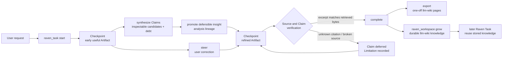

<div align="center">


# dsh-raven-research

**One progressive, source-grounded Task for deep research, writing, and learning —
inside [DeepSeek Harness](https://github.com/deepseek-ai/deepseek-harness).**

Early checkpoints you can steer mid-run · citations verified against the bytes actually retrieved · no second agent runtime.

[](https://github.com/wxxb789/dsh-raven-research/actions/workflows/ci.yml)
[](https://github.com/topics/dsh-plugin)
[](https://github.com/deepseek-ai/deepseek-harness)
[](https://www.typescriptlang.org/)
[](https://nodejs.org/)
[](LICENSE)
[](https://github.com/wxxb789/dsh-raven-research/stargazers)

English · [中文](README.zh.md)

[**TL;DR**](#tldr) · [**Install**](#install) · [**Usage**](#usage) · [**How it works**](#how-it-works-under-the-hood) · [**Configuration**](#configuration) · [**Operating**](#operating-raven) · [**FAQ**](#faq)

</div>

> [!IMPORTANT]
> **v1 developer preview.** Pinned and tested against DeepSeek Harness `0.1.2-alpha.1`, which is an alpha prerelease and ships
> breaking changes. Not published to npm yet — [install from a checkout](#install).

## TL;DR

- **What it is:** a DeepSeek Harness (`dsh`) plugin that adds one progressive, evidence-aware Task abstraction for
  deep research, general writing, academic writing, and learning.
- **Why it matters:** you get a useful Checkpoint early, you steer it mid-run instead of restarting, and every
  citation is checked against the bytes actually retrieved — not against what the model remembers.
- **How it is built:** one [Cordis](https://github.com/cordiverse/cordis) plugin split into an agent-role mode
  (`raven_task`, prompt, and Task context) and an optional host-role settings card. No second agent runtime,
  model host, vector store, or database. The Harness agent keeps researching and writing with its normal tools.
- **Install:** `pnpm build && pnpm pack`, add the tarball from the deployment root, then run
  `npx dsh-raven-install-preset` and choose Raven as the session mode. See [Install](#install).
- **Use:** talk to the Harness agent normally — no launch phrase, no separate Task UI, and no lifecycle commands to learn. Contextual guidance defaults to `auto` and can be set to `off`. See [Usage](#usage).
## Why Raven

A substantial research or writing request usually disappears into a long batch pipeline: you wait, you get one wall
of text, and the citations are whatever the model remembered. Raven changes the shape of that work.

| Plain long-running agent run | With Raven |
| --- | --- |
| Silence until a final dump | An early useful outline, draft, or findings set as a **Checkpoint**, then incremental refinement of the same Artifact |
| A correction restarts the work | A correction becomes a **Steering Revision** on the same Task; prior evidence and Checkpoints survive |
| Citations are remembered strings | Citations resolve to **inspected Sources** from web, local files, llm-wiki, or MCP; excerpts are matched against canonical Markdown |
| Three reprints of one wire story read as three confirmations | Claims sharing a declared `sourceFamily` are marked as **not independent corroboration** |
| Organized notes are mistaken for insight | A **Synthesis Pass** exposes Summary Debt and retains inspectable Insight Candidates with Claim lineage, assumptions, alternatives, and reversal evidence |
| Raven's interpretation is presented as sourced fact | External Claims say what Sources say; promoted analysis is separately rendered as a **Raven inference** from named Claims |
| One dead link fails the whole run | Failed dependencies **defer only the affected Claims**; independently verified work still completes honestly |
| State dies with the tool call | The latest successfully persisted Task snapshot is **rebuilt from the session log** and supports stop/resume |

Normal `discover → read → analyze → draft → verify → refine` movement stays autonomous. Raven asks only when an
unresolved choice changes the public outcome, evidence floor, audience, deliverable, significant cost, or an
external/destructive/sensitive side effect.

## Features

- **Batched discovery over the official search seam.** `discover` sends several complementary queries in one Task
  step through the Harness `web` search capability, folds one URL returned by several queries into one Lead, and
  keeps every sibling's results when a query fails — the failure is recorded as a Limitation, not an aborted batch.
  What comes back are **Leads**, never Sources: nothing can be cited until it has been opened and excerpted.
- **Agent Teams reuse.** Where the deployment composes the Harness Agent Teams capability and Raven detects membership,
  the Raven Task belongs to the Team: every observed member reads and extends the same Task, and a teammate cannot start
  a competing one. Without a detected membership — including a missing or failing experimental capability — each Agent
  keeps an independent Task book.
- **Progressive delivery.** The Raven prompt directs the main agent to publish an independently useful Checkpoint early
  while the Task remains active. Checkpoint validation is runtime-enforced; when the Harness displays it and continues
  later model/tool steps is owned by the Harness agent loop.
- **Steering instead of restarts.** `steer` applies a user correction to the live Task and preserves prior evidence.
- **One Markdown-first Source fabric.** Every Source keeps its Original Resource separate from Raven's canonical Markdown representation. Exactly four origins are supported: web, local files, llm-wiki pages, and MCP resources. Existing Markdown stays original; conversion names the producing Harness tool; `full`, `segment`, or `unknown` coverage prevents a bounded projection from impersonating a whole Resource. A successful non-web inspection persists a digest binding Resource, Markdown, producer, call ID, and coverage; unavailable or failed conversion defers dependent Claims.
- **Task-level Source Policy.** Natural requests become steerable policy on the same Task: allow/block web hosts, prefer primary evidence, scope local or llm-wiki roots, and include/exclude named MCP sources. This is never deployment configuration.
- **Citations checked against source material.** Artifacts cite stable Source IDs with `[@source-id]`. Raven independently re-fetches web Sources with the existing HTTP identity guarantees. Local, llm-wiki, and MCP Sources must name the prior successful Harness `inspectionCallId`; Raven checks its `tool/call` and `tool/result`, producer, resolved file identity or MCP namespace, returned Markdown, and excerpt. Rendered citations expose Origin and conversion provenance. Unknown citations, unattested representations, cross-host redirects, and mismatched excerpts are rejected.
- **Independence-aware Claim trace.** Every Completion appends a trace mapping material Claim IDs and text to Source
  IDs, marking Claims whose Sources share one `sourceFamily` so reprints of a single originating record cannot read
  as several confirmations. Genuinely conflicting Claims are recorded as contested rather than silently resolved.
- **First-class Insight Candidates.** `synthesize` lets the main agent record candidate interpretations, connections,
  explanations, hypotheses, reframings, implications, and theses against named Claims. Each candidate retains its
  assumptions, rationale, confidence, competing explanations, and evidence that would change Raven's mind. It is
  never automatically fact or accepted analysis.
- **Defensible analysis lineage.** Promoting a candidate requires a later material `analysis` Claim with the exact
  candidate text, premise Claim IDs, and assumptions. The Artifact renders Source-backed propositions as `source
  says` and promoted reasoning as `Raven inference`; a premise failure automatically defers dependent analysis.
- **Summary Debt without synthesis theater.** A synthesis pass warns when a section merely organizes or restates
  evidence, and when candidate reasoning has unusable lineage. `purpose=summary` and `purpose=explanation` explicitly
  suppress that diagnostic, so direct summaries, trivial writing, and ordinary learning remain lightweight.
- **Honest partial results.** Withdrawn Claims force the asserting prose to be edited in the same Checkpoint; a
  dropped citation may not leave a bare assertion standing. Unverifiable evidence refuses publication rather than
  silently downgrading to "unchecked".
- **Contextual guidance.** `guidance: auto` lets the main agent briefly surface one useful Raven option only when the
  current context calls for it — redirecting the work, changing source constraints, pausing/resuming, or preserving a
  result — without tutorials or approval gates. `guidance: off` suppresses those hints; Task behavior is unchanged.
- **Session-replayable Task book.** Direct calls and PTC mode `run_code` calls persist snapshots through Harness-owned
  session records, subject to the documented nested-log spill limit — see [One Task book, two durability paths](#one-task-book-two-durability-paths).
- **One sentence per line.** Every stored Artifact is normalized so each sentence occupies its own line, making a
  **line** the smallest edit unit: a revision diffs as the sentences that actually changed instead of as whole
  rewritten paragraphs. The transform is Markdown-structure-aware and idempotent — fenced code, tables, headings,
  thematic breaks, link definitions, math blocks, YAML frontmatter, hard line breaks, and list/blockquote
  continuation prefixes are copied through untouched.
- **Draft Variants.** `draft` asks every configured `provider/model` route for the same bounded instruction and
  returns the candidates, each laid out one sentence per line so they diff line by line. A Draft Variant is a
  candidate exactly as a Lead is: it carries no evidence, can never be cited, and never counts toward the evidence
  floor. Off until a deployment configures routes.
- **First-class settings namespace.** Registering the plugin exposes `raven-research` to every configuration surface
  a Harness deployment composes; there is nothing to add to the Harness itself.
- **A settings card in the Web GUI.** Raven ships a browser half that registers a card under Settings › Plugins for
  its own namespace — see [Configuration](#configuration) for what that requires.
- **Durable Raven Workspace.** The separate `raven_workspace` lifecycle initializes or safely adopts an
  [llm-wiki](docs/adr/0002-llm-wiki-repo-format.md), ingests Source-normalized documents, compounds completed Tasks
  into query/concept/entity/comparison pages, rebuilds the derived index, reports health defects, and lexically reuses
  stored knowledge in later Tasks. Conditional hashes and idempotent log markers prevent silent overwrites; originals
  and prior raw revisions remain intact. Markdown is authoritative, and no embedding or vector database is required.
- **Compatible one-off export.** `raven_task action=export` still emits artifact and immutable `raw/` pages plus an
  appendable `log.md` entry for users who want one Task without a maintained Workspace. Raven never touches the
  filesystem itself; the agent applies all bytes with ordinary Harness file tools.

## Install

Raven is **not on npm yet**, so install it from a checkout. Everything below happens outside the Harness repository:
you never edit a Harness checkout or a shipped preset.

### Requirements

| Requirement | Version |
| --- | --- |
| DeepSeek Harness | `0.1.2-alpha.1` (checkout `cd5ef8148158c3a752a658978873241fdf8e2bbc`) — see [Version pinning and peer dependencies](#version-pinning-and-peer-dependencies) |
| Node.js | `^22.19.0 \|\| >=24.0.0` |
| pnpm | `11.21.0` |
| Peer dependencies | Eleven `@deepseek-ai/*` packages — the Cordis framework, schema library, Harness Service Definitions, preset owner, and settings-page owner — supplied by the Harness deployment, never bundled |

### 1. Build and pack

```bash
git clone https://github.com/wxxb789/dsh-raven-research.git
cd dsh-raven-research
pnpm install --frozen-lockfile
pnpm build
pnpm pack        # -> dsh-raven-research-0.1.0.tgz
```

### 2. Add the tarball to your Harness deployment

Run this from the deployment root; the package only has to be resolvable in that Node resolution graph:

```bash
pnpm add /path/to/dsh-raven-research-0.1.0.tgz
```

The tarball installs with no runtime dependency of its own; the deployment supplies the peers. They are peers rather than dependencies on purpose: a profile installs plugins with `autoInstallPeers: false` so they fall through to the running installation and every plugin shares one cordis instance. Once the package
is published, the equivalent dependency is `dsh-raven-research@0.1.0`.

### 3. Raven is isolated to its own mode

**Raven contributes nothing until a session is started in Raven mode.** In PTC mode, in any other mode, and on
every settings page, this package is invisible: no `raven_task` in the tool catalog, no system-prompt section, no
pre-step Task context, and no settings card. Choosing the mode is the act of asking for Raven, and it is the only
way to get it.

That is why installing Raven is **one** step — step 4, the mode — and not two. Raven splits by `role`:

| Role | Mounted by | Registers | Isolated? |
| --- | --- | --- | --- |
| `role: agent` | the `raven` agent preset, step 4 | `raven_task`, its system-prompt section, the pre-step Task context, and the `tools/ptc-dispatch-log` waterfall | yes — scoped to the mode |
| `role: host` | nothing, by default | the `raven-research` settings namespace (the Settings → Plugins card) and the mount-time capability warning | **no** — a settings page is global |

The `tools/ptc-dispatch-log` waterfall does **not** need the host plane: event admission extends up the scope
chain and that event is scoped to `dispatch.agent`, so an agent-scoped listener still receives its own agent's PTC mode
sub-dispatches. Nothing the agent half needs is process-wide.

The settings namespace is the one surface that cannot be isolated, because a settings page is a *global* surface: a
card served from the host plane is visible from every mode, and a card served from inside the preset would appear
and vanish with a session using that preset. Isolation and the card cannot both be had — so isolation wins, and
**Raven is configured in the preset row instead**, in the `config:` block of the row the installer inserts. Every
field is listed there. Compatibility-sensitive network fields are explicit at safer new-install values; remaining
schema defaults stay commented until you change them:

```yaml
- id: raven-research
  name: dsh-raven-research
  config:
    role: agent
    # guidance: auto
    # sourceVerification: remote
    sourceNetworkPolicy: public-only
    sourceCheckTimeoutMs: 20000
    # searchMaxQueries: 4
    # proseLayout: sentence-per-line
    # …
```

<details>
<summary><b>Opt-in: the settings card, and the isolation it costs</b></summary>

<br>

> [!WARNING]
> **This breaks isolation, deliberately.** The card is a global page; mounting the host row makes Raven visible
> from *every* mode's Settings, including modes that will never offer `raven_task`. Do this only if editing YAML is
> worse for you than a Raven card appearing in PTC mode.

`dsh plugin add` will NOT do this for you. Raven declares no `dsh.bundle`, and the CLI says so when you install
it — *installed as a plain dependency, not a profile layer*. That absence is the isolation; mounting the row is a
deliberate act.

Paste the row into your profile's own overlay, `$DSH_HOME/profiles/<name>/cordis.patch.yml`, which is applied
after every bundle layer:

```yaml
# Raven's opt-in host row: the settings card, deliberately.
# `role: host` registers ONLY the `raven-research` settings namespace and the mount-time
# capability warning. No `raven_task`, no prompt section, no per-step Task context — those
# belong to `role: agent`, which the `raven` preset mounts. Other modes gain a card, not a tool.
# Delete this entry to return to full isolation.
- insert:
    - id: raven-research
      name: dsh-raven-research
      config:
        role: host
```

Restart the app afterwards: the composition is read at boot, and the browser half is loaded from the live loader
entries, so a card cannot appear in a process that started before the row existed.

With the card mounted, the preset row's `config:` becomes the *base layer*: a value stored in the user's
`settings.yaml` overrides it while the provider is composed, and the preset values become authoritative again if
it goes away. Mounting both roles is supported — the double-mount check only warns when the same role is mounted
twice.

</details>

### 4. Install the Raven mode

The agent half reaches a session as an agent preset — which is what a **mode** in the new-session UI is. Install it
with the bin this package provides:

```bash
npx dsh-raven-install-preset
```

That writes `$DSH_HOME/.agent-presets/raven` (`$DSH_HOME` defaults to `~/.dsh`), the user preset root
`@deepseek-ai/dsh-agent-presets` already scans.

**The mode INHERITS your deployment's own `ptc` preset, live.** A preset's `agent.cordis.yml` is the *whole*
agent composition — persona, tools, shell, compaction — not an overlay on a default, so a preset containing only
Raven's row would boot an agent with no persona, no tools and no shell. The installer therefore:

1. resolves a base preset — `--base <id>`, defaulting to `ptc` — by looking in `$DSH_HOME/.agent-presets`, then
   each `--base-root <dir>` you pass, then the shipped directories declared by the installed
   `@deepseek-ai/dsh-agent-presets` package or the package found through `$DSH_CHECKOUT`. If none carries it,
   the installer **fails naming every location it tried** and asks for an explicit `--base-root`;
2. writes `raven/agent.cordis.yml` as a ~2 KB composition of **two top-level sibling rows**: one
   `cordis:include` row whose `path` is that base composition, and beside it, at the same level of the same
   document, one `dsh-raven-research` row with `config: { role: agent }`. That second row is the whole
   difference from the base;
3. puts a generated header on top naming the base preset id, the path it is read from, and the fact that this is
   **not** a snapshot.

```yaml
# $DSH_HOME/.agent-presets/raven/agent.cordis.yml — the whole file, minus its header
- id: inherited-ptc
  name: cordis:include
  config:
    # a file:// URL: the include resolves this with new URL(path, baseUrl) then
    # fileURLToPath, and a bare Windows path like Q:\… parses as a URL *scheme*
    path: file:///path/to/the/package-declared/preset/root/ptc/agent.cordis.yml

# Raven's row is a SIBLING of the include above — never inside its `patches` list.
- id: raven-research
  name: dsh-raven-research
  config:
    role: agent
```

> [!IMPORTANT]
> **This is live inheritance, not a copy.** `cordis:include` reads that file at *mount* time, so upgrading the
> Harness changes what Raven mode inherits on the very next session — there is nothing to re-sync and no copy to go
> stale.

> [!IMPORTANT]
> **The installer never touches your Harness.** Raven is a plugin *of* a deployment, not a co-owner of it. Every
> write it makes lands inside `$DSH_HOME/.agent-presets/raven`. Your preset files are read and never written,
> moved, renamed — not even a permission bit is changed.

> [!WARNING]
> **Why the row is a sibling, and must never move into `patches`.** `Include` rebases its child tree onto the
> directory of the file it included. A row inserted through the include's `patches` list therefore resolves
> `dsh-raven-research` from inside your **Harness install**, where it is not installed; the include fails to
> apply; and the failing tree is written back as `[]`. Nothing suppresses that write — a nested include is
> instantiated from the plain `Include`, not the `PresetTree` subclass whose `write()` is a no-op.
> **This truncated a real file:** a deployment's shipped `code` preset was found at 3 bytes, down from 13605.

A side-by-side run over a copy of that same base reproduced it exactly. The patched shape failed to mount and left
a 3-byte base. The sibling shape this installer writes mounted cleanly and left the base untouched:

```text
HOST-ONLY tools: []
roster:            ["raven"]
installed file:    1981 bytes
base after mount:  13605 bytes (unchanged)
```

Both rows resolve from the installed preset directory, the base is read live and never written, and `raven_task`
appears only in the preset's scope. Your base file stays writable and is left exactly as it was — the guard is
emitting a shape that **resolves**, not a permission bit on a file this package does not own. Separately, in case
something *else* writes your base, the installer **detects** it, which costs nothing and touches nothing:

| what a re-run finds | what it says |
| --- | --- |
| base digest unchanged | nothing; the mode is up to date |
| base changed | that this is expected after a Harness upgrade, and **nothing needs doing** — live inheritance already picked it up. Still exits zero |
| base now contains Raven's own row | a **warning** naming the file, saying this installer never writes it, and telling you to restore it from your Harness install |

`--snapshot` remains for a deployment that would rather not depend on a file outside this package. It composes a
**copy** — the base's comments preserved by concatenating *text* rather than re-emitting YAML — and that copy goes
stale on a Harness upgrade; `--snapshot --force` re-syncs it.

The installer is idempotent in both modes: a re-run that would change nothing says so, and a live install whose base
moved on is *still* up to date, because it never copied it. It refuses to overwrite a differing copy without
`--force`. Use `--dry-run` to see what it would do without touching anything.

<details>
<summary><b>Alternative: add Raven to a preset you already maintain</b></summary>

<br>

To put Raven inside an existing preset rather than give it its own mode, skip the installer and append the row from
[`examples/agent-row.cordis.yml`](./examples/agent-row.cordis.yml) to that preset's `agent.cordis.yml`:

```yaml
- id: raven-research
  name: dsh-raven-research
  config:
    role: agent
    # Optional base layer for the raven-research settings namespace:
    # sourceVerification: remote
    # sourceCheckTimeoutMs: 30000
```

> [!WARNING]
> **Never edit a shipped Harness preset** — copy it first. Raven publishes no process service, so this row needs no
> isolate realm. It consumes the preset's scoped `tools` and `systemPrompt` registries and obtains `web` dynamically
> when source reopening is available.

</details>

> [!NOTE]
> The mode is the whole install. The host row is an opt-in that trades isolation for the settings card — see
> [step 3](#3-raven-is-isolated-to-its-own-mode). With the roles split they do not overlap, so mounting both does
> not register `raven_task` twice.

> [!IMPORTANT]
> The Harness mounts the Raven preset once under a standing scope and every Raven session joins that scope. Raven
> keys its shared plugin instance by Agent identity or successfully detected Team identity, so unrelated owners stay
> isolated while observed Team members share one in-memory Task book. Persisted snapshots are replayable — see
> [One Task book, two durability paths](#one-task-book-two-durability-paths).

### 5. Verify

Start the Harness, pick **Raven** as the mode for a new session, and ask the agent for something substantive (see
[Usage](#usage)). Raven is live when a `raven_task` call appears in the transcript and a Checkpoint arrives before
the final answer.

## Upgrade

```bash
cd dsh-raven-research
git pull
pnpm install --frozen-lockfile
pnpm check          # lint, typecheck, test, build
pnpm pack
```

Then re-add the fresh tarball from the deployment root:

```bash
pnpm add /path/to/dsh-raven-research-<version>.tgz
```

pnpm keys a local tarball by its integrity hash, so new bytes are picked up even when the version string is
unchanged; if a deployment still serves the old build, run `pnpm install --force`.

A live install normally needs no re-sync after a Harness upgrade. This release has one explicit exception: older
Raven installs generated against the removed `code` base must move to `ptc`. Review any local edits in the generated
preset, then run:

```bash
npx dsh-raven-install-preset --force
```

The installer recognizes that legacy generated header and prints the same migration command without overwriting.
A `--snapshot` install still needs its snapshot-specific re-sync after every base change:

```bash
npx dsh-raven-install-preset --snapshot --force
```

Two things to check before upgrading:

- **Harness pin.** Compare `dshRaven.harnessVersion` in `package.json` with the Harness you actually run. Raven is
  pinned to one prerelease and does not claim compatibility with untested versions.
- **Base.** A live install tracks the upgraded base automatically. A `--snapshot` install does not: upgrading the
  *Harness* is exactly the case that leaves the copy inlined into `raven/agent.cordis.yml` stale, and running the
  installer without `--force` reports that before changing anything.
- **Settings.** `raven-research` values stored in the user's `settings.yaml` survive the reinstall; the preset
  `config:` block is only the base layer.

> [!WARNING]
> An in-flight Task lives in the session, not on disk. Finish it or `export` it before swapping the build.

## Uninstall

1. Remove the Raven mode. It is a directory, so deleting it is the whole step:

   ```bash
   rm -rf "${DSH_HOME:-$HOME/.dsh}/.agent-presets/raven"
   ```

   If you mounted the row into a preset you maintain instead, delete the `- id: raven-research` row from that
   preset's `agent.cordis.yml`. If you opted into the settings card, also remove the host row from the profile
   bundle with `dsh plugin --profile <name> remove dsh-raven-research`.

2. Remove the package from the deployment:

   ```bash
   pnpm remove dsh-raven-research
   ```

3. Optional: drop the `raven-research` section from the user's `settings.yaml`, if you ever opted into the card.

Every Raven registration — the `raven_task` tool, the prompt section, the `agent/pre-step` listener, the
`tools/ptc-dispatch-log` listener, the settings section, and the browser card — is disposer-backed and owned by its
Cordis fiber, so unloading removes all of it and leaves no orphaned tool or prompt text (`pnpm test:dsh` exercises
exactly that disposal path against a real Harness Loader). Restart the Harness if your deployment does not reload
the composition on change.

Nothing else is left behind: Raven owns no database and no cache, and writes no files at runtime (the preset
directory the installer writes is what step 2 removes). Task state lives in the Harness session
log, and anything you exported is a plain llm-wiki repository you already own.

## Usage

`raven_task` is registered by the `raven` agent preset, so it exists **only in Raven mode**. Pick that mode when
starting the session; in any other mode the agent has no Raven tool and will answer without a Task.

Within Raven mode there is no launch phrase and no separate Raven UI — users talk to the Harness agent normally,
and the model drives the Task lifecycle. Say “only use these sites”, “block this site”, “use this local folder”, “include this llm-wiki”, “exclude this MCP source”, “focus on primary sources”, “pause here”, “continue”, or “keep this result”
in ordinary language; the agent translates that intent into Raven's internal protocol. In `guidance: auto` it may offer
one brief capability hint when useful. Set `guidance: off` in the Raven preset row (or the opt-in settings card) to
suppress those hints without changing the workflow.

```text
Research the strongest primary-source evidence for and against this policy. Show me
an early findings outline, keep working, and refine it into a decision memo.
```

```text
Turn these notes into an 800-word essay for engineering managers. Draft early so I
can redirect the emphasis.
```

```text
Develop a literature-review section from these papers. Preserve disagreement and do
not invent references.
```

```text
Teach me closures with one mental model, two worked examples, and a self-check.
```

Steering is just the next message — "focus on cost, not adoption", "block example.com", "use only this folder", or "cite only primary sources" — and it updates the same Task, including its Source Policy, instead of starting a new one.

### Internal protocol reference (integrators)

`raven_task` is model-facing, not a user-operated workflow language. Users should never need action names, Task ids,
phases, or revisions; the main agent translates ordinary requests. The operations are documented here only for
integrators and tests:

| Action | What it does |
| --- | --- |
| `start` | Opens one Task with an Outcome (`research`, `general-writing`, `academic-writing`, `learning`) and a grounding level (`required`, `optional`, `none`). |
| `discover` | Runs one batch of complementary queries through the Harness `web` search seam and returns **Leads** — uninspected candidates, never Sources. A failing query becomes a Limitation instead of losing the batch. |
| `synthesize` | Examines named Claims for interpretation, records inspectable **Insight Candidates** with assumptions and alternatives, and reports Summary Debt for a synthesis-heavy scope. It neither publishes nor accepts a candidate. |
| `draft` | Asks every configured `provider/model` route for the same bounded instruction and returns the candidates for comparison. A **Draft Variant** carries no evidence and can never be cited. |
| `checkpoint` | Publishes a user-visible Artifact version with new Sources, Claims, and recorded failures, and verifies grounded evidence. |
| `steer` | Applies a user correction to the same Task, preserving prior evidence and Checkpoints. |
| `complete` | Validates citation identity, material Claim links, matched excerpts, Source reachability, and the exact Artifact fingerprint against the latest post-steer Checkpoint. |
| `status` | Reports the current Task book and a bounded index of unpromoted Insight Candidate IDs. |
| `inspect` | Returns exact records for 1–8 explicitly named durable Insight Candidates; it never dumps the full Candidate collection. |
| `stop` | Marks the Task stopped; explicitly not Completion. It prevents later Task mutation after processing but does not cancel Harness work already in flight. |
| `resume` | Reopens a stopped Task — including an older one — without losing evidence or Artifact. |
| `export` | Returns llm-wiki page bytes for the agent to write with ordinary file tools. |

### One sentence per line

Raven stores every Artifact in the Task's Prose Layout rather than in whatever line shape the model submitted.
Under the default `sentence-per-line` layout each sentence occupies its own line, so a **line** is the smallest
edit unit and a revision diffs as the sentences that actually changed. Markdown structure is never reflowed:
fenced code, tables, headings, thematic breaks, link definitions, math blocks, YAML frontmatter, hard line breaks,
and list or blockquote continuation prefixes are copied through as written.

The transform is idempotent, and the stored bytes are the ones Completion compares against — so the returned
Artifact, not the submitted one, is what the model edits next. Set `proseLayout: as-written` to store exactly what
the agent wrote, or `proseFormat: plain` where Artifacts are not Markdown.

### Reasoning from evidence: Insight Candidates

A Lead is candidate evidence and a Draft Variant is candidate wording. An **Insight Candidate** is candidate reasoning:
an interpretation, connection, explanation, hypothesis, reframing, implication, or thesis that Raven can derive from
recorded Claims. `action=synthesize` gives that reasoning a durable, inspectable shape before any of it becomes accepted
analysis.

Each candidate records:

- stable `insightId`, text, kind, and intellectual pattern;
- premise `claimIds` rather than direct Source authority;
- explicit assumptions and a rationale for why the connection may matter;
- `low | medium | high` confidence as a judgment, never a fact status;
- evidence that `wouldChangeMind`; and
- optional `competesWith` links to plausible alternative explanations; competition is semantically undirected, so a later Candidate may name an earlier immutable one.

After replay or context loss, `status` lists up to eight unpromoted Candidate IDs without dumping all durable reasoning. Call `inspect` with 1–8 explicit `insightIds` to recover those exact Candidate records, including the text, premise IDs, assumptions, rationale, reversal evidence, confidence, and alternatives required for a later promotion.

The pattern vocabulary directs Raven toward tension, hidden assumptions, alternative causal mechanisms, boundary
conditions, counterfactuals, second-order effects, incentive mismatches, temporal and scale shifts, missing variables,
cross-domain analogies, unexpected connections, and implications individual Sources do not state. It does not reward
mechanical disagreement: useful candidates compare explanatory structures and name what would reverse them.

A Synthesis Pass names the Artifact or section scope, the Claims considered, and its purpose. With
`purpose=synthesis`, no interpretation is **high Summary Debt** and interpretation with unusable premises remains weak;
a candidate with usable Claim lineage clears the debt. Debt is tracked independently for each exact synthesis scope:
only a later debt-free `purpose=synthesis` pass over that same scope clears it. `purpose=summary` and
`purpose=explanation` accrue no debt but do not hide another scope's debt. The normal Checkpoint path also remains
available, so an explicit summary, trivial rewrite, or teaching explanation does not pay synthesis ceremony.

A candidate is never automatically accepted. A later Checkpoint promotes it only through a material
`kind=analysis` Claim carrying the candidate's unchanged text, `insightId`, exact `derivedFromClaimIds`, and exact
assumptions. Every premise must still be supported or qualified. Raven rejects the candidate as an `external` Claim,
renders accepted analysis under **Analysis lineage** as “Raven inference from …,” and automatically defers it if a
premise later loses support. Competing candidates remain visible after promotion. This is the intellectual substrate for
future drafting workflows; it does not add multi-skeleton or multi-model synthesis.

### Comparing wording: Draft Variants

`action=draft` sends one bounded instruction — a section, a paragraph, an abstract — to every configured
`provider/model` route and returns the results together, each laid out one sentence per line so they diff line by
line. A route that fails or times out costs its own variant, never the round.

A Draft Variant is a **candidate**, exactly as a Lead is. It carries no evidence, may never be cited, and never
counts toward the evidence floor; a sentence every variant agrees on is still unsupported until a recorded Source
excerpt supports it. Adopt phrasing, never facts.

The deployment owns the route list: the agent may select a subset of `draftRoutes` and nothing else, because naming
a model is naming spend and a data path. An unknown route is refused with the configured set named rather than
quietly substituted. Drafting is **off** until a deployment sets `draftRoutes`; until then the call reports that
instead of drafting from the session model.

### Keeping knowledge across Tasks: Raven Workspace

A **Raven Task** is one bounded research or writing job. A **Raven Workspace** is a separate, user-owned,
long-lived [llm-wiki](docs/adr/0002-llm-wiki-repo-format.md). Task Completion does not close it, Workspace adoption
does not start a Task, and Raven remains fully usable when no Workspace exists.

The internal `raven_workspace` tool supports the practical lifecycle:

| Action | Effect |
| --- | --- |
| `initialize` | Create only missing `wiki/SCHEMA.md`, `wiki/index.md`, and `wiki/log.md` for a fresh wiki. |
| `adopt kind=wiki` | Recognize an existing llm-wiki without rewriting any existing page; seed only missing standard structure. |
| `adopt kind=folder` | Leave every Original Resource in place and add immutable normalized-Markdown pages under `wiki/raw/documents/`. |
| `ingest` | Add later non-web Source-normalized material; identical input is a no-op and changed content creates a `supersedes` revision. Web material enters through a completed Task and `grow`, so excerpt verification cannot impersonate a full capture. |
| `grow` | Fold one completed Task into an existing or new query, concept, entity, or comparison page while retaining history, Sources, confidence, Task provenance, and contradictions. |
| `maintain` | Deterministically regenerate the disposable `wiki/index.md` catalog, but only from an explicitly complete Markdown snapshot (`complete=true`). |
| `health` | Report missing structure/frontmatter, type mismatches, raw digest drift, dangling Sources, unexplained contestation, and a stale generated index; global health also requires `complete=true`. |
| `reuse` | Lexically rank stored Markdown by title, tags, and body without embeddings; mark results as stored rather than freshly verified knowledge. |

Raven still owns no filesystem authority. Before a Workspace action, the agent inspects the needed `wiki/**/*.md`
files with ordinary Harness file tools and passes their exact bytes. `health` and `maintain` refuse to run unless the
agent explicitly attests that this is the complete Markdown snapshot; a partial set can neither report global health
nor replace the global index. The returned plan carries `absent` or current
`sha256` preconditions for every write and a deterministic marker for every append. The agent must re-read targets,
enforce those conditions, apply the bytes with ordinary file tools, and re-read the result. Re-running the same
adoption, ingest, or Task contribution is therefore a no-op rather than a duplicate log entry or overwrite.

Mixed-document folders do not create another converter. Existing Markdown is passed byte-for-byte as
`derivation=original`; PDF, HTML, office, and other media must use the ordinary Source layer's existing Markdown
normalization and carry the Original Resource URI/media type, `producedBy`, `inspectionCallId`, coverage, and exact
converted Markdown. Unsupported or failed normalization is reported and the original stays untouched.

`reuse` is prior knowledge, not a freshness waiver. For durable concepts, the later Task may inspect the selected
Workspace page and register it as an `llm-wiki` Source. For prices, office holders, product status, counts, or other
volatile/current Claims, Raven labels the stored result as requiring fresh verification and the agent must reopen the
authoritative Original Resource.

The compatible one-off path remains: after a Task has an Artifact, `raven_task action=export` returns an artifact page
under `wiki/queries`, one immutable `wiki/raw` excerpt page per Source with its verification receipt
(`capture: excerpt-only`), and one appendable `wiki/log.md` entry. Pass `init=true` only for a new repository. This is
still useful when a user wants one Task and no maintained Workspace.

## How it works (under the hood)



### What the plugin registers

Raven exports plain Cordis plugin metadata (`name`, `inject = ['tools', 'systemPrompt']`, a Schemastery `Config`,
and `apply`) and keeps `apply` thin. On the host plane it registers:

- separate `raven_task` and `raven_workspace` model tools through `ctx.tools`;
- one compact static section through `ctx.systemPrompt`;
- one `agent/pre-step` listener that puts the live Task book in front of the model before each step;
- one `tools/ptc-dispatch-log` listener that keeps a PTC mode Task step durable (see below); and
- the `raven-research` settings section, gated behind `ctx.inject` so a deployment without a settings service simply
  never runs that wiring.

The package also ships a browser half (`dsh.client`, exported as `./client`) whose only contribution is one card in
the keyed `settings.plugin.item` slot, registered under the key `raven-research` — the same string the host half
registers as its settings namespace. That keying is what lets a plugin distributed outside the Harness repository
contribute a card at all: the tab pairs the two halves without ever learning what the namespace means. The browser
half mirrors no Task state; the tool, the evidence checks, the model calls, and the durable record are all host
concerns.

`web` is deliberately not injected: it is fetched dynamically from the context when a Source has to be reopened or a
discovery batch runs, so a deployment without it still loads and still writes. The experimental `agentTeams`
capability is read the same way and is never a dependency: it is private and unpublished upstream, so Raven mirrors
only the shape it reads and degrades to single-agent behaviour everywhere else. Every registration returns a
disposer owned by the calling fiber, which is what makes [uninstall](#uninstall) clean.

### One Task book, two durability paths

Raven keeps one Task book per owning Agent identity — or per successfully detected Agent Team identity — and rebuilds
it from the durable records carried by the owning Harness sessions rather than from storage of its own:

- A **direct tool call** carries the Task record as durable result metadata (`tool/result.meta`, kind
  `dsh-raven-research/task-state`).
- A call made **inside a PTC mode `run_code` program** is a nested sub-call with no result card, so the Harness
  computes no presentation metadata for it. Raven attaches the same record to the durable copy of that sub-dispatch
  instead, through the `tools/ptc-dispatch-log` waterfall, as an HTML comment on the Harness-owned
  `tool/code-dispatch` event.

> [!IMPORTANT]
> Raven writes **no plugin-owned session event type**. The Harness persistence read path accepts only its generated
> known-event set and exposes no event-name registration seam to out-of-repo plugins. A private event would therefore
> make the session unloadable; riding the existing `tool/code-dispatch` event keeps it loadable by construction. If a
> spill policy replaces an oversized log copy, that one step is simply not restored, and the next direct call
> republishes the whole record.

The latest successfully persisted snapshot restores the book when a session resumes. A spilled nested PTC mode log
can omit that one step; the session still loads, and a later direct state-changing call republishes a full snapshot.

Raven derives the fields it reads from the official augmented `SessionEventMap['tool/code-dispatch']` instead of
copying a payload shape. Because the published compile package predates `PtcDispatchLog`, `pnpm test:dsh` closes the
runtime half against the exact target checkout: it composes the official `run_code`, executes a real `raven_task`
sub-call through `tools/ptc-dispatch-log`, and verifies the resulting `tool/code-dispatch` replay.

### One Task per detected Agent Team

When Raven successfully detects membership through the optional Harness Agent Teams capability, it keys the Task book
by Team id rather than Agent id. Observed members then share one active Task identity, evidence set, and Artifact, and a
teammate's competing `start` is refused. After a process restart, each member's durable records fold into the shared
book as that member is observed; until then the rebuilt view may contain only the calling member's persisted history.
Raven reads the capability structurally through `ctx.get('agentTeams')` and contains every call because the Team
packages are private and unpublished. No capability, no membership, or a throwing probe degrades to an independent
single-Agent book rather than pretending Team ownership was established.

### The failure path carries the Task too

A failed call has to reach the model with the Task it must correct against, but the registry's own error text cannot
know a Task is open. Raven attaches a `<raven_task_recovery>` note through the tool-owned content finalizer — the
one hook that also runs for invalid arguments and cancellations, where the output projection never runs at all.

### The verification pipeline

Grounded Checkpoints and Completion run recorded Sources through an internal `SourceVerifier` seam (a Harness-web
adapter in production, a deterministic adapter in tests):

1. Reopen the recorded URL over the Harness `web` capability, bounded by `sourceCheckTimeoutMs`.
2. Reject a redirect that leaves the recorded source identity, so a parked or aggregated host cannot silently stand
   in for a citation.
3. Normalize HTML presentation to text, then match the bounded excerpt literally; a mismatch reports the nearest
   retrieved passage instead of a bare failure.
4. Treat a truncated retrieval as **unverifiable**, never as fabrication — a body the fetch contract cut off is a
   retrieval limit, not missing evidence.
5. Report a per-Source timeout as unverifiable instead of holding the whole Checkpoint open.

Completion then re-checks citation identity, material Claim links, Source reachability, and the exact Artifact
fingerprint, and appends the independence-aware Claim trace.

### Package surface and non-goals

Raven ships as one dependency-light ESM package: one Cordis plugin, separate Task and Workspace model tools, one
prompt section, pure TypeScript Task and Workspace engines, a browser half contributing a single settings card,
compact same-session Task replay through official `tool/result.meta` and `tool/code-dispatch`, and three seams over
official Harness capabilities — a `SourceSearcher` for Leads, a `SourceVerifier` for evidence and Workspace document
normalization receipts, and a drafter for Draft Variants.

It deliberately excludes a Task GUI, model host, vector store, embedding requirement, custom scheduler, general agent
framework, and Raven-owned database. Workspace Markdown is user-owned filesystem state applied through ordinary
Harness tools; long-running goals, subagents, workflows, files, and persistence remain Harness responsibilities.

<details>
<summary><b>Design evidence and decisions</b></summary>

<br>

- [`docs/design/architecture.md`](./docs/design/architecture.md)
- [`docs/adr/0001-one-task-one-tool.md`](./docs/adr/0001-one-task-one-tool.md)
- [`docs/adr/0002-llm-wiki-repo-format.md`](./docs/adr/0002-llm-wiki-repo-format.md)
- [`docs/adr/0003-prose-layout.md`](./docs/adr/0003-prose-layout.md)
- [`docs/adr/0004-draft-variants.md`](./docs/adr/0004-draft-variants.md)
- [`docs/adr/0005-bundle-and-settings-card.md`](./docs/adr/0005-bundle-and-settings-card.md)
- [`docs/acceptance.md`](./docs/acceptance.md)
- [`docs/reverse-engineering/assessment.md`](./docs/reverse-engineering/assessment.md)
- [`docs/reverse-engineering/hermes-research-skills.md`](./docs/reverse-engineering/hermes-research-skills.md)
- [`docs/reverse-engineering/hermes-r-round-references.md`](./docs/reverse-engineering/hermes-r-round-references.md)
- [`docs/reverse-engineering/hermes-nana-wiki.md`](./docs/reverse-engineering/hermes-nana-wiki.md)
- [`CONTEXT.md`](./CONTEXT.md)

</details>

## Configuration

Raven owns the `raven-research` settings namespace. Registering it is what exposes it: a Harness that composes a
settings provider serves the namespace to every configuration surface.

| Field | Default | Effect |
| --- | --- | --- |
| `guidance` | `auto` | `auto` lets the main agent offer at most one brief, relevant Raven capability hint and avoids repetition, tutorials, protocol details, and approval gates. `off` suppresses optional hints without changing Task behavior. |
| `sourceVerification` | `remote` | `structural-only` withholds every remote check. No Source can then be confirmed, so a Checkpoint that records Sources is refused with the policy named. Set it only where the network is genuinely out of reach. |
| `sourceNetworkPolicy` | `unrestricted` (schema compatibility); Raven preset: `public-only` | `public-only` refuses local/private destinations before calling the fetch provider. This reduces SSRF exposure but cannot prevent DNS rebinding inside the provider. Omitted legacy configuration remains `unrestricted`; newly installed Raven mode sets `public-only` explicitly. |
| `sourceCheckTimeoutMs` | `0` (schema compatibility); Raven preset: `20000` | Deadline for one remote Source check, in milliseconds. `0` means no per-Source deadline. Newly installed Raven mode explicitly uses 20 seconds; an exceeded deadline reports that Source as unverifiable instead of holding the Checkpoint open. |
| `sourceDiscovery` | `seam` | `disabled` withholds `action=discover` entirely: the call reports discovery as unavailable and records a Limitation rather than returning an empty result the agent could mistake for "nothing exists". The agent keeps its own Harness tools. |
| `searchMaxQueries` | `4` | Upper bound on queries in one `discover` batch, mirroring the Harness `web_search` batch bound. The bound is applied **before** deduplication, so repeating a query spends its slot. |
| `searchMaxResults` | `8` | Upper bound on candidates requested per query, mirroring the Harness `web_search` source bound. The merged Lead list is bounded separately. |
| `searchTimeoutMs` | `30000` | Deadline for one discovery query, in milliseconds. `0` means no deadline. An exceeded query is recorded as a failed query and a Limitation; its siblings still return their Leads. |
| `proseLayout` | `sentence-per-line` | How every stored Artifact is laid out. The default puts one sentence on each line, making a line the smallest edit unit. `as-written` stores exactly what the agent submitted. |
| `proseFormat` | `markdown` | The Artifact format Raven assumes. `markdown` is the documented default final output format and is what makes the layout structure-aware. `plain` treats every line as prose, so a deployment whose Artifacts are not Markdown does not get its headings and code reflowed as sentences. |
| `draftRoutes` | `[]` | Model routes a Draft Variant may be requested from, one `provider/model` per entry, split on the **first** slash so a namespaced model id survives — `openrouter/deepseek/deepseek-chat` is the provider `openrouter` and the model `deepseek/deepseek-chat`. This list is the whole universe: the agent may select a subset of it and nothing else. Empty disables Draft Variants and reports that instead of drafting from the session model. |
| `draftMaxTokens` | `4000` | Upper bound on one Draft Variant, in model output tokens. `0` means the built-in bound. Every route in a round shares it so the variants stay comparable. |
| `draftTimeoutMs` | `120000` | Deadline for one Draft Variant, in milliseconds. `0` means no deadline. A route that exceeds it produces no variant and says so; its siblings still return theirs. |

> [!NOTE]
> No setting can lower a Task's evidence floor. Withholding checks makes evidence unverifiable, which refuses
> publication; it never turns unchecked Sources into confirmed ones.

The composition entry in `cordis.yml` is the `base` layer. When a deployment explicitly opts into the global host
settings card, a value stored in the user's `settings.yaml` overrides that base on the next Raven step; if the settings
service goes away, the mode's composition entry becomes authoritative again. The override is process-global, which is
part of the isolation trade-off accepted by mounting the host row.

A browser card for this namespace is registered under **Settings › Plugins** by Raven's browser half, so the fields
above are editable without hand-writing `settings.yaml`. It is a disclosure card grouped into evidence, discovery,
prose, drafting, and other user preferences such as guidance, drawn to the same geometry and design tokens as the cards the Harness ships for its own
plugins — they share one list, and a card that measured itself differently would read as a different kind of object.
Every edit is staged and written only on Save, including a Reset, because a settings write is a durable
revision-fenced document mutation rather than something a control should commit as it settles; the card marks which
keys the user layer actually overrides from key PRESENCE rather than value comparison, refuses a Save while any
staged edit is unacceptable rather than writing the valid half of a form, and reads the section back afterwards
rather than treating "no exception" as "landed". Copy ships in English and Simplified Chinese.

The card states no validation rules of its own. Its fields, their control kinds, their accepted values, and their
bounds are read from the schema the Host half registered — reached through `settingsScope.describe()`, which carries
each namespace's serialized schema, and rehydrated through the Harness's own `settingsSchema` service, whose class
doc names this exact use: *"Dynamic client plugins receive this Cordis entity instead of importing executable
helpers from one another."* A refused draft therefore reports the schema's own words (`expected number >= 0 but got
-5`), a bound that lives only in `config.ts`. Adding a field to `Config` makes it appear in the card without
touching the browser half; only its label, hint, and group are local, because the schema carries no title, order, or
group metadata and the Harness's own cards take all three from locale keys for the same reason.

One rule is deliberately this card's rather than the schema's: `draftRoutes` is `array(string)`, so the Host accepts
any strings at all and the engine then skips every entry that is not `provider/model`. Refusing that Save is the
card declining to offer an action whose effect would be silence, and it is reported as the card's own rule.

Three honest requirements. The card only appears in a deployment that composes
`@deepseek-ai/dsh-client-ui-settings-plugins` — the Harness web app bundle does. It injects the browser `locale` and
`settingsSchema` services, so a client shell without them runs none of this wiring. And the keyed
`settings.plugin.item` slot it targets is the contract as declared by Harness `0.1.2-alpha.1`; `0.1.0-rc.6` is still
the newest version published to npm and declares the older list-shaped slot, so Raven vendors the newer shape —
together with the locale registration signature, the schema service, the describe face, and the card chrome it
mirrors — and `scripts/verify-dsh.ts` asserts all of them against the Harness checkout under test, which turns any
drift into a failed release gate instead of a card that silently never renders, renders its own dictionary keys, or
judges values by a contract the Host no longer honours.

Because the client bundle preset that compiles `.module.css` is unpublished, the card carries its stylesheet as text
and injects one `<style data-plugin="dsh-raven-research">` tag at module scope, which is the same end state that
preset produces. Losing that injection does not fail a build — it renders an unstyled blob inside a list of styled
cards — so `tests/integration/client-bundle.test.ts` asserts the CSS is in the artifact.

## Operating Raven

Everything in this section is a runtime property of the deployment, not a Raven setting.
A user who skips it discovers most of it when a Task refuses to complete.

### Prerequisites

| Outcome | Needs a verified Source? | Needs a composed `web` capability? | Needs a search credential? |
| --- | --- | --- | --- |
| `research` | **Required** | Only for web Sources | Only for `action=discover` |
| `academic-writing` | **Required** | Only for web Sources | Only for `action=discover` |
| `general-writing` | For external Claims | Only for web Sources | Only for `action=discover` |
| `learning` | For external Claims | Only for web Sources | Only for `action=discover` |

`research` and `academic-writing` default to `grounding: required`, and that floor cannot be lowered to `none` by a setting or by the agent. They may satisfy it with a verified web, local, llm-wiki, or MCP Source. Web Sources require the composed fetch provider and retain independent re-fetch checks. Non-web Sources require an explicit Task Source Policy plus Markdown from an ordinary Harness file/MCP tool. A successful owning-session receipt produces a persisted `inspectionSha256`, so later Completion or another Agent Team member can verify the immutable snapshot without the original event view. A grounding-required Task with zero verified Claims stays `active` rather than being labelled complete.

The stock Harness profile deliberately leaves HTTP fetch disabled because its current local
provider does not implement complete SSRF/private-network confinement. The shipped Raven preset explicitly sets
`sourceNetworkPolicy: public-only`, which refuses local hostnames, private/special IP literals,
and DNS names with any non-public answer before delegating. This is a **pre-flight filter, not
an SSRF sandbox**: the provider resolves the name again when it connects, so DNS rebinding
remains possible. A deployment that can reach sensitive internal targets must confine the
fetch provider at the network layer; do not use `unrestricted` as a substitute for confinement.

You will see the refusal as a Source check reporting:

```text
DeepSeek Harness web capability is not composed
```

and, when a provider is composed but none of them can serve the request, the Harness's
own error:

```text
no usable web provider is registered
```

**Discovery additionally needs the search provider's credential.** `action=discover` uses
the `web` **search** half, which is a different provider from the fetch half — fetch can
work while search does not. The DeepSeek search provider resolves a credential through
the credentials service, and without it the query fails with:

```text
DeepSeek search has no API key for "DEEPSEEK_API_KEY"; store it through the credentials service
```

That failure is recorded as a `tool` Limitation on the Task and the sibling queries keep
their Leads — a batch is never lost to one failing query. With no search half composed at
all, `discover` reports:

```text
DeepSeek Harness web search capability is not composed
```

Discovery is a convenience, not a requirement: the agent's own retrieval tools still
work, and it is always the agent — never `discover` — that opens a Lead and records the
excerpt.

Drafting is off by default and needs no credential of its own; if `draftRoutes` is empty,
`action=draft` reports `no Draft Variant route is configured` instead of quietly drafting
from the session model. A configured route does require that provider's credential in the
Harness.

### Cost

Raven adds no model of its own, but two actions multiply work the deployment pays for.

- **A draft round bills every configured route, in parallel.** `action=draft` sends the
  same instruction to every route in `draftRoutes` (or the subset the agent selects) and
  runs them concurrently, so the cost of one round is the sum over routes, not the cost
  of one model. Three routes is three billed completions for one instruction. Each is
  bounded by `draftMaxTokens` (default `4000` output tokens) and `draftTimeoutMs`
  (default `120000`). This is why the deployment owns the route list and the agent may
  only pick a subset: naming a model is naming spend and a data path.
- **Verification re-fetches every cited web Source, twice per publication.** Web Resources are reopened at `checkpoint` and again at `complete`; Completion does not trust the earlier result because a page can change. A Task with 20 web Sources checkpointed four times and completed once performs about 100 fetches. Local, llm-wiki, and MCP verification rechecks the bounded Markdown already in Task state and makes no network call; their ordinary Harness inspection happened before registration.
- **Discovery** costs one search-backend call per query in the batch, up to
  `searchMaxQueries` (default `4`), each requesting up to `searchMaxResults` (default `8`)
  candidates.

Checkpoints that cite no web Source, plus steering, status, stop, resume, and export, perform no Raven network calls and bill nothing.

### Data handling

Raven has no store, no telemetry, and no network destination of its own. Everything that
leaves the machine leaves through a Harness capability the deployment composed:

| What leaves | Where it goes | When |
| --- | --- | --- |
| Recorded web Source **URLs**, re-fetched in full | The origin host of each web Source | Every grounded `checkpoint`, and every `complete` |
| Local, llm-wiki, and MCP resource requests | Whatever ordinary Harness file/MCP tool the agent invokes | Before Source registration; Raven does not add a connector or second retrieval path |
| **Search queries** you or the agent formulate | The composed search backend (e.g. the DeepSeek search provider) | Every `discover` |
| The **draft instruction** and whatever context the drafter sends with it | Every configured model route in the round | Every `draft` |

Note the third row: **Artifact and instruction text is sent to each draft route**, so a
route pointed at a third-party provider is a data path for the text being written. That
is the reason `draftRoutes` is a deployment setting and not something the agent can widen.

Nothing else is transmitted by Raven. Task Source metadata, bounded non-web Markdown representations, excerpts,
Claims, Limitations, Source Policy, and Artifacts live in the Harness **session log**. Workspace tool calls likewise
carry the inspected Markdown snapshots and normalized documents needed for that operation; do not pass sensitive local
or MCP content unless that session log is an acceptable persistence location. Applied Workspace pages also live in the
user-owned llm-wiki. Raven itself writes no file at any point.

**On `export`, Raven still writes nothing.** `action=export` is a pure projection: it
returns llm-wiki page bytes and their intended paths, and the *agent* writes them with
ordinary Harness file tools, inside that agent's existing approval and sandbox boundary.
What lands on disk when you accept those writes is:

```text
wiki/queries/<slug>.md    the Artifact page, with derived frontmatter
wiki/raw/<source-id>.md   one immutable page per Source: Original Resource and Markdown
                          provenance, the verified excerpt only (capture: excerpt-only),
                          its verification receipt, and a sha256 over that page's body
wiki/log.md               one appended entry
wiki/SCHEMA.md            seeded only with init=true
wiki/index.md             seeded only with init=true
```

The one-off `raw/` pages store the bounded excerpt and provenance, **not** the full Original Resource or full
Markdown representation, so an export is not a copy of the sources you read. A maintained Workspace adds:

```text
wiki/raw/documents/<title>-<identity>.md  immutable normalized Markdown plus Original Resource provenance
wiki/{queries,concepts,entities,comparisons}/<title>.md
                                           compounding knowledge pages with Task/source/history metadata
wiki/index.md                              deterministic disposable catalog
wiki/log.md                                append-only operations with idempotency markers
```

### Limits

Task ceilings are per Task; Workspace ceilings are per operation. Both are enforced by their engines so a direct
caller cannot bypass them. Inputs ride the Harness session log, so an unbounded Task snapshot or Workspace scan would
eventually make a session unloadable.

| Cap | Limit | What happens at the limit |
| --- | --- | --- |
| Source Markdown | **40,000 characters each** | A larger normalized representation is rejected; shorten it to the relevant document section without altering the cited excerpt. |
| Sources | **256** | Further Source registrations in the submitted batch are rejected; the Checkpoint is refused with the cap named, leaving prior state intact. |
| Claims | **512** | Same — the batch is refused rather than silently truncated, so provenance is never partially recorded. |
| Checkpoints | **128 descriptors** | Older descriptors are trimmed while the first is preserved, and one slot is reserved for Completion. The original Artifact remains in its historical tool result. |
| Limitations | **256** | Recorded failures stop accumulating. The Task keeps working; the cap is reported so a Limitation is never dropped silently. |
| Artifact | **100,000 characters** | The submitted Artifact is rejected before it is laid out or hashed. Split the work or export and continue. |
| Steering Revisions | **128** | `steer` is refused; existing Checkpoints and evidence are untouched. |
| Durable Task snapshot | **1,000,000 UTF-8 JSON bytes** | Non-final mutations leave 64,000 bytes reserved for Completion. A mutation whose combined Sources, Claims, excerpts, corrections, Limitations, and Artifact exceed its aggregate budget is refused without replacing accepted state. |
| Workspace Markdown snapshots | **512 files, 200,000 characters each, 4,000,000 total** | The operation is rejected before producing a partial plan. Split ingest/grow work into batches; a Workspace beyond this complete-snapshot ceiling cannot run global `health` or `maintain` in one call. |
| Workspace documents per adopt/ingest | **64** | The whole submitted batch is rejected rather than silently dropping Original Resources. |
| Workspace reuse results | **20** | A larger requested result set is rejected; ranking itself remains lexical and derived. |

Capacity refusals leave the previously accepted state untouched, and a Task that has hit
a cap can still `complete` and `export`. Individual field ceilings (a request or correction at
20,000 characters, a summary at 2,000, an excerpt at 20,000, a Source title at 1,000, a
locator at 4,000) are reported the same way.

### Troubleshooting

| What you see | Why | What to do |
| --- | --- | --- |
| `DeepSeek Harness web capability is not composed` | No fetch provider, so no web Source can be verified. | Compose `web`, or use an explicitly scoped local, llm-wiki, or MCP Source whose Markdown was produced by an ordinary Harness tool. |
| `no usable web provider is registered` | `web` is composed but no registered provider can serve the request. | Check which providers the deployment registers and whether they are `available()`. |
| `DeepSeek search has no API key for "DEEPSEEK_API_KEY"` | Discovery reached the search provider, which has no credential. | Store the key through the credentials service (Models page in the Web GUI, or the environment). Fetch is unaffected. |
| `DeepSeek Harness web search capability is not composed` | No search half at all. | Compose a search provider, or let the agent use its own retrieval tools — discovery is optional. |
| Discovery reports unavailable and records a Limitation, with no error | `sourceDiscovery: disabled`. | Deliberate: an empty result would read as "nothing exists". Set it back to `seam`. |
| `no Draft Variant route is configured` | `draftRoutes` is empty — the default. | Set `draftRoutes` to `provider/model` entries. Drafting is off until you do. |
| A route is refused with the configured set named | The agent selected a route outside `draftRoutes`. | Expected: the agent may only select a subset. Add the route to the deployment setting if it should be allowed. |
| A Checkpoint citing a web Source is refused, naming `structural-only` | `sourceVerification: structural-only` withholds remote web checks. | Set it back to `remote`, or use a non-web Source with a verified Markdown representation. |
| Completion is refused: candidate bytes differ from the latest Checkpoint | The final edit was never published as a Checkpoint, or the *submitted* bytes were edited rather than the *stored* ones. | Re-read the rendered Artifact and complete with exactly those bytes. Storage is in the Task's Prose Layout, so the returned bytes differ from what was sent. |
| Completion is refused: a Steering Revision has no subsequent Checkpoint | A correction arrived after the last Checkpoint. | Publish a Checkpoint that applies the correction, then complete. |
| A cited Source reports its excerpt absent, naming the nearest passage | The excerpt does not occur in the retrieved body. | Repair the excerpt from the named passage. Do not weaken a correct excerpt until it fits — an *absent* excerpt is a different signal from a *diverging* one. |
| A Source reports `unavailable` on a truncated retrieval | The fetch was cut off; a cut-off body cannot disprove an excerpt from the tail. | Not an accusation of fabrication. Retry, or cite a locator earlier in the document. |
| Workspace write precondition no longer matches | A page changed after Raven inspected the Workspace, so applying the plan could overwrite newer knowledge. | Do not write. Re-read the current Markdown and re-run the same Workspace action. |
| Workspace health reports `raw-digest-mismatch` or `dangling-source` | Immutable material was edited, or a knowledge page references a missing raw page. | Preserve the damaged bytes, restore/re-ingest the Source, repair the reference, run `maintain`, then run `health` again. |
| A grounded Task will not complete despite good work | No material supported/qualified external Claim has a currently reachable, excerpt-matched Source. | Verify at least one Source, or accept `completed-with-limits` by deferring the affected Claims explicitly. |
| The settings card is missing from Settings › Plugins | The deployment does not compose `@deepseek-ai/dsh-client-ui-settings-plugins`, or the client shell lacks the `locale`/`settingsSchema` services. | Edit `settings.yaml` directly. The Harness web app bundle does compose it. |
| An in-flight Task vanished | Task state lives in the session, not on disk. | `export` before swapping builds or ending a session. Use `status` after a resume to reconstruct the book. |

## Version pinning and peer dependencies

Two version numbers in `package.json` look like they disagree. They do not, and the
difference is worth understanding before reading it as drift.

```json
"peerDependencies": { "@deepseek-ai/dsh-tools": "*", ... },
"devDependencies":  { "@deepseek-ai/dsh-tools": "0.1.0-rc.6", ... },
"dshRaven": {
  "harnessVersion": "0.1.2-alpha.1",
  "harnessCommit": "cd5ef8148158c3a752a658978873241fdf8e2bbc"
}
```

**The peers are `*` deliberately.** A profile installs plugins with
`autoInstallPeers: false` and `nodeLinker: hoisted` precisely so an out-of-tree plugin's
peers fall through to the running Harness installation and every plugin shares **one**
cordis instance. A narrowed range cannot make a mismatched deployment work — it either
fails the install or resolves a *second* copy whose services the Harness cannot see, and
that failure presents as an absent service rather than as a version conflict. So the
range is not where compatibility is expressed.

**The `dshRaven` pin is where it is expressed.** It names the exact Harness version and
commit this build was tested against. `scripts/verify-dsh.ts` is its executable check —
it reads the pin from `package.json` (there is deliberately no second copy) and composes
Raven against a real checkout — and the release workflow refuses to publish a build whose
pin is absent or malformed. **Read the pin, not the ranges, to know what this build runs
against.**

**The `@deepseek-ai/*` devDependencies are at `0.1.0-rc.6` while the pin says
`0.1.2-alpha.1`, and that gap is expected.** Those devDependencies are the newest Service
Definition packages *published to npm*; the pin targets the *Harness release*, which
moves ahead of them. The two numbers describe different things and are not required to
match. Where the gap matters, Raven keeps the targeted client shape isolated in
`src/client/slot-contract.ts`; bundle tests exercise it, and `test:dsh` checks every
emitted client request against the target's own module table. Authenticated card
interaction remains an explicit release smoke, never an inferred source-text pass.
Dependabot ignores `@deepseek-ai/*` so it cannot move the compile seam without the pin.

The honest consequence of `*`: a pre-1.0 prerelease that reshapes a seam gives **no install-time
signal**. The pin plus `pnpm run test:dsh` against a matching checkout is the only thing
that catches it, which is why that gate is mandatory before a release — see
[CONTRIBUTING.md](./CONTRIBUTING.md).

## Compatibility

Raven v1 is pinned and tested against:

- DeepSeek Harness `0.1.2-alpha.1`;
- Harness checkout commit `cd5ef8148158c3a752a658978873241fdf8e2bbc`;
- Node.js `^22.19.0 || >=24.0.0`; and
- pnpm `11.21.0`.

DeepSeek Harness is currently an alpha prerelease and ships breaking changes. Raven does not claim compatibility with untested
Harness versions.

## Development

```bash
pnpm install --frozen-lockfile
pnpm check
pnpm test:pack
```

The repository uses a TypeScript-first modern toolchain: TypeScript 6 for strict type checking, tsdown for ESM and
declaration builds, Vitest for unit/integration/acceptance tests, Oxlint with warnings denied, and pnpm with a
frozen lockfile and an explicit `esbuild` build allowlist.

Verify the real Harness Loader, prompt registry, tool registry, execution pipeline, and Cordis disposal against the
intended checkout:

```powershell
$env:DSH_CHECKOUT = 'Q:\repos\deepseek-harness'
pnpm test:dsh
```

For a release-equivalent local gate:

```powershell
$env:DSH_CHECKOUT = 'Q:\repos\deepseek-harness'
pnpm check:release
```

### Acceptance coverage

<details>
<summary><b>The Vitest suite covers all four Outcomes and verifies that Raven …</b></summary>

<br>

- batches complementary discovery queries, folds one URL into one Lead, and survives a failing query;
- refuses to present Leads as evidence, and reports withheld or absent discovery instead of an empty search;
- lays every stored Artifact out one sentence per line, idempotently, without reflowing Markdown structure;
- returns Draft Variants as candidates only, and reports an unconfigured or unknown route instead of substituting one;
- derives an inspectable Insight Candidate from multiple Claims, retains a competing explanation, and replays both;
- renders Source testimony separately from Raven inference with exact Claim and assumption lineage;
- detects summary-heavy synthesis while leaving explicit summary and explanation paths debt-free;
- refuses to promote an Insight Candidate as external fact or from a deferred premise;
- inserts exactly one host-plane row from the bundle patch, and registers the settings card under its namespace key;
- shares one active Task across a detected Agent Team and refuses a teammate's competing Task;
- restores persisted PTC mode Task snapshots without writing a plugin-owned session event type, while keeping the documented spill limit explicit;
- injects contextual guidance in `auto`, suppresses it completely in `off`, and preserves the same progressive workflow;
- exposes a useful intermediate research Artifact before final verification;
- refines the same Task after a mid-run user correction;
- proceeds through normal stages without a confirmation action;
- grounds Claims through the same Source/citation model across exactly web, local, llm-wiki, and MCP origins;
- preserves original Markdown and exposes converted Markdown provenance;
- turns unreadable or unsupported resources into unavailable Sources, deferred Claims, and retained Limitations;
- rejects unknown references and excerpts absent from canonical Markdown;
- independently reopens cited web URLs before grounded Checkpoints and again at Completion;
- preserves independent results across partial source failures;
- requires Completion bytes to equal the latest post-steer Checkpoint;
- distinguishes Completion from tool/worker termination; and
- stops and resumes without losing the Task, evidence, or Artifact.

</details>

`pnpm test:pack` creates an isolated staging project with no `lib/`, links only the pinned development toolchain,
exercises the real `prepack` lifecycle without mutating the repository build, checks the exact 13-file allowlist,
and installs the tarball in a clean external consumer before import, apply, and model-tool execution. CI uses a fresh
pnpm store and registry; an offline workstation may set `RAVEN_PACK_STORE_DIR`, `RAVEN_PACK_CACHE_DIR`, and
`RAVEN_PACK_OFFLINE=1` to reuse a pre-populated content-addressable store and metadata cache without linking the
consumer to this repository.

## FAQ

**Does Raven replace the Harness agent, or add another model?**
Neither. Raven adds one task abstraction and one tool. The existing Harness agent does the research and writing
with its own tools and its own model.

**Does `synthesize` run a new model workflow or choose among several models?**
No. The existing main agent identifies and submits Insight Candidates; Raven validates, persists, renders, and
propagates their lineage. Draft Variants remain wording candidates, and this release adds neither multi-skeleton nor
multi-model synthesis.

**Do I need a vector database, an index, or an embedding pipeline?**
No. Raven has no connector store of its own. Web Sources are independently reopened through the Harness `web` capability. The agent inspects local files, llm-wiki pages, and MCP resources with ordinary Harness tools and records bounded Markdown plus explicit Original Resource and producer provenance.

**Does Raven search the web itself, or does the agent?**
Both, on purpose. `action=discover` runs a batch of complementary queries through the same `ctx.web` search seam
that backs the Harness `web_search` tool, so the queries and their failures become part of the Task record instead
of disappearing into the transcript. The agent keeps its own retrieval tools for everything else, and it is still
the agent that opens a Lead and records the excerpt — discovery never produces evidence.

**Does it work inside an Agent Team?**
When membership is successfully detected, yes: the Raven Task belongs to that Team rather than one member. Agent
Teams is an experimental, unpublished Harness capability, so Raven consumes it optionally; without a detected
membership — including a failing probe — every Agent owns an independent Task book.

**Does it work without web access?**
Yes. A grounded Task may use local files, llm-wiki pages, or MCP resources without web access when its Source Policy names those inputs and ordinary Harness tools produce Markdown. Web Claims remain unavailable without a web provider. Any Source lacking verified Markdown is deferred, and a grounding-required Task with zero valid Claims stays active rather than being labeled complete.

**Does it work in PTC mode (`run_code`)?**
Yes — see [One Task book, two durability paths](#one-task-book-two-durability-paths).

**How is this different from a "deep research" pipeline?**
A pipeline hides its middle and hands you one final report. Raven publishes the middle as steerable Checkpoints on
one continuing Task, and gates Completion on excerpt-level verification rather than on the run having finished.

**Does excerpt matching prove the Claim is true?**
No. Raven verifies a bounded excerpt against canonical Markdown and preserves its route to the Original Resource. For web it also verifies HTTP reachability and redirect identity. Literal presence is not semantic entailment; the agent remains responsible for Claim judgment.

**Is it on npm?**
Not yet. Build and pack from a checkout — see [Install](#install).

**Which DeepSeek Harness versions are supported?**
Only the pinned prerelease listed under [Compatibility](#compatibility).

**How do I remove it cleanly?**
Drop one preset row and one dependency — see [Uninstall](#uninstall). Raven leaves no database or cache behind and
does not delete user-owned llm-wiki Workspace files.

## v1 limits

- Excerpt verification is literal, not semantic (see FAQ).
- The four Outcomes select grounding defaults and explicit prompt policy inside the existing Harness agent; Raven
  embeds no second model and no deterministic prose generator, so content quality remains model-dependent.
- Natural-language correction detection is performed by the Harness model using Raven's pre-step context. The plugin
  supplies the deterministic same-Task `steer` transition; it does not guess corrections with a rule-based text
  classifier.
- Without a composed Harness `web` capability, web Claims stay deferred; explicitly scoped local, llm-wiki, and MCP Sources remain available through their recorded Markdown.
- The latest successfully persisted Task snapshot is replayable from the owning Harness session records, including
  multiple stopped or completed Task identities and later resume of an older Task. An oversized nested PTC mode log
  can omit that one step; a later direct mutation republishes a full snapshot. Cross-session reusable knowledge belongs
  to the separate Markdown Workspace rather than Task state. Scheduled maintenance and spaced-repetition storage remain
  out of scope.
- Raven renders Task progress through ordinary tool results and chat; its only browser surface is the settings card,
  and v1 has no custom UI for the Task itself.
- Draft Variants are off until a deployment configures `draftRoutes`, and a variant is never evidence: it cannot be
  cited and never counts toward the evidence floor.

## Contributing

Issues and pull requests are welcome — see [CONTRIBUTING.md](./CONTRIBUTING.md) for the gates, the pin rules, and
the release procedure, and [SECURITY.md](./SECURITY.md) to report a vulnerability. Run `pnpm check` before opening a
PR; the release-equivalent gate is `pnpm check:release` with `DSH_CHECKOUT` pointing at a Harness checkout. Changes
are recorded in [CHANGELOG.md](./CHANGELOG.md).

If Raven saves you a rewrite, a ⭐ helps other DeepSeek Harness users find it — and browse
[`dsh-plugin`](https://github.com/topics/dsh-plugin) for the rest of the ecosystem.

## License

[MIT](LICENSE)

---

<div align="center">

[TL;DR](#tldr) · [Install](#install) · [Upgrade](#upgrade) · [Uninstall](#uninstall) · [Usage](#usage) · [How it works](#how-it-works-under-the-hood) · [Operating](#operating-raven) · [Troubleshooting](#troubleshooting) · [FAQ](#faq)

<sub><b>Keywords:</b> DeepSeek Harness plugin · dsh-plugin · Cordis plugin · AI research agent · deep research · agentic research · source grounding · citation verification · evidence-based writing · academic writing assistant · learning assistant · retrieval-augmented generation · hallucination mitigation · TypeScript · Node.js</sub>

</div>
