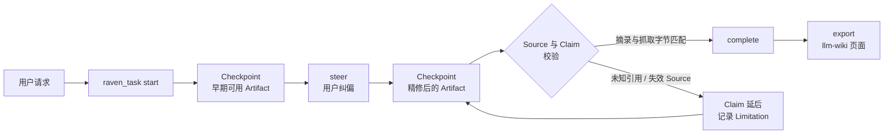

# dsh-raven-research

[English](README.md) | 中文

[](https://github.com/wxxb789/dsh-raven-research/actions/workflows/ci.yml)
[](https://github.com/topics/dsh-plugin)
[](https://github.com/deepseek-ai/deepseek-harness)
[](https://www.typescriptlang.org/)
[](https://nodejs.org/)
[](LICENSE)
[](https://github.com/wxxb789/dsh-raven-research/stargazers)

**Raven 把一次 [DeepSeek Harness](https://github.com/deepseek-ai/deepseek-harness) 会话变成一个渐进式、可溯源的
Task，用于深度研究（deep research）、通用写作、学术写作与学习辅导 —— 过程中持续产出可用的 Checkpoint，支持中途纠偏，
并且每一条引用都要与真实抓取到的字节对得上。**

它是一个 host-only 的原生 [Cordis](https://github.com/cordiverse/cordis) 插件：不引入第二个 agent runtime，
不自带模型、向量库或数据库。研究和写作仍由现有的 Harness agent 用自己的工具完成，Raven 负责维持连续的 Task 身份、
可见的中间产物、用户 steering、source/claim 溯源，以及最终的完成校验。

> **状态：** v1，developer preview。锚定并针对 DeepSeek Harness `0.1.0-rc.7` 测试；Harness 本身仍是 RC 且迭代很快，
> Raven 不宣称兼容未经测试的 Harness 版本。

- [为什么需要 Raven](#为什么需要-raven)
- [特性](#特性)
- [工作流程](#工作流程)
- [快速开始](#快速开始)
- [配置](#配置)
- [会触发 Raven Task 的提问方式](#会触发-raven-task-的提问方式)
- [让成果活过本次会话：llm-wiki 导出](#让成果活过本次会话llm-wiki-导出)
- [兼容性](#兼容性)
- [架构](#架构)
- [开发](#开发)
- [FAQ](#faq)
- [v1 限制](#v1-限制)

## 为什么需要 Raven

一个有分量的研究或写作请求，通常会掉进一条很长的批处理管线：你等很久，拿到一大块文字，而引用只是模型"记得"的字符串。
Raven 改变的是这项工作的形态。

| 普通的长跑 agent | 使用 Raven |
| --- | --- |
| 出结果前一直沉默 | 先给出可用的提纲 / 初稿 / 发现清单作为 **Checkpoint**，再对同一 Artifact 增量精修 |
| 一次纠正就要重来 | 纠正变成同一个 Task 上的 **Steering Revision**，此前的证据与 Checkpoint 全部保留 |
| 引用是"记住"的字符串 | 引用指向**真正打开过的 Source**，摘录会与抓取到的正文比对 |
| 同一通稿的三次转载被当成三次印证 | 共享同一 `sourceFamily` 的 Claim 会被标记为**不构成独立佐证** |
| 一个死链拖垮整轮 | 失败的依赖只会 **defer 受影响的 Claim**，其余已验证的工作照常诚实完成 |
| 状态随工具调用消失 | Task book 由 session log 重建，stop / resume 之后依然存在 |

`discover → read → analyze → draft → verify → refine` 这些常规推进都是自主的。只有当一个未决选择会影响公开结果、
证据底线、受众、交付物、显著成本，或涉及外部/破坏性/敏感副作用时，Raven 才会来问。

## 特性

- **渐进交付。** Checkpoint 本身就可用，且在 Task 仍在运行时发布，让你在昂贵的部分开始前就能改方向。
- **纠偏而不是重启。** `steer` 把用户的修正应用到运行中的 Task，并保留既有证据。
- **引用要对得上抓取字节。** Artifact 用 `[@source-id]` 引用稳定的 Source ID；Raven 将有界摘录与抓取正文比对，
  机械渲染记录的 URL，并拒绝未知引用、未注册 URL、跨站重定向以及失效或不匹配的 Source。不匹配时会报告最接近的
  抓取片段，方便修正锚点，而不是原样重试。
- **带独立性判断的 Claim trace。** 每次 Completion 都会追加一张把关键 Claim ID / 文本映射到 Source ID 的 trace，
  并标出共享同一 `sourceFamily` 的 Claim，避免同一原始记录的多份转载被读成多次印证。
- **诚实的部分结果。** Claim 被撤回时，断言它的正文必须在同一个 Checkpoint 内改写：不允许只删引用、留下裸断言。
  无法验证的证据会拒绝发布，而不是悄悄降级成"未检查"。
- **会话内持久的 Task book。** 直接工具调用通过 `tool/result.meta` 携带 Task 记录；Code Mode `run_code` 内的调用
  拿不到 result card，因此 Raven 会以 `dsh-raven-research/task-state` session event 发布同一份记录。两条路径都能在
  resume 时恢复。
- **失败路径也带上下文。** 调用失败时，模型会收到通过 tool-owned content finalizer 附加的 `<raven_task_recovery>`
  提示 —— 这是参数非法与取消场景下仍会执行的那个钩子。
- **一等公民的 settings namespace。** 注册插件即暴露 `raven-research` 命名空间到 Harness 组合出的每一个配置界面，
  Harness 端无需改动。
- **可持久化导出。** `export` 产出一个合法的 [llm-wiki](docs/adr/0002-llm-wiki-repo-format.md) 仓库 —— artifact 页、
  每个 Source 一张带验证回执的不可变 `raw/` 页、以及可追加的 `log.md` —— 由 agent 用普通文件工具写入，
  Raven 自身从不碰文件系统。

## 工作流程



`raven_task` 是面向模型的工具。它的 `start`、`checkpoint`、`steer`、`complete`、`status`、`stop`、`resume`、
`export` 都是同一个用户 Task 的内部生命周期操作，不是需要用户自己管理的多套流程。

## 快速开始

Raven 尚未发布到 npm，请从仓库构建打包：

```bash
git clone https://github.com/wxxb789/dsh-raven-research.git
cd dsh-raven-research
pnpm install --frozen-lockfile
pnpm build
pnpm pack
```

用 pnpm 把生成的 tarball 安装进 DeepSeek Harness 部署的 Node 解析图。发布之后，等价依赖是
`dsh-raven-research@0.1.0`。

然后新建或复制一份**用户自有**的 agent preset，并追加
[`examples/agent-row.cordis.yml`](./examples/agent-row.cordis.yml) 中的这一行：

```yaml
- id: raven-research
  name: dsh-raven-research
```

不要改 Harness 自带的 preset。Raven 不发布进程服务，因此这一行不需要 isolate realm；它消费 preset 作用域内的
`tools` 与 `systemPrompt` 注册表，并在可以重开 source 时动态获取 `web`。

Raven 有两个 peer dependency，均由 Harness 部署提供：`@deepseek-ai/dsh-settings` 与 `@deepseek-ai/schemastery`。

## 配置

Raven 拥有 `raven-research` 这个 settings namespace。只要注册插件，组合了 settings provider 的 Harness 就会把它
提供给所有配置界面。

| 字段 | 默认值 | 作用 |
| --- | --- | --- |
| `sourceVerification` | `remote` | `structural-only` 会屏蔽所有远程检查。此时没有 Source 能被确认，因此记录了 Source 的 Checkpoint 会被拒绝并指明该策略。仅在网络确实不可达时使用。 |
| `sourceCheckTimeoutMs` | `0` | 单个远程 Source 检查的期限（毫秒）。`0` 表示不设期限。超时会把该 Source 报告为不可验证，而不是让 Checkpoint 一直挂着。 |

任何配置都不能降低 Task 的证据底线。屏蔽检查只会让证据变成"不可验证"从而拒绝发布，绝不会把未检查的 Source 变成
已确认。

`cordis.yml` 中的组合条目是 `base` 层。用户 `settings.yaml` 中的值会覆盖它，并在下一次 Source 检查时生效、无需重启；
若 settings 服务消失，组合条目重新成为权威。

该命名空间的浏览器配置卡片暂缓：client module 系统要求 loader 的 lazy-CJS factory 格式的 `dsh.client` bundle，
而生成它的 preset 并未在 Harness 仓库之外发布。

## 会触发 Raven Task 的提问方式

没有启动咒语，也没有独立的 Raven UI —— 用户照常和 Harness agent 对话即可。

```text
研究支持与反对这项政策的最强一手证据。先给我一份早期发现提纲，继续推进，
最后精修成一份决策备忘录。
```

```text
把这些笔记写成一篇面向工程管理者的 800 字文章。早点出初稿，方便我调整重点。
```

```text
基于这些论文写出一节文献综述。保留分歧，不要编造参考文献。
```

```text
用一个心智模型、两个例子和一次自测，教我理解闭包。
```

## 让成果活过本次会话：llm-wiki 导出

Completion 之后调用 `action=export`，Raven 返回一个 [llm-wiki](docs/adr/0002-llm-wiki-repo-format.md) 仓库的页面
字节：`wiki/queries` 下的 artifact 页、每个 Source 一张携带已验证摘录与验证回执的不可变 `wiki/raw` 页
（`capture: excerpt-only`），以及一条可追加的 `wiki/log.md` 记录。对尚无 wiki 的仓库传 `init=true`，会一并生成
`SCHEMA.md`、`index.md` 与 `log.md`。产物是合法的 llm-wiki，可被 Obsidian 及该 skill 自己的工具读取。返回的字节要
原样写入 —— 每张 raw 页的摘要覆盖其自身正文，导出后再编辑会使其失效。

## 兼容性

Raven v1 锚定并测试于：

- DeepSeek Harness `0.1.0-rc.7`；
- Harness checkout commit `99f6f02fecdb7dff40c3fbc9470f5907c29f74ca`；
- Node.js `^22.19.0 || >=24.0.0`；以及
- pnpm `11.21.0`。

## 架构

Raven 是一个依赖极少的 ESM 包，包含：

- 一个 Cordis 插件；
- 一个 `raven_task` 模型工具；
- 一段紧凑的 system prompt；
- 一个纯 TypeScript 的 Task engine；
- 通过官方 `tool/result.meta` 实现的同会话紧凑重放；以及
- 一个内部 `SourceVerifier` 接缝，配 Harness-web 适配器与确定性测试适配器。

它刻意不做 GUI、模型宿主、向量库、自定义调度器、通用 agent 框架和 Raven 自有数据库。长期目标、subagent、workflow、
文件与持久化仍归 Harness 负责。

设计依据与决策记录：

- [`docs/design/architecture.md`](./docs/design/architecture.md)
- [`docs/adr/0001-one-task-one-tool.md`](./docs/adr/0001-one-task-one-tool.md)
- [`docs/adr/0002-llm-wiki-repo-format.md`](./docs/adr/0002-llm-wiki-repo-format.md)
- [`docs/acceptance.md`](./docs/acceptance.md)
- [`docs/reverse-engineering/assessment.md`](./docs/reverse-engineering/assessment.md)
- [`CONTEXT.md`](./CONTEXT.md)

## 开发

```bash
pnpm install --frozen-lockfile
pnpm check
pnpm test:pack
```

技术栈是 TypeScript 优先的现代工具链：TypeScript 6 严格类型检查、tsdown 构建 ESM 与声明文件、Vitest 覆盖
unit/integration/acceptance、Oxlint 且 warning 视为错误、pnpm 使用 frozen lockfile 与显式 `esbuild` 构建白名单。

针对指定 checkout 验证真实的 Harness Loader、prompt registry、tool registry、执行管线与 Cordis 释放：

```powershell
$env:DSH_CHECKOUT = 'Q:\repos\deepseek-harness'
pnpm test:dsh
```

与发布等价的本地门禁：

```powershell
$env:DSH_CHECKOUT = 'Q:\repos\deepseek-harness'
pnpm check:release
```

### 验收覆盖

Vitest 套件覆盖全部四种 Outcome，并验证 Raven：

- 在最终校验前就暴露可用的中间研究 Artifact；
- 在中途纠偏后继续精修同一个 Task；
- 正常阶段推进无需确认动作；
- 拒绝未知引用，以及在抓取字节中不存在的摘录；
- 在有据可依的 Checkpoint 之前以及 Completion 时重新打开被引用的 URL；
- 在部分 source 失败时保留独立结果；
- 要求 Completion 字节等于最新一次 steer 之后的 Checkpoint；
- 区分 Completion 与工具/worker 终止；以及
- stop 与 resume 不丢失 Task、证据与 Artifact。

`pnpm test:pack` 会创建一个不含 `lib/` 的隔离 staging 工程，只链接锚定的开发工具链，跑真实的 `prepack` 生命周期
而不污染仓库构建，校验恰好六个文件的白名单，并在第二个外部消费者中用隔离的 pnpm home/store 安装 tarball，然后执行
import、apply 与模型工具调用。

## FAQ

**Raven 会替代 Harness agent，或者再塞一个模型进来吗？**
都不会。Raven 只增加一个任务抽象和一个工具；研究与写作仍由现有 Harness agent 用自己的工具和模型完成。

**需要向量数据库、索引或 embedding 管线吗？**
不需要。Raven 没有自己的存储。Source 以稳定身份记录，并在校验时通过 Harness 的 `web` 能力重新打开。

**没有联网能用吗？**
非取证类的写作与学习可以。没有组合 `web` 能力时，外部 Claim 不会被发布为"已支撑"：它们保持 deferred；一个要求
grounding 但没有任何有效 Claim 的 Task 会保持 active，而不会被标记为完成。

**Code Mode（`run_code`）里能用吗？**
可以。`run_code` 内的调用拿不到 result card，因此 Raven 会以 `dsh-raven-research/task-state` session event 发布同一份
Task 记录，resume 时依旧能恢复 Task book。

**它和"deep research"管线有什么不同？**
管线把中间过程藏起来，最后甩给你一份报告。Raven 把中间过程作为可纠偏的 Checkpoint 发布在同一个 Task 上，并且以
摘录级校验（而不是"跑完了"）作为 Completion 的闸口。

**摘录匹配能证明 Claim 为真吗？**
不能。Raven 校验的是 URL 可达性，以及在空白/HTML 呈现归一化之后有界摘录的字面存在。字面存在不等于语义蕴含，
Claim 的判断仍由 agent 负责。

**发到 npm 了吗？**
还没有。请按[快速开始](#快速开始)从仓库构建打包。

**支持哪些 DeepSeek Harness 版本？**
只有[兼容性](#兼容性)中锚定的那个 RC。Harness 处于 developer preview，会有破坏性变更。

## v1 限制

- 摘录校验是字面的，不是语义的（见 FAQ）。
- 四种 Outcome 只是在现有 Harness agent 内部选择 grounding 默认值与显式 prompt 策略；Raven 不内嵌第二个模型，也没有
  确定性的文本生成器，因此内容质量仍取决于模型。
- 自然语言纠偏的识别由 Harness 模型基于 Raven 的前置上下文完成。插件提供的是确定性的同 Task `steer` 迁移，
  而不是基于规则的文本分类器去猜测纠正意图。
- 未组合 Harness `web` 能力时，外部 Claim 保持 deferred。
- 状态在所属 Harness 会话内持久，包括多个已停止或已完成的 Task 身份以及稍后 resume 旧 Task。跨会话项目、可复用语料库
  和间隔重复存储不在范围内；要留存成果请用 `export`。
- Raven 通过普通的工具结果与聊天呈现进度；v1 没有自定义浏览器 UI。

## 贡献

欢迎 issue 与 PR。提 PR 前请跑 `pnpm check`；与发布等价的门禁是设置 `DSH_CHECKOUT` 后运行 `pnpm check:release`。

如果 Raven 帮你省下了一次重写，点一个 ⭐ 能让更多 DeepSeek Harness 用户找到它 —— 也欢迎浏览
[`dsh-plugin`](https://github.com/topics/dsh-plugin) 话题下的生态。

## 许可证

[MIT](LICENSE)

---

**关键词：** DeepSeek Harness 插件 · dsh-plugin · Cordis plugin · AI 研究 agent · deep research · 深度研究 ·
可溯源写作 · 引用校验 · 学术写作助手 · 学习助手 · RAG · 幻觉抑制 · TypeScript · Node.js
