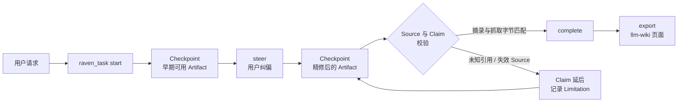

<div align="center">


# dsh-raven-research

**在 [DeepSeek Harness](https://github.com/deepseek-ai/deepseek-harness) 里，
用一个渐进式、可溯源的 Task 完成深度研究、写作与学习。**

中途可纠偏的早期 Checkpoint · 每条引用都对照真实抓取的字节校验 · 不引入第二个 agent runtime

[](https://github.com/wxxb789/dsh-raven-research/actions/workflows/ci.yml)
[](https://github.com/topics/dsh-plugin)
[](https://github.com/deepseek-ai/deepseek-harness)
[](https://www.typescriptlang.org/)
[](https://nodejs.org/)
[](LICENSE)
[](https://github.com/wxxb789/dsh-raven-research/stargazers)

[English](README.md) · 中文

[**TL;DR**](#tldr) · [**安装**](#安装) · [**使用**](#使用) · [**工作原理**](#工作原理-under-the-hood) · [**配置**](#配置) · [**运维**](#运维须知) · [**FAQ**](#faq)

</div>

> [!IMPORTANT]
> **v1 developer preview。** 锚定并针对 DeepSeek Harness `0.1.1-rc.2` 测试，而 Harness 本身仍是 RC、会有破坏性变更。
> 尚未发布到 npm —— 请[从源码安装](#安装)。

## TL;DR

- **是什么：** 一个 DeepSeek Harness（`dsh`）插件，为深度研究、通用写作、学术写作与学习引入一个渐进式、证据感知的
  Task 抽象。
- **解决什么：** 早期就能拿到可用的 Checkpoint，中途纠偏而不是推倒重来，并且每条引用都对照真实抓取到的字节校验 ——
  而不是对照模型的记忆。
- **怎么实现：** 一个 [Cordis](https://github.com/cordiverse/cordis) 插件，拆成 agent-role 模式（内部
  `raven_task`、prompt 与 Task context）和可选的 host-role settings 卡片。不引入第二个 agent runtime，
  不自带模型、向量库或数据库；研究与写作仍由现有 Harness agent 用自己的工具完成。
- **安装：** `pnpm build && pnpm pack`，把 tarball 装进 Harness 部署，再运行
  `npx dsh-raven-install-preset`。见[安装](#安装)。
- **使用：** 照常跟 Harness agent 对话 —— 没有启动咒语、独立 Task UI，也不用学习生命周期命令。情境提示默认为 `auto`，也可设为 `off`。见[使用](#使用)。
## 为什么需要 Raven

一个有分量的研究或写作请求，通常会掉进一条很长的批处理管线：你等很久，拿到一大块文字，而引用只是模型"记得"的字符串。
Raven 改变的是这项工作的形态。

| 普通的长跑 agent | 使用 Raven |
| --- | --- |
| 出结果前一直沉默 | 先给出可用的提纲 / 初稿 / 发现清单作为 **Checkpoint**，再对同一 Artifact 增量精修 |
| 一次纠正就要重来 | 纠正变成同一个 Task 上的 **Steering Revision**，此前的证据与 Checkpoint 全部保留 |
| 引用是"记住"的字符串 | 引用指向来自 web、本地文件、llm-wiki 或 MCP 的**真正检查过的 Source**；摘录会与规范 Markdown 比对 |
| 同一通稿的三次转载被当成三次印证 | 共享同一 `sourceFamily` 的 Claim 会被标记为**不构成独立佐证** |
| 一个死链拖垮整轮 | 失败的依赖只会 **defer 受影响的 Claim**，其余已验证的工作照常诚实完成 |
| 状态随工具调用消失 | 最近一次成功持久化的 Task snapshot 由 session log 重建，并支持 stop / resume |

`discover → read → analyze → draft → verify → refine` 这些常规推进都是自主的。只有当一个未决选择会影响公开结果、
证据底线、受众、交付物、显著成本，或涉及外部/破坏性/敏感副作用时，Raven 才会来问。

## 特性

- **基于官方搜索接缝的批量发现。** `discover` 在一个 Task step 内，通过 Harness `web` 搜索能力发出若干互补
  query，把多个 query 返回的同一 URL 合并为一条 Lead；某个 query 失败时，其余 query 的结果照常保留 —— 失败被记录为
  Limitation，而不是让整批作废。返回的是 **Lead**，绝不是 Source：没被打开并摘录之前，任何东西都不能被引用。
- **复用 Agent Teams。** 部署组合了 Harness Agent Teams 能力且 Raven 成功检测到成员关系时，Task 归属于 Team：已观察
  到的成员推进同一个 active Task，队友无法另起竞争 Task。未检测到成员关系（包括实验能力缺失或探测失败）时，每个 Agent
  保持独立 Task book。
- **渐进交付。** Raven prompt 指示主 Agent 在 Task 仍 active 时尽早发布一份可独立使用的 Checkpoint。Checkpoint 校验由
  runtime 强制执行；何时向用户显示、何时继续后续 model/tool step，则由 Harness agent loop 决定。
- **纠偏而不是重启。** `steer` 把用户的修正应用到运行中的 Task，并保留既有证据。
- **统一的 Markdown-first Source fabric。** 每个 Source 都把 Original Resource 与 Raven 的规范 Markdown Representation 分开保存。恰好支持四种 origin：web、本地文件、llm-wiki 页面和 MCP resource。原本就是 Markdown 的内容保持原样；发生转换时会记录产出它的 Harness tool provenance；资源不可读、不受支持或转换失败时，依赖它的 Claim 会被 defer。
- **Task-level Source Policy。** 自然语言请求会变成同一 Task 上可继续纠偏的 policy：允许/屏蔽 web host、优先一手证据、限定本地或 llm-wiki root，以及包含/排除指定 MCP source。这不是部署配置。
- **引用要对得上 Source material。** Artifact 用 `[@source-id]` 引用稳定的 Source ID。Raven 仅对 web Source 以既有 HTTP 身份保证独立重新抓取；本地、llm-wiki 与 MCP 的摘录则与已记录的 Markdown Representation 比对。渲染后的引用会暴露 Origin 与转换 provenance；未知引用、未注册 web URL、跨站重定向、损坏的 Representation 和不匹配摘录都会被拒绝。
- **带独立性判断的 Claim trace。** 每次 Completion 都会追加一张把关键 Claim ID / 文本映射到 Source ID 的 trace，
  并标出共享同一 `sourceFamily` 的 Claim，避免同一原始记录的多份转载被读成多次印证；真正冲突的 Claim 会被记录为
  contested，而不是被悄悄消解。
- **诚实的部分结果。** Claim 被撤回时，断言它的正文必须在同一个 Checkpoint 内改写：不允许只删引用、留下裸断言。
  无法验证的证据会拒绝发布，而不是悄悄降级成"未检查"。
- **情境提示。** `guidance: auto` 只在相关时让主 Agent 简短提示一项有用能力，例如调整方向、增减来源、暂停/继续或保留
  成果，不会变成教程或审批流程。`guidance: off` 会关闭这些可选提示，但不改变 Task 行为。
- **可在会话内重放的 Task book。** 直接调用与 Code Mode `run_code` 调用通过 Harness 自有 session record 持久化
  snapshot，并受下文的 nested-log spill 边界约束 —— 见 [Task book 的两条持久化路径](#task-book-的两条持久化路径)。
- **一句一行。** 每一份存下来的 Artifact 都会被规整成"每个句子独占一行"，让**行**成为最小编辑单元：一次修订
  diff 出来的是真正改动的那些句子，而不是整段重写。该变换是 Markdown 结构感知且幂等的 —— fenced code、表格、
  标题、分隔线、链接定义、数学块、YAML frontmatter、硬换行，以及列表项与引用块的续行前缀都原样保留。
- **Draft Variants。** `draft` 用同一条有界指令向每个已配置的 `provider/model` route 各要一份草稿并返回候选，
  每份都按一句一行排布，因此可以逐行对比。Draft Variant 与 Lead 一样只是**候选**：不携带证据、永远不可被引用，
  也不计入证据底线。部署未配置 route 前该功能关闭。
- **一等公民的 settings namespace。** 注册插件即暴露 `raven-research` 命名空间到 Harness 组合出的每一个配置界面，
  Harness 端无需改动。
- **Web GUI 里的 settings 卡片。** Raven 附带一个浏览器半边，为自己的命名空间在 Settings › Plugins 下注册一张
  卡片 —— 前置条件见[配置](#配置)。
- **可持久化导出。** `export` 产出一个合法的 [llm-wiki](docs/adr/0002-llm-wiki-repo-format.md) 仓库 —— artifact 页、
  每个 Source 一张带验证回执的不可变 `raw/` 页、以及可追加的 `log.md` —— 由 agent 用普通文件工具写入，
  Raven 自身从不碰文件系统。

## 安装

Raven **尚未发布到 npm**，请从仓库源码安装。下面所有操作都发生在 Harness 仓库之外：你不需要改动 Harness checkout，
也不需要改动它自带的 preset。

### 环境要求

| 要求 | 版本 |
| --- | --- |
| DeepSeek Harness | `0.1.1-rc.2`（checkout `b150a551b8d465e31e418e1b2eaf5e79bbb7d28e`）—— 见[版本锚定与 peer dependencies](#版本锚定与-peer-dependencies) |
| Node.js | `^22.19.0 \|\| >=24.0.0` |
| pnpm | `11.21.0` |
| Peer dependencies | 九个 `@deepseek-ai/*` 包 —— cordis 框架、schema 库，以及七个 Harness Service Definition（`cordis`、`dsh-agent`、`dsh-llm`、`dsh-session`、`dsh-settings`、`dsh-system-prompt`、`dsh-tools`、`dsh-web`、`schemastery`）—— 由 Harness 部署提供，绝不打包进产物 |

### 1. 构建并打包

```bash
git clone https://github.com/wxxb789/dsh-raven-research.git
cd dsh-raven-research
pnpm install --frozen-lockfile
pnpm build
pnpm pack        # -> dsh-raven-research-0.1.0.tgz
```

### 2. 把 tarball 装进 Harness 部署

在部署根目录执行；这个包只需要在该 Node 解析图中可被解析：

```bash
pnpm add /path/to/dsh-raven-research-0.1.0.tgz
```

tarball 自身没有任何运行时依赖，peer 由部署提供。声明为 peer 而非 dependency 是刻意的：profile 以 `autoInstallPeers: false` 安装插件，peer 因此穿透到运行中的 installation，所有插件共享同一个 cordis 实例。发布之后，等价依赖是 `dsh-raven-research@0.1.0`。

### 3. Raven 隔离在自己的模式中

**在未开启 Raven 模式的会话里，Raven 不提供任何功能。** 在 `code` 模式、在其他任何模式下，以及在所有设置页面上，本包都是不可见的：没有工具目录里的 `raven_task`，没有 system-prompt 段落，没有 pre-step Task 上下文，也没有 settings 卡片。选择该模式就是请求使用 Raven 的动作，也是获取它的唯一方式。

这就是为什么安装 Raven 只有 **一个** 步骤 —— 第 4 步，安装模式 —— 而不是两个步骤。Raven 按 `role` 拆分：

| 角色 (Role) | 由谁挂载 | 注册内容 | 是否隔离？ |
| --- | --- | --- | --- |
| `role: agent` | 第 4 步的 `raven` agent preset | `raven_task`、系统提示词段落、pre-step Task 上下文以及 `tools/code-dispatch-log` waterfall | **是** —— 作用域限定在模式内 |
| `role: host` | 默认不挂载 | `raven-research` settings 命名空间（Settings → Plugins 卡片）与挂载时的能力告警 | **否** —— 设置页面是全局的 |

`tools/code-dispatch-log` waterfall **并不**需要 host plane：事件准入沿作用域链向上扩散，且该事件的作用域为 `dispatch.agent`，因此限定在 agent 作用域的监听器依然能收到本 agent 自己的 Code Mode 子 dispatch。

settings 命名空间是唯一无法隔离的界面，因为设置页面是一个*全局*界面：由 host plane 提供的卡片在任何模式下都可见，而如果从 preset 内部提供卡片，它会随使用该 preset 的会话出现和消失。隔离与卡片不可兼得 —— 因此隔离优先，**Raven 改为在 preset 行中进行配置**。每个字段都列在那里；对兼容性敏感的网络字段会显式采用更安全的新安装值，其余 schema 默认值则保持注释，直到操作者修改：

```yaml
- id: raven-research
  name: dsh-raven-research
  config:
    role: agent
    # guidance: auto
    # sourceVerification: remote
    sourceNetworkPolicy: public-only
    sourceCheckTimeoutMs: 20000
    # searchMaxQueries: 4
    # proseLayout: sentence-per-line
    # …
```

<details>
<summary><b>选择性开启：settings 卡片及其破坏隔离的代价</b></summary>

<br>

> [!WARNING]
> **这会故意破坏隔离。** 卡片是一个全局页面；挂载 host 行会让 Raven 在*每一个*模式的 Settings 中可见，包括那些永远不会提供 `raven_task` 的模式。仅当比起在 `code` 模式中出现 Raven 卡片你更讨厌编辑 YAML 时，才进行此操作。

`dsh plugin add` **不会**替你完成这一步。Raven 不声明 `dsh.bundle`，安装时 CLI 会明确告知 —— *installed as a
plain dependency, not a profile layer*。这个「缺席」正是隔离本身；挂载这一行是一个刻意的动作。

把这一行贴进你自己 profile 的覆盖层 `$DSH_HOME/profiles/<name>/cordis.patch.yml`，它在每个 bundle 层之后应用：

```yaml
# Raven 的选择性开启 host 行：为了设置卡片，且知道代价。
# `role: host` 只注册 `raven-research` settings 命名空间与挂载期能力告警。
# 不注册 `raven_task`、不注册提示词段、不注册每步 Task 上下文 —— 那些属于 `role: agent`，
# 由 `raven` preset 挂载。其它模式得到的是一张卡片，不是一个工具。
# 删掉这一条即可回到完全隔离。
- insert:
    - id: raven-research
      name: dsh-raven-research
      config:
        role: host
```

之后需要重启应用：组合只在启动时读取，浏览器半边也依据运行中的 loader entries 加载，
所以在这一行存在之前启动的进程里，卡片不可能出现。

挂载卡片后，preset 行的 `config:` 将成为*基础层*：用户 `settings.yaml` 中存储的值会在组合 provider 时覆盖它，如果它被移除，preset 值将再次成为权威配置。支持同时挂载两个角色 —— 双重挂载检查仅在同一个角色被挂载两次时发出警告。

</details>

### 4. 安装 Raven 模式

agent 那一半以 agent preset 的形式进入会话 —— 而新建会话界面里的**模式（mode）**正是 agent preset。用本包提供的
bin 安装：

```bash
npx dsh-raven-install-preset
```

它会写出 `$DSH_HOME/.agent-presets/raven`（`$DSH_HOME` 默认为 `~/.dsh`），也就是
`@deepseek-ai/dsh-agent-presets` 本来就会扫描的用户 preset 根目录。

**该模式实时继承（LIVE）部署本身的 `code` preset。** preset 的 `agent.cordis.yml` 是**完整的**
agent composition —— persona、工具、shell、compaction —— 而不是叠加在某个默认值之上的覆盖层；因此一个只含 Raven
这一行的 preset，启动出来会是没有 persona、没有工具、没有 shell 的 agent。所以安装器会：

1. 寻找基础 preset（`--base <id>`，默认 `code`）：依次查找 `$DSH_HOME/.agent-presets`、你传入的每个
   `--base-root <dir>`，以及设置了 `DSH_CHECKOUT` 时的 `$DSH_CHECKOUT/apps/cli/config/agent-presets`。若都没有，
   安装器会**列出它尝试过的每一个位置**并报错退出，提示你用 `--base-root` 指向部署的 `config/agent-presets`，
   而不是凭空编造一份 composition；
2. 把 `raven/agent.cordis.yml` 写成约 2 KB 的 composition，内容是**两个顶层平级行（sibling rows）**：一个
   `cordis:include` 行，其 `path` 为该基础 composition；以及在同一份文档的同一层级、与它并列的一个
   `dsh-raven-research` 行（`config: { role: agent }`）。后面这一行就是它与基础 preset 的全部差异；
3. 在文件顶部加一段生成的头部，记录基础 preset id、读取来源路径，以及该文件**不是**快照的事实。

```yaml
# $DSH_HOME/.agent-presets/raven/agent.cordis.yml — 完整文件（不含头部）
- id: inherited-code
  name: cordis:include
  config:
    # file:// URL：include 会先用 new URL(path, baseUrl) 再用
    # fileURLToPath 来解析它；像 Q:\… 这样的纯 Windows 路径会被解析为 URL scheme 并引发 ERR_INVALID_URL_SCHEME 报错
    path: file:///path/to/your/config/agent-presets/code/agent.cordis.yml

# Raven 的行是上面这个 include 的**平级兄弟行**，绝不能放进它的 `patches` 列表。
- id: raven-research
  name: dsh-raven-research
  config:
    role: agent
```

> [!IMPORTANT]
> **这是实时继承，而不是拷贝。** `cordis:include` 会在**挂载时**读取该文件，因此升级 Harness 就会在下一次会话中
> 自动更新 Raven 模式继承的内容 —— 没有任何需要重新同步的东西，也没有会过期的拷贝。

> [!IMPORTANT]
> **安装器绝不会触碰你的 Harness。** Raven 是部署的插件（plugin *of* a deployment），而不是其共同所有者。它的每一次写入都落在 `$DSH_HOME/.agent-presets/raven` 内部。你的 preset 文件只会被读取，绝不会被写入、移动、重命名 —— 甚至连权限位（permission bit）都不会改变。

> [!WARNING]
> **为什么这一行必须是平级兄弟行，绝不能移入 `patches`。** `Include` 会把它的子树 rebase 到被包含文件所在的
> 目录上。因此通过 include 的 `patches` 列表插入的行，会从你的 **Harness 安装目录**内部去解析
> `dsh-raven-research` —— 而它并未安装在那里；于是 include 应用失败，失败后的树被写回为 `[]`。
> 没有任何东西会抑制这次写入：嵌套 include 是由朴素的 `Include` 实例化的，而不是 `write()` 为空操作的
> `PresetTree` 子类。**这已经真实地截断过文件：** 某个部署出厂的 `code` preset 被发现只剩 3 字节，原本是 13605 字节。

在同一个基础文件的副本上做的对照运行精确复现了这一点：patch 形态挂载失败，并留下一个 3 字节的基础文件；而本安装器写出的平级兄弟形态挂载成功，基础文件毫发无损：

```text
HOST-ONLY tools: []
roster:            ["raven"]
installed file:    1981 bytes
base after mount:  13605 bytes (unchanged)
```

两个行都从已安装的 preset 目录解析，基础文件被实时读取且从不写入，`raven_task` 仅出现在该 preset 的作用域内。你的基础文件保持可写，并保持完全原样 —— 真正的防护是输出一个**能够解析成功**的形态，而不是给一个本包并不拥有的文件加上权限位。另外，万一有**别的**东西写了你的基础文件，安装器会进行检测（detect）—— 这既无需任何成本，也不会触碰任何文件：

| 重新运行时的检测结果 | 输出说明 |
| --- | --- |
| base digest 未变 | 无输出，模式已是最新 |
| base 已改变 | 说明这是 Harness 升级后的预期情况，**无需任何操作**，因为 live inheritance 已经继承了变更。该次运行仍以 exit 0 视为最新 |
| base 现在包含 Raven 自己的行 | **警告**，指名该文件，说明本安装器从不写入该文件，并要求操作者从其 Harness 安装中恢复它 |

`--snapshot` 为不希望依赖本包之外文件的部署保留。它合成一份**拷贝** —— 通过拼接**文本**而不是重新序列化 YAML 来保留基础文件中的注释 —— 并且该拷贝会在 Harness 升级后过期；`--snapshot --force` 可对其重新同步。

安装器在两种模式下均满足幂等性：如果重新运行不会改变任何内容，它会做出提示；在实时安装模式下，即使基础文件的内容发生了变化，重新运行**依然**是最新的，因为它从未拷贝过这些内容。没有 `--force` 时，它拒绝覆盖有差异的拷贝。使用 `--dry-run` 可以预览它将要执行的操作，而不会修改任何内容。

<details>
<summary><b>备选：把 Raven 加进你已经维护的 preset</b></summary>

<br>

若想把 Raven 放进某个既有 preset 而不是让它独占一个模式，则跳过安装器，把
[`examples/agent-row.cordis.yml`](./examples/agent-row.cordis.yml) 中的这一行追加到该 preset 的
`agent.cordis.yml`：

```yaml
- id: raven-research
  name: dsh-raven-research
  config:
    role: agent
    # 可选：raven-research settings namespace 的 base 层
    # sourceVerification: remote
    # sourceCheckTimeoutMs: 30000
```

> [!WARNING]
> **不要改 Harness 自带的 preset** —— 先复制一份。Raven 不发布进程服务，因此这一行不需要 isolate realm；它消费
> preset 作用域内的 `tools` 与 `systemPrompt` 注册表，并在可以重开 source 时动态获取 `web`。

</details>

> [!NOTE]
> 模式即为完整的安装。host 行是一个选择性开启项，它用隔离换取了 settings 卡片 —— 见
> [第 3 步](#3-raven-隔离在自己的模式中)。角色拆开后它们不再重叠，因此同时挂载两个角色不会将
> `raven_task` 注册两次。

> [!IMPORTANT]
> Harness 会把 Raven preset 在 standing scope 下挂载一次，所有 Raven 会话再加入该 scope。Raven 在共享插件实例内按
> Agent 身份或成功检测到的 Team 身份隔离状态；无关 owner 互不干扰，已观察到的 Team 成员共享一份内存 Task book。
> 已持久化的 snapshot 可重放 —— 见 [Task book 的两条持久化路径](#task-book-的两条持久化路径)。

### 5. 验证

启动 Harness，为新会话选择 **Raven** 模式，向 agent 提一个有分量的请求（见[使用](#使用)）。当对话里出现
`raven_task` 调用、并且在最终答案之前先收到 Checkpoint，就说明 Raven 已经生效。

## 升级

```bash
cd dsh-raven-research
git pull
pnpm install --frozen-lockfile
pnpm check          # lint、typecheck、test、build
pnpm pack
```

然后在部署根目录重新安装新的 tarball：

```bash
pnpm add /path/to/dsh-raven-research-<version>.tgz
```

pnpm 以完整性哈希标识本地 tarball，因此即便版本号没变也会识别到新字节；若部署仍在用旧构建，执行
`pnpm install --force`。

默认（实时）安装在 Harness 升级后**无需**重新同步 —— 这正是实时继承的意义所在。仅当你是使用 `--snapshot` 安装时才需要重新运行安装器：

```bash
npx dsh-raven-install-preset --snapshot --force
```

升级前请确认三件事：

- **Harness 锚定版本。** 比对 `package.json` 里的 `dshRaven.harnessVersion` 与你实际运行的 Harness。Raven 只锚定
  一个 RC，不宣称兼容未经测试的版本。
- **Base 基础。** 实时安装会自动跟踪升级后的基础。`--snapshot` 安装则不会：升级 **Harness** 正是导致内联进
  `raven/agent.cordis.yml` 的拷贝过期的原因，不加 `--force` 运行安装器会在修改任何东西之前进行报告。
- **配置。** 存在用户 `settings.yaml` 里的 `raven-research` 取值会在重装后保留；preset 的 `config:` 块只是 base 层。

> [!WARNING]
> 进行中的 Task 存在会话里而不是磁盘上。换构建之前，先把它完成或 `export` 出来。


## 卸载

1. 删除 Raven 模式。它是一个目录，删除目录即完成了卸载：

   ```bash
   rm -rf "${DSH_HOME:-$HOME/.dsh}/.agent-presets/raven"
   ```

   如果你是将该行追加到了自己维护的 preset 中，请从该 preset 的 `agent.cordis.yml` 中删除 `- id: raven-research` 行。如果你之前选择性开启了 settings 卡片，还需要从 profile bundle 中移除 host 行：`dsh plugin --profile <name> remove dsh-raven-research`。

2. 从部署中移除包：

   ```bash
   pnpm remove dsh-raven-research
   ```

3. 可选：如果你之前开启过 settings 卡片，从用户的 `settings.yaml` 中删除 `raven-research` 部分。

Raven 的每一处注册 —— `raven_task` 工具、prompt section、`agent/pre-step` 监听器、`tools/code-dispatch-log`
监听器、settings section 以及浏览器卡片 —— 都由 Cordis fiber 持有 disposer，卸载会把它们一并撤销，不会留下孤儿工具
或残留 prompt 文本（`pnpm test:dsh` 正是针对真实 Harness Loader 验证这条释放路径）。如果你的部署不会在 composition
变更时重载，请重启 Harness。

除此之外没有任何残留：Raven 没有数据库、没有缓存；运行期不写任何文件（安装器写出的那个 preset 目录，正是上面第 2
步删掉的东西）。Task 状态存在 Harness session log 中，导出的内容则是一个本来就属于你的普通 llm-wiki 仓库。

## 使用

`raven_task` 由 `raven` agent preset 注册，因此它**只在 Raven 模式下存在**。请在新建会话时选择该模式；在其他任何
模式下，agent 都没有 Raven 工具，会直接作答而不开 Task。

在 Raven 模式内部，没有启动咒语，也没有独立 Raven UI —— 用户照常和 Harness agent 对话。直接说“只用这些站点”“屏蔽这个站点”“使用这个本地文件夹”“包含这个 llm-wiki”“排除这个 MCP source”“只看一手来源”“先暂停”“继续”或“保留这份结果”即可，主 Agent 会把自然语言翻译成 Raven 的内部协议。`guidance: auto` 仅在有帮助时提示一项相关能力；在 Raven preset 行（或选择性开启的 settings 卡片）设 `guidance: off`，即可关闭提示而不改变工作流。

```text
研究支持与反对这项政策的最强一手证据。先给我一份早期发现提纲，继续推进，
最后精修成一份决策备忘录。
```

```text
把这些笔记写成一篇面向工程管理者的 800 字文章。早点出初稿，方便我调整重点。
```

```text
基于这些论文写出一节文献综述。保留分歧，不要编造参考文献。
```

```text
用一个心智模型、两个例子和一次自测，教我理解闭包。
```

纠偏就是下一条消息 —— "重点讲成本，不要讲采用率"、"屏蔽 example.com"、"只使用这个文件夹"或"只引用一手资料" —— 它会更新同一个 Task（包括 Source Policy），而不是开一个新的。

### 内部协议参考（供集成者）

`raven_task` 面向模型，不是让用户操作的工作流语言。用户不应学习 action 名、Task id、phase 或 revision；主 Agent 会翻译普通请求。下表只供集成与测试参考：

| Action | 作用 |
| --- | --- |
| `start` | 开启一个 Task，指定 Outcome（`research`、`general-writing`、`academic-writing`、`learning`）与 grounding 级别（`required`、`optional`、`none`）。 |
| `discover` | 通过 Harness `web` 搜索接缝跑一批互补 query，返回 **Lead** —— 尚未查看的候选，绝不是 Source。失败的 query 会变成一条 Limitation，而不是让整批丢失。 |
| `draft` | 用同一条有界指令向每个已配置的 `provider/model` route 各要一份草稿并返回候选以供比较。**Draft Variant** 不携带证据，永远不可被引用。 |
| `checkpoint` | 发布一版用户可见的 Artifact，附带新的 Source、Claim 与失败记录，并校验有据可依的证据。 |
| `steer` | 把用户纠偏应用到同一个 Task，保留既有证据与 Checkpoint。 |
| `complete` | 校验引用身份、关键 Claim 链接、摘录匹配、Source 可达性，以及与最新一次 steer 之后 Checkpoint 完全一致的 Artifact 指纹。 |
| `status` | 报告当前 Task book。 |
| `stop` | 把 Task 标记为 stopped；明确不等于 Completion。处理后会阻止后续 Task mutation，但不会取消已经在运行的 Harness 工作。 |
| `resume` | 重新打开已停止的 Task（包括较早的那个），不丢失证据与 Artifact。 |
| `export` | 返回 llm-wiki 页面字节，由 agent 用普通文件工具写盘。 |

### 一句一行

Raven 不会按模型提交时的行形态存 Artifact，而是按 Task 的 Prose Layout 存。默认的 `sentence-per-line` 让每个句子
独占一行，于是**行**成为最小编辑单元，一次修订 diff 出来的就是真正改动的那些句子。Markdown 结构从不被重排：
fenced code、表格、标题、分隔线、链接定义、数学块、YAML frontmatter、硬换行，以及列表项与引用块的续行前缀都按原样
保留。

该变换是幂等的，而且 Completion 比对的正是存下来的字节 —— 因此模型下一步要编辑的是返回的 Artifact，而不是它提交的
那份。若要原样保存 agent 写的内容，设 `proseLayout: as-written`；若 Artifact 本就不是 Markdown，设
`proseFormat: plain`。

### 比较措辞：Draft Variants

`action=draft` 把一条有界指令 —— 某一节、某一段、一份摘要 —— 发给每个已配置的 `provider/model` route，并把结果一起
返回，每份都按一句一行排布，因此可以逐行对比。某个 route 失败或超时只损失它自己那一份，不会拖垮整轮。

Draft Variant 与 Lead 一样是**候选**。它不携带证据、不可被引用，也不计入证据底线；即使每一份变体都写了同一句话，
在有 Source 摘录支撑之前它依然是无据的。可以采纳措辞，绝不采纳事实。

route 清单归部署所有：agent 只能从 `draftRoutes` 里选子集，不能选别的 —— 因为点名一个模型就是点名一笔开销和一条
数据通路。未配置的 route 会被拒绝并列出已配置的集合，而不是被悄悄替换成默认值。在部署设置 `draftRoutes` 之前，
Draft Variants 处于**关闭**状态，调用会如实报告这一点，而不是转而用会话模型起草。

### 让成果活过本次会话：llm-wiki 导出

Completion 之后调用 `action=export`，Raven 返回一个 [llm-wiki](docs/adr/0002-llm-wiki-repo-format.md) 仓库的页面
字节：`wiki/queries` 下的 artifact 页、每个 Source 一张携带已验证摘录与验证回执的不可变 `wiki/raw` 页
（`capture: excerpt-only`），以及一条可追加的 `wiki/log.md` 记录。对尚无 wiki 的仓库传 `init=true`，会一并生成
`SCHEMA.md`、`index.md` 与 `log.md`。产物是合法的 llm-wiki，可被 Obsidian 及该 skill 自己的工具读取。返回的字节要
原样写入 —— 每张 raw 页的摘要覆盖其自身正文，导出后再编辑会使其失效。

## 工作原理 (under the hood)



### 插件注册了什么

Raven 导出的是普通的 Cordis 插件元数据（`name`、`inject = ['tools', 'systemPrompt']`、Schemastery `Config` 与
`apply`），并让 `apply` 保持很薄。在 host plane 上它注册：

- 通过 `ctx.tools` 注册的一个 `raven_task` 模型工具；
- 通过 `ctx.systemPrompt` 注册的一段紧凑静态 section；
- 一个 `agent/pre-step` 监听器，在每一步之前把当前 Task book 放到模型面前；
- 一个 `tools/code-dispatch-log` 监听器，让 Code Mode 中的 Task step 保持持久（见下文）；以及
- `raven-research` settings section，它挂在 `ctx.inject` 之后，所以没有 settings 服务的部署根本不会执行这段接线。

这个包还附带一个浏览器半边（`dsh.client`，通过 `./client` 导出），它唯一的贡献是在带 key 的
`settings.plugin.item` slot 中注册一张卡片，key 为 `raven-research` —— 与 host 半边注册的 settings namespace 是同
一个字符串。正是这种按 key 配对，才让一个在 Harness 仓库之外分发的插件有可能贡献卡片：该 tab 无需知道这个
namespace 意味着什么，就能把两个半边配到一起。浏览器半边不镜像任何 Task 状态；工具、证据校验、模型调用与持久记录
全部是 host 侧的事。

`web` 刻意不走 inject：需要重开 Source 或跑一批发现时才从 context 动态获取，因此缺少该能力的部署照样能加载、
照样能写作。实验性的 `agentTeams` 能力以同样的方式读取，并且从不作为依赖：它在上游是私有且未发布的，因此 Raven
只镜像自己读取的那部分形状，其余场景一律退化为单 agent 行为。每一处注册都返回由调用 fiber 持有的 disposer ——
这正是[卸载](#卸载)能干净收场的原因。

### Task book 的两条持久化路径

Raven 按所属 Agent 身份 —— 或成功检测到的 Agent Team 身份 —— 维护 Task book，并从这些身份所对应 Harness session 携带的持久记录重建，而不是靠自己的存储：

- **直接工具调用**通过持久化的结果元数据携带 Task 记录（`tool/result.meta`，kind 为
  `dsh-raven-research/task-state`）。
- **Code Mode `run_code` 程序内的调用**是嵌套子调用，没有 result card，Harness 也就不会为它计算 presentation
  metadata。因此 Raven 改为通过 `tools/code-dispatch-log` 瀑布流，把同一份记录以 HTML 注释的形式附加到 Harness
  自有的 `tool/code-dispatch` 事件、即该子调度的持久化副本上。

> [!IMPORTANT]
> Raven **不写任何插件自有的 session event type**。Harness 的持久化读取路径会拒绝解释存档日志中任何它不认识的
> event type，除非写入方把该事件标记为 `ignorable`，而 `Session.append` 并不给仓库外的插件设置该标记的途径 ——
> 因此一个以插件自有类型写入的 Code Mode Task step，会让整个会话无法加载。搭载已知事件类型，从构造上就保证会话
> 可加载。若部署的 spill 策略替换掉了超大的日志副本，那一步只是无法恢复；会话照样能加载，下一次直接调用会把整份
> 记录重新发布出来。

会话 resume 时会从最近一次成功持久化的 snapshot 恢复这本 book。若超大的 Code Mode nested log 被 spill 掉，那一步可能不在重放中；会话仍能加载，后续直接的状态 mutation 会重新发布完整 snapshot。

Code Mode 就是 Harness 中在 UI 里以 **PTC mode** 为 preset 别名的那项能力，因此跑该 preset 的部署正是这条路径服务的
对象。Raven 不在本地重述这份契约：`src/plugin.ts` 从 `@deepseek-ai/dsh-tools` 导入 `CodeDispatchEventData` 与
`CodeDispatchLog`，并把事件 key 钉到官方增强后的 `SessionEventMap` 上，于是上游的重命名或改形在这里是**编译错误**，
而不是某个 Task step 悄悄不再被恢复。`pnpm test:dsh` 补上另一半：它在进程内的 code runtime 之上组合出官方的
`run_code` 工具，并真的跑一段调用 `raven_task` 的程序，让真实的 bridge 跑真实的 waterfall、追加真实的
`tool/code-dispatch` 事件；同时它还直接断言上游的那些声明，一旦它们移动就指名该重述什么。

### 每个检测到的 Agent Team 一个 Task

Raven 通过可选的 Harness Agent Teams 能力成功检测到成员关系时，以 Team id 而不是 Agent id 作为 Task book 的键。已观察
到的成员于是共享一个 active Task 身份、同一份证据集与 Artifact，队友另起的竞争 `start` 会被拒绝。进程重启后，各成员
自己的持久记录会在该成员被观察到时并入共享 book；在此之前，重建视图可能只含当前调用成员的历史。Raven 通过
`ctx.get('agentTeams')` 结构化读取该能力并包住每次调用，因为 Team 包在上游是私有、未发布的。能力缺失、没有成员关系或
探测抛错时，会退化成独立的单 Agent book，而不会假装已经建立 Team ownership。

### 失败路径同样带着 Task

调用失败时，模型需要拿到"要对着改"的那个 Task，但注册表自身的错误文本并不知道有 Task 正在进行。Raven 通过
tool-owned content finalizer 附加 `<raven_task_recovery>` 提示 —— 这是在参数非法与取消场景下仍会执行、
而输出投影完全不会执行的那个钩子。

### 校验流水线

有据可依的 Checkpoint 与 Completion 会把四种 origin 的 Source 送进同一条 Markdown-first 校验流水线：

1. web Source 通过 Harness `web` 能力重新打开 Original Resource，受 `sourceCheckTimeoutMs` 约束，并拒绝偏离原始身份的重定向。
2. 本地文件、llm-wiki 页面与 MCP resource 不经过第二套 retrieval runtime；agent 在登记前用普通 Harness file/MCP tool 检查内容，并记录 `inspectionCallId`。Raven 会在所属 session log 中核对真实 `tool/call` 与 `tool/result`、producer、解析后的文件身份或 MCP namespace，以及返回的 Markdown，而不是接受调用者自证的 Representation。
3. 原始 Markdown 保持原样；转换后的 Representation 记录 producer Harness tool provenance。
4. 对规范 Markdown 做有界摘录的字面匹配；web 抓取被截断、资源不可读、不受支持或转换失败时，Source 标记为 `unavailable`，依赖的 Claim 被 defer，并保留 Limitation。
5. 单个 web Source 超时按不可验证上报，而不是让整个 Checkpoint 一直挂着。

Completion 会再次核对引用身份、关键 Claim 链接、Source 可达性与 Artifact 指纹，并追加带独立性判断的 Claim trace。

### 包的边界与非目标

Raven 是一个依赖极少的 ESM 包：一个 Cordis 插件、一个模型工具、一段 prompt section、一个纯 TypeScript Task engine、
一个只贡献单张 settings 卡片的浏览器半边、基于官方 `tool/result.meta` 与 `tool/code-dispatch` 的同会话紧凑重放，
以及架在官方 Harness 能力之上的三个接缝 —— 基于 `ctx.web` 产出 Lead 的 `SourceSearcher` 与校验证据的
`SourceVerifier`，以及产出 Draft Variant 的 drafter。

它刻意不做 Task GUI、模型宿主、向量库、自定义调度器、通用 agent 框架和 Raven 自有数据库。长期目标、subagent、
workflow、文件与持久化仍归 Harness 负责。

<details>
<summary><b>设计依据与决策记录</b></summary>

<br>

- [`docs/design/architecture.md`](./docs/design/architecture.md)
- [`docs/adr/0001-one-task-one-tool.md`](./docs/adr/0001-one-task-one-tool.md)
- [`docs/adr/0002-llm-wiki-repo-format.md`](./docs/adr/0002-llm-wiki-repo-format.md)
- [`docs/adr/0003-prose-layout.md`](./docs/adr/0003-prose-layout.md)
- [`docs/adr/0004-draft-variants.md`](./docs/adr/0004-draft-variants.md)
- [`docs/adr/0005-bundle-and-settings-card.md`](./docs/adr/0005-bundle-and-settings-card.md)
- [`docs/acceptance.md`](./docs/acceptance.md)
- [`docs/reverse-engineering/assessment.md`](./docs/reverse-engineering/assessment.md)
- [`docs/reverse-engineering/hermes-research-skills.md`](./docs/reverse-engineering/hermes-research-skills.md)
- [`docs/reverse-engineering/hermes-r-round-references.md`](./docs/reverse-engineering/hermes-r-round-references.md)
- [`docs/reverse-engineering/hermes-nana-wiki.md`](./docs/reverse-engineering/hermes-nana-wiki.md)
- [`CONTEXT.md`](./CONTEXT.md)

</details>

## 配置

Raven 拥有 `raven-research` 这个 settings namespace。只要注册插件，组合了 settings provider 的 Harness 就会把它
提供给所有配置界面。

| 字段 | 默认值 | 作用 |
| --- | --- | --- |
| `guidance` | `auto` | `auto` 仅在相关时让主 Agent 提示至多一项 Raven 能力，并避免重复、教程、协议细节和审批门。`off` 关闭这些可选提示，不改变 Task 行为。 |
| `sourceVerification` | `remote` | `structural-only` 只屏蔽远程 web 检查；本地、llm-wiki 与 MCP Source 仍可根据已记录且验证过的 Markdown Representation 确认。仅在网络确实不可达时使用。 |
| `sourceNetworkPolicy` | `unrestricted`（schema 兼容默认）；Raven preset：`public-only` | `public-only` 会在调用 fetch provider 前拒绝本机、私有或特殊网络目标。省略该新字段的旧配置仍保持 `unrestricted`；新安装的 Raven 模式会显式设置 `public-only`。 |
| `sourceCheckTimeoutMs` | `0`（schema 兼容默认）；Raven preset：`20000` | 单个远程 Source 检查的期限（毫秒）。`0` 表示不设单次期限。新安装的 Raven 模式会显式使用 20 秒；超时会把该 Source 报告为不可验证。 |
| `sourceDiscovery` | `seam` | `disabled` 会完全屏蔽 `action=discover`：调用会报告发现能力不可用并记录一条 Limitation，而不是返回一个可能被 agent 误读成"什么都不存在"的空结果。agent 仍然保有自己的 Harness 工具。 |
| `searchMaxQueries` | `4` | 单批 `discover` 中 query 数量的上限，与 Harness `web_search` 的批量上限一致。该上限在**去重之前**生效，因此重复的 query 会占掉自己的名额。 |
| `searchMaxResults` | `8` | 每个 query 请求候选数的上限，与 Harness `web_search` 的 source 上限一致。合并后的 Lead 列表另有单独的上限。 |
| `searchTimeoutMs` | `30000` | 单个发现 query 的期限（毫秒）。`0` 表示不设期限。超时的 query 会被记录为失败 query 与一条 Limitation；其兄弟 query 照常返回各自的 Lead。 |
| `proseLayout` | `sentence-per-line` | 每一份存下来的 Artifact 如何排布。默认让每个句子独占一行，使行成为最小编辑单元。`as-written` 则原样保存 agent 提交的内容。 |
| `proseFormat` | `markdown` | Raven 假定的 Artifact 格式。`markdown` 是文档约定的默认最终输出格式，也是排布得以结构感知的前提。`plain` 把每一行都当作散文，因此 Artifact 本就不是 Markdown 的部署不会被重排标题与代码。 |
| `draftRoutes` | `[]` | 允许请求 Draft Variant 的模型 route，每项一个 `provider/model`，按**第一个**斜杠切分，因此带命名空间的 model id 得以保留 —— `openrouter/deepseek/deepseek-chat` 的 provider 是 `openrouter`，model 是 `deepseek/deepseek-chat`。该清单即全集：agent 只能从中选子集，不能选别的。留空即关闭 Draft Variants，并如实报告，而不是转而用会话模型起草。 |
| `draftMaxTokens` | `4000` | 单份 Draft Variant 的长度上限（模型输出 token）。`0` 表示使用内置上限。同一轮中所有 route 共享该上限，以保证变体之间可比。 |
| `draftTimeoutMs` | `120000` | 单份 Draft Variant 的期限（毫秒）。`0` 表示不设期限。超时的 route 不产出变体并会说明；其兄弟 route 照常返回各自的结果。 |

> [!NOTE]
> 任何配置都不能降低 Task 的证据底线。屏蔽检查只会让证据变成"不可验证"从而拒绝发布，绝不会把未检查的 Source
> 变成已确认。

`cordis.yml` 中的组合条目是 `base` 层。仅当部署明确开启全局 host settings 卡片时，用户 `settings.yaml` 中的值才会在下一次 Raven step 覆盖该 base；settings 服务消失后，模式自己的组合条目重新成为权威。这份 override 是进程全局的，正是挂载 host 行时接受的隔离代价之一。

### settings 卡片

Raven 的浏览器半边会在 **Settings › Plugins** 下为该命名空间注册一张卡片，因此上面这些字段无需手写
`settings.yaml` 即可编辑。它是一张可折叠卡片，按证据核验、线索发现、Artifact 排版、Draft Variant 及 guidance 等其它
用户偏好分组，几何尺寸与设计 token 都与 Harness 为自家插件提供的卡片一致。
所有编辑（包括「重置」）都只在保存时写入：settings 写入是一次带 revision 栅栏的持久文档变更，而不是控件一落定就该
提交的东西。卡片依据 key 在用户层的**存在性**（而非值比较）标出哪些字段被覆盖，任何一处暂存编辑无法解析时拒绝整次
保存 —— 而不是只写入表单中正确的那一半 —— 并在写入后回读该 section，而不是把「没有抛异常」当成「已生效」。文案提供
英文与简体中文两份。

卡片不自带任何校验规则。它的字段、控件类型、可选值与取值范围，全部来自 Host 半边注册的那份 schema —— 通过
`settingsScope.describe()` 拿到每个 namespace 的序列化 schema，再交给 Harness 自己的 `settingsSchema` 服务
rehydrate；该服务的类注释写的正是这个用途：*"Dynamic client plugins receive this Cordis entity instead of importing
executable helpers from one another."* 因此被拒绝的输入会直接显示 schema 自己的措辞（`expected number >= 0 but got
-5`），而那条下界只存在于 `config.ts`。往 `Config` 里加一个字段，卡片里就会出现，无需改动浏览器半边；只有标签、提示
与分组是本地的 —— schema 不携带 title/order/group 元数据，Harness 自家的卡片出于同样原因也是从 locale key 取这三样。

有一条规则刻意归卡片而非 schema 所有：`draftRoutes` 是 `array(string)`，Host 接受任意字符串，引擎随后会把不是
`provider/model` 的条目直接跳过。拦下这次保存，是卡片拒绝提供一个「效果等于什么都没发生」的操作，因此它以卡片自己的
名义报出。

三个需要如实说明的前置条件。其一，只有组合了 `@deepseek-ai/dsh-client-ui-settings-plugins` 的部署才会出现这张
卡片 —— Harness web app bundle 属于此类。其二，它注入浏览器端 `locale` 与 `settingsSchema` 服务，缺其一则这部分接线
根本不会运行。其三，它所对接的带 key 的 `settings.plugin.item` slot 契约是 Harness `0.1.1-rc.2` 声明的那一版；而
`0.1.0-rc.6` 至今仍是 npm 上最新的已发布版本，声明的仍是较旧的 list 形态，因此 Raven 内联了较新的形态 —— 连同 locale
注册签名、schema 服务、describe face 与它所镜像的卡片外观 —— 并由 `scripts/verify-dsh.ts` 对被测 Harness checkout
逐一断言 —— 于是契约漂移会导致 release gate 失败，而不是让卡片在浏览器里悄无声息地不渲染、把自己的字典 key 直接显示
给读者、或按 Host 已经不再认可的规则去判定取值。

由于编译 `.module.css` 的客户端 bundle preset 尚未发布，卡片以文本形式携带自己的样式表，并在模块作用域注入一个
`<style data-plugin="dsh-raven-research">` 标签 —— 与该 preset 的最终产物完全一致。丢掉这次注入不会让构建失败，
只会在一列有样式的卡片中渲染出一坨没有样式的内容，因此 `tests/integration/client-bundle.test.ts` 会断言 CSS 确实
存在于产物中。

## 运维须知

本节讲的都是部署的运行时属性，而不是 Raven 的配置项。跳过它的用户，通常会在 Task 拒绝完成的那一刻才发现这些事。

### 前置条件

| Outcome | 需要组合 `web` 能力吗？ | 需要搜索凭据吗？ |
| --- | --- | --- |
| `research` | 仅使用 web Source 时需要 | 仅 `action=discover` 需要 |
| `academic-writing` | 仅使用 web Source 时需要 | 仅 `action=discover` 需要 |
| `general-writing` | 仅使用 web Source 时需要 | 仅 `action=discover` 需要 |
| `learning` | 仅使用 web Source 时需要 | 仅 `action=discover` 需要 |

`research` 与 `academic-writing` 默认 `grounding: required`，且该底线不能被配置或 agent 降到 `none`。它们可用已验证的 web、本地、llm-wiki 或 MCP Source 满足该要求。web Source 需要组合 fetch provider，并保留独立重新抓取检查；非 web Source 需要显式 Task Source Policy，以及由普通 Harness file/MCP tool 产出的 Markdown Representation，不引入第二套 retrieval runtime。没有任何已验证 Claim 的 grounding-required Task 会保持 `active`，而不会被标记为完成。

Harness 的 stock profile 会刻意关闭 HTTP fetch，因为当前本地 provider 尚未实现完整的 SSRF／私网隔离。随附的 Raven preset 会显式设置
`sourceNetworkPolicy: public-only`，会在委托抓取前拒绝本机名、私有／特殊 IP，以及含任何非公共 DNS 结果的域名。
这只是**预检过滤器，不是 SSRF sandbox**：provider 建连时会再次解析 DNS，因此 DNS rebinding 风险仍然存在。能访问
敏感内网的部署必须在网络层隔离 fetch provider，不能把 `unrestricted` 当作隔离手段。

你会在 Source 检查中看到这样的拒绝：

```text
DeepSeek Harness web capability is not composed
```

而当 provider 已组合、但没有任何一个能服务该请求时，看到的是 Harness 自己的报错：

```text
no usable web provider is registered
```

**发现（discovery）还额外需要搜索 provider 的凭据。** `action=discover` 用的是 `web` 的**搜索**半边，它与 fetch
半边是不同的 provider —— fetch 正常而搜索不可用是完全可能的。DeepSeek 搜索 provider 通过 credentials 服务解析凭据，
缺少凭据时该 query 会失败并报出：

```text
DeepSeek search has no API key for "DEEPSEEK_API_KEY"; store it through the credentials service
```

该失败会被记为 Task 上的一条 `tool` Limitation，其兄弟 query 的 Lead 照常保留 —— 一整批绝不会因为一个 query
失败而作废。若根本没有组合搜索半边，`discover` 报告的是：

```text
DeepSeek Harness web search capability is not composed
```

发现是便利功能而非必需品：agent 自己的检索工具照常可用，而且打开 Lead、记录摘录的始终是 agent，永远不是 `discover`。

起草默认关闭，自身不需要凭据；`draftRoutes` 为空时，`action=draft` 会报告 `no Draft Variant route is configured`，
而不是悄悄改用会话模型起草。已配置的 route 则确实需要该 provider 在 Harness 中的凭据。

### 成本

Raven 不引入自己的模型，但有两个动作会成倍放大部署实际支付的开销。

- **一轮 draft 会并行计费每一个已配置的 route。** `action=draft` 把同一条指令发给 `draftRoutes` 中的每个 route
  （或 agent 选定的子集）并发执行，因此一轮的成本是各 route 之和，而不是一个模型的成本。三个 route 就是为一条指令
  付三次补全费用。每份变体受 `draftMaxTokens`（默认 `4000` 输出 token）与 `draftTimeoutMs`（默认 `120000`）约束。
  这正是 route 清单归部署所有、agent 只能选子集的原因：指定一个模型，就是在指定花费和一条数据通路。
- **校验只会重新抓取每一个被引用的 web Source，且每次发布抓两遍。** web Resource 在 `checkpoint` **以及** `complete` 时各重开一次；Completion 不信任 Checkpoint 早先的结果，因为页面可能改变。一个含 20 个 web Source、checkpoint 四次并完成一次的 Task，量级上会产生约 100 次抓取，请用 `sourceCheckTimeoutMs` 给每次设限。本地、llm-wiki 与 MCP 校验只重查 Task state 中有界的 Markdown，不发起网络调用；它们在登记前已由普通 Harness tool 检查。
- **发现**的成本是每批中每个 query 一次搜索后端调用，query 数最多 `searchMaxQueries`（默认 `4`），每个 query 最多
  请求 `searchMaxResults`（默认 `8`）个候选。

本地、llm-wiki 与 MCP 的 Source 校验，以及 checkpoint、steer、status、stop、resume 与 export 本身，都不发起 Raven 网络调用，也不产生 Raven 侧费用；只有 checkpoint/complete 中的 web Source 会触发上述重新抓取。

### 数据流向

Raven 没有自己的存储、遥测和网络目的地。所有离开本机的数据，都经由部署自己组合的 Harness 能力：

| 离开的内容 | 去向 | 时机 |
| --- | --- | --- |
| 已记录的 web Source **URL**，并完整重新抓取 | 各 web Source 的源站 | 每次有据可依的 `checkpoint`，以及每次 `complete` |
| 本地、llm-wiki 与 MCP resource 请求 | agent 调用的普通 Harness file/MCP tool | Source 登记之前；Raven 不增加 connector 或第二条 retrieval path |
| 你或 agent 拟定的**搜索 query** | 已组合的搜索后端（例如 DeepSeek 搜索 provider） | 每次 `discover` |
| **起草指令**及 drafter 随附的上下文 | 本轮中每一个已配置的模型 route | 每次 `draft` |

请特别注意第三行：**Artifact 与指令文本会发送给每一个 draft route**，因此指向第三方 provider 的 route，就是正在
撰写的文本的一条数据通路。这正是 `draftRoutes` 属于部署配置、而 agent 无法自行扩大的原因。

除此之外不再传输任何内容。Original Resource metadata、有界的非 web Markdown Representation、摘录、Claim、Limitation、Source Policy 与 Artifact 只存在于 Harness 的 **session log** 中；除非该 session log 是可接受的持久化位置，否则不要登记敏感的本地或 MCP 内容。Raven 在任何环节都不写文件。

**即使 `export`，Raven 依然不写任何文件。** `action=export` 是一次纯投影：它返回 llm-wiki 的页面字节及其目标路径，
由 *agent* 用普通的 Harness 文件工具写入，处在该 agent 既有的审批与沙箱边界之内。你接受这些写入后，落到磁盘上的是：

```text
wiki/queries/<slug>.md    Artifact 页，带派生出的 frontmatter
wiki/raw/<source-id>.md   每个 Source 一张不可变页：Original Resource、Markdown producer 与
                          inspection receipt provenance、已验证摘录（capture: excerpt-only）、
                          校验回执，以及对该页自身正文的 sha256
wiki/log.md               追加一条记录
wiki/SCHEMA.md            仅在 init=true 时播种
wiki/index.md             仅在 init=true 时播种
```

`raw/` 页保存的是有界摘录，**不是**整页快照，因此一次 export 并不是你读过的那些来源的副本。

### 上限

每个上限都以 Task 为单位、由引擎强制执行，因此直接调用方也无法绕开。它们存在的原因是：Task 状态会在每次 resume 时
从 session log 重放，无界的状态最终会让会话无法加载。

| 上限项 | 数值 | 触顶时会怎样 |
| --- | --- | --- |
| Source | **256** | 本次提交批次中后续的 Source 登记被拒；该 Checkpoint 连同上限一并被拒绝，既有状态原封不动。 |
| Source Markdown | **每个 40,000 字符** | 更大的规范化 Representation 会被拒绝；请缩短到相关文档章节，但不要改动被引用的摘录。 |
| Claim | **512** | 同上 —— 整批被拒而不是静默截断，因此不会出现只记录了一半的 provenance。 |
| Checkpoint | **128 个描述符** | 触顶时裁剪较旧描述符但保留第一个，并为 Completion 预留位置；历史 Artifact 仍保留在原始 tool result 中。 |
| Limitation | **256** | 记录的失败不再累积。Task 照常工作；上限会被报告，因此不会有 Limitation 被静默丢弃。 |
| Artifact | **100,000 字符** | 提交的 Artifact 在排布与哈希之前即被拒绝。请拆分工作，或先 export 再继续。 |
| Steering Revision | **128** | `steer` 被拒；既有 Checkpoint 与证据不受影响。 |
| 持久 Task snapshot | **1,000,000 UTF-8 JSON bytes** | 非最终 mutation 会为 Completion 预留 64,000 bytes。Sources、Claims、摘录、纠偏、Limitations 与 Artifact 的组合状态超过当次聚合预算时，mutation 被拒，既有状态不被替换。 |

容量拒绝不会改变此前已经接受的状态，且一个已经触顶的
Task 始终仍可 `complete` 与 `export`。单字段上限（request 与 correction 各 20,000 字符、summary 2,000、摘录 20,000、
Source 标题 1,000、locator 4,000）的报告方式与此相同。

### 疑难排查

| 你看到的 | 原因 | 怎么办 |
| --- | --- | --- |
| `DeepSeek Harness web capability is not composed` | 没有 fetch provider，因此 web Source 无法验证。 | 组合 `web`，或使用由显式 Task Source Policy 准入、并有真实 Harness inspection receipt 的本地、llm-wiki 或 MCP Source。 |
| `no usable web provider is registered` | `web` 已组合，但没有任何已注册 provider 能服务该请求。 | 检查部署注册了哪些 provider，以及它们的 `available()` 是否为真。 |
| `DeepSeek search has no API key for "DEEPSEEK_API_KEY"` | 发现已到达搜索 provider，但它没有凭据。 | 通过 credentials 服务存入 key（Web GUI 的 Models 页，或环境变量）。不影响 fetch。 |
| `DeepSeek Harness web search capability is not composed` | 根本没有搜索半边。 | 组合一个搜索 provider，或让 agent 用自己的检索工具 —— 发现本就是可选的。 |
| 发现报告不可用并记下一条 Limitation，但没有报错 | `sourceDiscovery: disabled`。 | 这是刻意的：空结果会被读成"什么都不存在"。改回 `seam` 即可。 |
| `no Draft Variant route is configured` | `draftRoutes` 为空 —— 即默认值。 | 把 `draftRoutes` 配成若干 `provider/model` 条目。在此之前起草是关闭的。 |
| 某个 route 被拒绝，并列出了已配置的集合 | agent 选了 `draftRoutes` 之外的 route。 | 符合预期：agent 只能选子集。若该 route 确实应被允许，把它加进部署配置。 |
| 引用了 web Source 的 Checkpoint 被拒，并指明 `structural-only` | `sourceVerification: structural-only` 屏蔽远程 web 检查。 | 改回 `remote`，或使用带已验证 Markdown 与 inspection receipt 的非 web Source。 |
| Completion 被拒：候选字节与最新 Checkpoint 不一致 | 最后一次编辑没有先发布为 Checkpoint，或改的是*提交过*的字节而不是*存下来*的那份。 | 重新读取渲染后的 Artifact，并用那份字节完成。存储采用 Task 的 Prose Layout，因此返回的字节与提交的并不相同。 |
| Completion 被拒：某个 Steering Revision 之后没有 Checkpoint | 纠偏发生在最后一次 Checkpoint 之后。 | 先发布一个应用了该纠偏的 Checkpoint，再完成。 |
| 被引用的 Source 报告摘录不存在，并给出最接近的片段 | 该摘录未出现在抓取到的正文中。 | 依据给出的片段修正摘录。不要为了"能对上"而把一条正确的摘录削弱 —— 摘录*完全不存在*与摘录*有偏差*是两种不同的信号。 |
| 抓取被截断的 Source 报告为 `unavailable` | 抓取被切断；被切掉的正文无法证伪一条取自尾部的摘录。 | 这不是在指控伪造。重试，或改引文档靠前位置的 locator。 |
| 工作做得不错，但有据要求的 Task 就是无法完成 | 没有任何关键的 supported/qualified 外部 Claim 拥有当前可达且摘录匹配的 Source。 | 至少验证一个 Source；或显式 defer 受影响的 Claim，接受 `completed-with-limits`。 |
| Settings › Plugins 里没有这张卡片 | 部署没有组合 `@deepseek-ai/dsh-client-ui-settings-plugins`，或客户端 shell 缺少 `locale`/`settingsSchema` 服务。 | 直接编辑 `settings.yaml`。Harness web app bundle 是组合了的。 |
| 进行中的 Task 不见了 | Task 状态存在会话里，不在磁盘上。 | 换构建或结束会话前先 `export`。resume 之后用 `status` 重建 Task book。 |

## 版本锚定与 peer dependencies

`package.json` 里有两个版本号看起来彼此矛盾。它们并不矛盾，而且在把它读成"漂移"之前，值得先理解这个差别。

```json
"peerDependencies": { "@deepseek-ai/dsh-tools": "*", ... },
"devDependencies":  { "@deepseek-ai/dsh-tools": "0.1.0-rc.6", ... },
"dshRaven": {
  "harnessVersion": "0.1.1-rc.2",
  "harnessCommit": "b150a551b8d465e31e418e1b2eaf5e79bbb7d28e"
}
```

**peer 全部写成 `*` 是刻意的。** profile 以 `autoInstallPeers: false` 与 `nodeLinker: hoisted` 安装插件，正是为了
让仓外插件的 peer 穿透到运行中的 Harness installation，从而所有插件共享**同一个** cordis 实例。收窄范围并不能让一个
不匹配的部署跑起来 —— 它要么让安装失败，要么解析出**第二份**副本，而 Harness 看不见那份副本的服务；这种失败表现为
"服务不存在"，而不是"版本冲突"。因此版本范围并不是表达兼容性的地方。

**`dshRaven` 这块才是。** 它指明了本次构建实际测试所针对的 Harness 版本与 commit。`scripts/verify-dsh.ts` 是它的
可执行检查 —— 它从 `package.json` 读取该锚定值（刻意不存在第二份副本），并把 Raven 组合到一个真实 checkout 上运行 ——
而发布工作流会拒绝发布锚定缺失或格式错误的构建。**要知道这次构建针对什么运行，请看锚定值，而不是版本范围。**

**`@deepseek-ai/*` 的 devDependency 停在 `0.1.0-rc.6`，而锚定写的是 `0.1.1-rc.2`，这个落差是预期之内的。**
那些 devDependency 是*已发布到 npm* 的最新 Service Definition 包；而锚定针对的是 *Harness 发行版*，后者走在前面。
两个数字描述的是不同的东西，并不要求一致。在这个落差真正有影响的地方 —— 即形态发生过变化的客户端 slot 契约 ——
Raven 在 `src/client/slot-contract.ts` 内联了较新的形态，并由 `scripts/verify-dsh.ts` 对锚定的 checkout 断言，
因此漂移会打断 release gate，而不是悄悄产出一张永远不渲染的卡片。Dependabot 被配置为忽略 `@deepseek-ai/*`，
以免自动升级在锚定值不变的情况下挪动这道接缝、让锚定继续宣称一个已经不成立的兼容性。

`*` 需要如实承担的后果是：一个重塑了接缝的 pre-1.0 RC，在安装期**不会给出任何信号**。唯一能发现它的，是锚定值加上
针对匹配 checkout 运行的 `pnpm run test:dsh` —— 这正是该门禁在发布前不可省略的原因，见
[CONTRIBUTING.md](./CONTRIBUTING.md)。

## 兼容性

Raven v1 锚定并测试于：

- DeepSeek Harness `0.1.1-rc.2`；
- Harness checkout commit `b150a551b8d465e31e418e1b2eaf5e79bbb7d28e`；
- Node.js `^22.19.0 || >=24.0.0`；以及
- pnpm `11.21.0`。

DeepSeek Harness 目前仍是 RC，会有破坏性变更。Raven 不宣称兼容未经测试的 Harness 版本。

## 开发

```bash
pnpm install --frozen-lockfile
pnpm check
pnpm test:pack
```

技术栈是 TypeScript 优先的现代工具链：TypeScript 6 严格类型检查、tsdown 构建 ESM 与声明文件、Vitest 覆盖
unit/integration/acceptance、Oxlint 且 warning 视为错误、pnpm 使用 frozen lockfile 与显式 `esbuild` 构建白名单。

针对指定 checkout 验证真实的 Harness Loader、prompt registry、tool registry、执行管线与 Cordis 释放：

```powershell
$env:DSH_CHECKOUT = 'Q:\repos\deepseek-harness'
pnpm test:dsh
```

与发布等价的本地门禁：

```powershell
$env:DSH_CHECKOUT = 'Q:\repos\deepseek-harness'
pnpm check:release
```

### 验收覆盖

<details>
<summary><b>Vitest 套件覆盖全部四种 Outcome，并验证 Raven ……</b></summary>

<br>

- 批量发出互补的发现 query，把同一 URL 合并为一条 Lead，并能扛住某个 query 失败；
- 拒绝把 Lead 当作证据呈现，并在发现能力被屏蔽或缺失时如实报告，而不是给出一次空搜索；
- 把每一份存下来的 Artifact 幂等地排布为一句一行，且不重排 Markdown 结构；
- 只把 Draft Variant 作为候选返回，并在 route 未配置或未知时如实报告，而不是替换成别的 route；
- 从 bundle patch 恰好插入一行 host-plane 行，并按命名空间 key 注册 settings 卡片；
- 在成功检测到的 Agent Team 内共享一个 active Task，并拒绝队友另起竞争 Task；
- 在不写插件自有 session event type 的前提下恢复已持久化的 Code Mode Task snapshot，并明确 spill 边界；
- 在 `auto` 注入情境提示、在 `off` 完全关闭提示，同时保持同一套渐进工作流；
- 在最终校验前就暴露可用的中间研究 Artifact；
- 在中途纠偏后继续精修同一个 Task；
- 正常阶段推进无需确认动作；
- 让 web、本地、llm-wiki 与 MCP 四种 origin 通过同一 Source/Claim/citation contract 完成 grounding；
- 保留原始 Markdown，并暴露 converted Markdown 的 producer 与 inspection receipt provenance；
- 把不可读、不受支持、缺失 receipt 或伪造的 material 如实降级为 unavailable/failed Source、deferred Claim 与 Limitation；
- 拒绝未知引用，以及规范 Markdown 中不存在的摘录；
- 在有据可依的 Checkpoint 之前以及 Completion 时独立重新打开被引用的 web URL；
- 在部分 source 失败时保留独立结果；
- 要求 Completion 字节等于最新一次 steer 之后的 Checkpoint；
- 区分 Completion 与工具/worker 终止；以及
- stop 与 resume 不丢失 Task、证据与 Artifact。

</details>

`pnpm test:pack` 会创建一个不含 `lib/` 的隔离 staging 工程，只链接锚定的开发工具链，跑真实的 `prepack` 生命周期
而不污染仓库构建，校验恰好 13 个文件的白名单，并在干净的外部消费者中安装 tarball，然后执行 import、apply 与模型工具
调用。CI 使用全新的 pnpm store 与 registry；离线工作站可设置 `RAVEN_PACK_STORE_DIR`、`RAVEN_PACK_CACHE_DIR` 和
`RAVEN_PACK_OFFLINE=1`，复用预先填充的内容寻址 store 与 metadata cache，而不会把消费者链接回本仓库。

## FAQ

**Raven 会替代 Harness agent，或者再塞一个模型进来吗？**
都不会。Raven 只增加一个任务抽象和一个工具；研究与写作仍由现有 Harness agent 用自己的工具和模型完成。

**需要向量数据库、索引或 embedding 管线吗？**
不需要。Raven 没有 connector store。web Source 会通过 Harness `web` 能力独立重新打开；本地、llm-wiki 与 MCP 则由 agent 使用普通 Harness tool 检查，并通过所属 session 的 inspection receipt 绑定 Original Resource 与有界 Markdown。

**Raven 自己搜网，还是 agent 搜？**
都搜，这是有意为之。`action=discover` 通过与 Harness `web_search` 工具同源的 `ctx.web` 搜索接缝跑一批互补 query，
因此 query 及其失败会进入 Task 记录，而不是消散在对话里。其余检索仍由 agent 用自己的工具完成，而且打开 Lead、
记录摘录的依然是 agent —— 发现永远不产出证据。

**在 Agent Team 里能用吗？**
成功检测到成员关系时可以：Raven Task 属于该 Team，而不属于某一个成员。Agent Teams 是实验性、未发布的 Harness
能力，因此 Raven 以可选方式消费它；没有检测到成员关系（包括探测失败）时，每个 Agent 各自拥有独立 Task book。

**没有联网能用吗？**
可以。没有 web 时，有据要求的 Task 仍可使用由 Source Policy 显式准入的本地、llm-wiki 或 MCP Resource；普通 Harness tool 的 inspection receipt 必须证明 Markdown provenance。web Claim 仍保持 deferred；没有任何有效 Claim 的 grounding-required Task 会保持 active，而不会被标记为完成。

**Code Mode（`run_code`）里能用吗？**
可以 —— 见 [Task book 的两条持久化路径](#task-book-的两条持久化路径)。

**它和"deep research"管线有什么不同？**
管线把中间过程藏起来，最后甩给你一份报告。Raven 把中间过程作为可纠偏的 Checkpoint 发布在同一个 Task 上，并且以
摘录级校验（而不是"跑完了"）作为 Completion 的闸口。

**摘录匹配能证明 Claim 为真吗？**
不能。Raven 校验有界摘录是否存在于有 receipt 的规范 Markdown，并保留其到 Original Resource 的路径；web 还会额外校验 HTTP 可达性与重定向身份。字面存在不等于语义蕴含，Claim 的判断仍由 agent 负责。

**发到 npm 了吗？**
还没有。请按[安装](#安装)从仓库构建打包。

**支持哪些 DeepSeek Harness 版本？**
只有[兼容性](#兼容性)中锚定的那个 RC。

**怎么干净卸载？**
删一行 preset 配置、移除一个依赖即可 —— 见[卸载](#卸载)。Raven 不会留下数据库、缓存或文件。

## v1 限制

- 摘录校验是字面的，不是语义的（见 FAQ）。
- 四种 Outcome 只是在现有 Harness agent 内部选择 grounding 默认值与显式 prompt 策略；Raven 不内嵌第二个模型，也没有
  确定性的文本生成器，因此内容质量仍取决于模型。
- 自然语言纠偏的识别由 Harness 模型基于 Raven 的前置上下文完成。插件提供的是确定性的同 Task `steer` 迁移，
  而不是基于规则的文本分类器去猜测纠正意图。
- 未组合 Harness `web` 能力时，web Claim 保持 deferred；由 Source Policy 显式准入且 inspection receipt 有效的本地、llm-wiki 与 MCP Source 仍可用于 grounding。
- 最近一次成功持久化的 Task snapshot 可从所属 Harness session record 重放，包括多个 stopped/completed Task 身份及稍后
  resume 旧 Task。超大的 nested Code Mode log 可能漏掉那一步；后续直接 mutation 会重新发布完整 snapshot。跨会话项目、
  可复用语料库和间隔重复存储不在范围内；要留存成果请用 `export`。
- Raven 通过普通的工具结果与聊天呈现 Task 进度；它在浏览器里唯一的界面是 settings 卡片，v1 没有针对 Task 本身的
  自定义 UI。
- 在部署配置 `draftRoutes` 之前 Draft Variants 处于关闭状态；变体本身永远不是证据：不可被引用，也不计入证据底线。

## 贡献

欢迎 issue 与 PR —— 门禁、锚定规则与发布流程见 [CONTRIBUTING.md](./CONTRIBUTING.md)，报告安全问题见
[SECURITY.md](./SECURITY.md)。提 PR 前请跑 `pnpm check`；与发布等价的门禁是设置 `DSH_CHECKOUT` 后运行
`pnpm check:release`。变更记录在 [CHANGELOG.md](./CHANGELOG.md)。

如果 Raven 帮你省下了一次重写，点一个 ⭐ 能让更多 DeepSeek Harness 用户找到它 —— 也欢迎浏览
[`dsh-plugin`](https://github.com/topics/dsh-plugin) 话题下的生态。

## 许可证

[MIT](LICENSE)

---

<div align="center">

[TL;DR](#tldr) · [安装](#安装) · [升级](#升级) · [卸载](#卸载) · [使用](#使用) · [工作原理](#工作原理-under-the-hood) · [运维](#运维须知) · [疑难排查](#疑难排查) · [FAQ](#faq)

<sub><b>关键词：</b> DeepSeek Harness 插件 · dsh-plugin · Cordis plugin · AI 研究 agent · deep research · 深度研究 · 可溯源写作 · 引用校验 · 学术写作助手 · 学习助手 · RAG · 幻觉抑制 · TypeScript · Node.js</sub>

</div>
