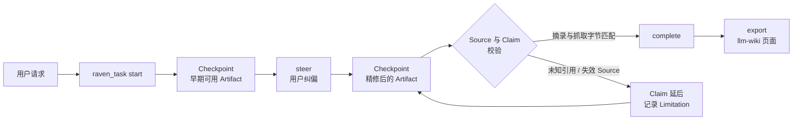

<div align="center">


# dsh-raven-research

**在 [DeepSeek Harness](https://github.com/deepseek-ai/deepseek-harness) 里，
用一个渐进式、可溯源的 Task 完成深度研究、写作与学习。**

中途可纠偏的早期 Checkpoint · 每条引用都对照真实抓取的字节校验 · 不引入第二个 agent runtime

[](https://github.com/wxxb789/dsh-raven-research/actions/workflows/ci.yml)
[](https://github.com/topics/dsh-plugin)
[](https://github.com/deepseek-ai/deepseek-harness)
[](https://www.typescriptlang.org/)
[](https://nodejs.org/)
[](LICENSE)
[](https://github.com/wxxb789/dsh-raven-research/stargazers)

[English](README.md) · 中文

[**TL;DR**](#tldr) · [**安装**](#安装) · [**使用**](#使用) · [**工作原理**](#工作原理-under-the-hood) · [**配置**](#配置) · [**FAQ**](#faq)

</div>

> [!IMPORTANT]
> **v1 developer preview。** 锚定并针对 DeepSeek Harness `0.1.1-rc.1` 测试，而 Harness 本身仍是 RC、会有破坏性变更。
> 尚未发布到 npm —— 请[从源码安装](#安装)。

## TL;DR

- **是什么：** 一个 DeepSeek Harness（`dsh`）插件，为深度研究、通用写作、学术写作与学习引入一个渐进式、证据感知的
  Task 抽象。
- **解决什么：** 早期就能拿到可用的 Checkpoint，中途纠偏而不是推倒重来，并且每条引用都对照真实抓取到的字节校验 ——
  而不是对照模型的记忆。
- **怎么实现：** 一个挂在 host plane 的 [Cordis](https://github.com/cordiverse/cordis) 插件、一个面向模型的
  `raven_task` 工具、一段紧凑的 prompt，以及 Web GUI 里的一张 settings 卡片。不引入第二个 agent runtime，
  不自带模型、向量库或数据库；研究与写作仍由现有 Harness agent 用自己的工具完成。
- **安装：** `pnpm build && pnpm pack`，把 tarball 装进 Harness 部署，再执行
  `dsh plugin --profile <name> add dsh-raven-research`。见[安装](#安装)。
- **使用：** 照常跟 Harness agent 对话 —— 没有启动咒语，也没有独立的 Task UI。见[使用](#使用)。
## 为什么需要 Raven

一个有分量的研究或写作请求，通常会掉进一条很长的批处理管线：你等很久，拿到一大块文字，而引用只是模型"记得"的字符串。
Raven 改变的是这项工作的形态。

| 普通的长跑 agent | 使用 Raven |
| --- | --- |
| 出结果前一直沉默 | 先给出可用的提纲 / 初稿 / 发现清单作为 **Checkpoint**，再对同一 Artifact 增量精修 |
| 一次纠正就要重来 | 纠正变成同一个 Task 上的 **Steering Revision**，此前的证据与 Checkpoint 全部保留 |
| 引用是"记住"的字符串 | 引用指向**真正打开过的 Source**，摘录会与抓取到的正文比对 |
| 同一通稿的三次转载被当成三次印证 | 共享同一 `sourceFamily` 的 Claim 会被标记为**不构成独立佐证** |
| 一个死链拖垮整轮 | 失败的依赖只会 **defer 受影响的 Claim**，其余已验证的工作照常诚实完成 |
| 状态随工具调用消失 | Task book 由 session log 重建，stop / resume 之后依然存在 |

`discover → read → analyze → draft → verify → refine` 这些常规推进都是自主的。只有当一个未决选择会影响公开结果、
证据底线、受众、交付物、显著成本，或涉及外部/破坏性/敏感副作用时，Raven 才会来问。

## 特性

- **基于官方搜索接缝的批量发现。** `discover` 在一个 Task step 内，通过 Harness `web` 搜索能力发出若干互补
  query，把多个 query 返回的同一 URL 合并为一条 Lead；某个 query 失败时，其余 query 的结果照常保留 —— 失败被记录为
  Limitation，而不是让整批作废。返回的是 **Lead**，绝不是 Source：没被打开并摘录之前，任何东西都不能被引用。
- **复用 Agent Teams。** 部署组合了 Harness Agent Teams 能力时，Raven Task 归属于 Team：每个成员读取并推进同一个
  Task，队友无法另起一个竞争的 Task，各成员自己的持久化记录会合并进同一本 Task book。没有组合 Team 时，一切照旧。
- **渐进交付。** Checkpoint 本身就可用，且在 Task 仍在运行时发布，让你在昂贵的部分开始前就能改方向。
- **纠偏而不是重启。** `steer` 把用户的修正应用到运行中的 Task，并保留既有证据。
- **引用要对得上抓取字节。** Artifact 用 `[@source-id]` 引用稳定的 Source ID；Raven 将有界摘录与抓取正文比对，
  机械渲染记录的 URL，并拒绝未知引用、未注册 URL、跨站重定向以及失效或不匹配的 Source。不匹配时会报告最接近的
  抓取片段，方便修正锚点，而不是原样重试。
- **带独立性判断的 Claim trace。** 每次 Completion 都会追加一张把关键 Claim ID / 文本映射到 Source ID 的 trace，
  并标出共享同一 `sourceFamily` 的 Claim，避免同一原始记录的多份转载被读成多次印证；真正冲突的 Claim 会被记录为
  contested，而不是被悄悄消解。
- **诚实的部分结果。** Claim 被撤回时，断言它的正文必须在同一个 Checkpoint 内改写：不允许只删引用、留下裸断言。
  无法验证的证据会拒绝发布，而不是悄悄降级成"未检查"。
- **会话内持久的 Task book。** 直接工具调用与 Code Mode `run_code` 内的调用都有效，并且能扛过 stop / resume ——
  见 [Task book 的两条持久化路径](#task-book-的两条持久化路径)。
- **一句一行。** 每一份存下来的 Artifact 都会被规整成"每个句子独占一行"，让**行**成为最小编辑单元：一次修订
  diff 出来的是真正改动的那些句子，而不是整段重写。该变换是 Markdown 结构感知且幂等的 —— fenced code、表格、
  标题、分隔线、链接定义、数学块、YAML frontmatter、硬换行，以及列表项与引用块的续行前缀都原样保留。
- **Draft Variants。** `draft` 用同一条有界指令向每个已配置的 `provider/model` route 各要一份草稿并返回候选，
  每份都按一句一行排布，因此可以逐行对比。Draft Variant 与 Lead 一样只是**候选**：不携带证据、永远不可被引用，
  也不计入证据底线。部署未配置 route 前该功能关闭。
- **一等公民的 settings namespace。** 注册插件即暴露 `raven-research` 命名空间到 Harness 组合出的每一个配置界面，
  Harness 端无需改动。
- **Web GUI 里的 settings 卡片。** Raven 附带一个浏览器半边，为自己的命名空间在 Settings › Plugins 下注册一张
  卡片 —— 前置条件见[配置](#配置)。
- **可持久化导出。** `export` 产出一个合法的 [llm-wiki](docs/adr/0002-llm-wiki-repo-format.md) 仓库 —— artifact 页、
  每个 Source 一张带验证回执的不可变 `raw/` 页、以及可追加的 `log.md` —— 由 agent 用普通文件工具写入，
  Raven 自身从不碰文件系统。

## 安装

Raven **尚未发布到 npm**，请从仓库源码安装。下面所有操作都发生在 Harness 仓库之外：你不需要改动 Harness checkout，
也不需要改动它自带的 preset。

### 环境要求

| 要求 | 版本 |
| --- | --- |
| DeepSeek Harness | `0.1.1-rc.1`（checkout `528c682e061696f5a160f363f236ecbf53cbd006`） |
| Node.js | `^22.19.0 \|\| >=24.0.0` |
| pnpm | `11.21.0` |
| Peer dependencies | 九个 `@deepseek-ai/*` 包 —— cordis 框架、schema 库，以及七个 Harness Service Definition（`cordis`、`dsh-agent`、`dsh-llm`、`dsh-session`、`dsh-settings`、`dsh-system-prompt`、`dsh-tools`、`dsh-web`、`schemastery`）—— 由 Harness 部署提供，绝不打包进产物 |

### 1. 构建并打包

```bash
git clone https://github.com/wxxb789/dsh-raven-research.git
cd dsh-raven-research
pnpm install --frozen-lockfile
pnpm build
pnpm pack        # -> dsh-raven-research-0.1.0.tgz
```

### 2. 把 tarball 装进 Harness 部署

在部署根目录执行；这个包只需要在该 Node 解析图中可被解析：

```bash
pnpm add /path/to/dsh-raven-research-0.1.0.tgz
```

tarball 自身没有任何运行时依赖，peer 由部署提供。声明为 peer 而非 dependency 是刻意的：profile 以 `autoInstallPeers: false` 安装插件，peer 因此穿透到运行中的 installation，所有插件共享同一个 cordis 实例。发布之后，等价依赖是 `dsh-raven-research@0.1.0`。

### 3. 启用

Raven 声明了 Profile Bundle（`package.json` 里的 `dsh.bundle.patch`），因此可以由 Harness CLI 直接挂载：

```bash
dsh plugin --profile <name> add dsh-raven-research
```

该命令把这个包追加进 profile 的 `dsh.profile.bundles`，随包分发的
[`cordis.patch.yml`](./cordis.patch.yml) 则在 **host plane** 插入一行：

```yaml
- insert:
    - id: raven-research
      name: dsh-raven-research
```

选择 host plane 是有意的。Raven 不发布 Service，所以通常那条 host-plane 判据并不适用；真正适用的是它注册的东西里
有两样是进程级的。其一是 settings namespace —— 只有当有东西在提供它时配置界面才能呈现它；若只挂在某个 preset 内，
`raven-research` 就只在恰好有会话使用该 preset 时出现在 settings UI 里，会话之间则消失。其二是
`tools/code-dispatch-log` waterfall，它承载着在 `run_code` 内部推进 Task step 的持久记录，同理也是进程级的。
又因为 `tools` 与 `system-prompt` 是分层注册表，host 行会落在全局层，每个 agent 无需选择加入即可看到 `raven_task`。

<details>
<summary><b>备选：把 Raven 限定在单个 agent preset</b></summary>

<br>

若只想给某一个 preset 使用，则跳过 bundle，把
[`examples/agent-row.cordis.yml`](./examples/agent-row.cordis.yml) 中的这一行追加到该 preset 的 `cordis.yml`：

```yaml
- id: raven-research
  name: dsh-raven-research
  # 可选：raven-research settings namespace 的 base 层
  # config:
  #   sourceVerification: remote
  #   sourceCheckTimeoutMs: 30000
```

> [!WARNING]
> **不要改 Harness 自带的 preset** —— 先复制一份。Raven 不发布进程服务，因此这一行不需要 isolate realm；它消费
> preset 作用域内的 `tools` 与 `systemPrompt` 注册表，并在可以重开 source 时动态获取 `web`。

</details>

> [!WARNING]
> **两种方式不要同时使用。** 同一个包同时挂在 host plane 和 preset 内，会把 `raven_task` 注册两次、落进两个不同的层。

### 4. 验证

启动 Harness，向 agent 提一个有分量的请求（见[使用](#使用)）。当对话里出现 `raven_task` 调用、并且在最终答案之前
先收到 Checkpoint，就说明 Raven 已经生效。

## 升级

```bash
cd dsh-raven-research
git pull
pnpm install --frozen-lockfile
pnpm check          # lint、typecheck、test、build
pnpm pack
```

然后在部署根目录重新安装新的 tarball：

```bash
pnpm add /path/to/dsh-raven-research-<version>.tgz
```

pnpm 以完整性哈希标识本地 tarball，因此即便版本号没变也会识别到新字节；若部署仍在用旧构建，执行
`pnpm install --force`。

升级前请确认两件事：

- **Harness 锚定版本。** 比对 `package.json` 里的 `dshRaven.harnessVersion` 与你实际运行的 Harness。Raven 只锚定
  一个 RC，不宣称兼容未经测试的版本。
- **配置。** 存在用户 `settings.yaml` 里的 `raven-research` 取值会在重装后保留；preset 的 `config:` 块只是 base 层。

> [!WARNING]
> 进行中的 Task 存在会话里而不是磁盘上。换构建之前，先把它完成或 `export` 出来。

## 卸载

1. 从 profile bundle 中移除 Raven：

   ```bash
   dsh plugin --profile <name> remove dsh-raven-research
   ```

   如果你当初用的是 preset 行，则从该 preset 的 `cordis.yml` 中删掉 `- id: raven-research` 这一行。

2. 从部署中移除依赖：

   ```bash
   pnpm remove dsh-raven-research
   ```

3. 可选：删掉用户 `settings.yaml` 中的 `raven-research` 段。

Raven 的每一处注册 —— `raven_task` 工具、prompt section、`agent/pre-step` 监听器、`tools/code-dispatch-log`
监听器、settings section 以及浏览器卡片 —— 都由 Cordis fiber 持有 disposer，卸载会把它们一并撤销，不会留下孤儿工具
或残留 prompt 文本（`pnpm test:dsh` 正是针对真实 Harness Loader 验证这条释放路径）。如果你的部署不会在 composition
变更时重载，请重启 Harness。

除此之外没有任何残留：Raven 没有数据库、没有缓存、不写文件。Task 状态存在 Harness session log 中，导出的内容则是
一个本来就属于你的普通 llm-wiki 仓库。

## 使用

没有启动咒语，也没有独立的 Raven UI —— 用户照常和 Harness agent 对话，Task 生命周期由模型驱动。

```text
研究支持与反对这项政策的最强一手证据。先给我一份早期发现提纲，继续推进，
最后精修成一份决策备忘录。
```

```text
把这些笔记写成一篇面向工程管理者的 800 字文章。早点出初稿，方便我调整重点。
```

```text
基于这些论文写出一节文献综述。保留分歧，不要编造参考文献。
```

```text
用一个心智模型、两个例子和一次自测，教我理解闭包。
```

纠偏就是下一条消息 —— "重点讲成本，不要讲采用率""再挑剔一些""只引用一手资料" —— 它会落在同一个 Task 上，
而不是开一个新的。

### `raven_task` 的 action

`raven_task` 面向模型。这些是同一个用户 Task 的内部生命周期操作，不是需要用户自己管理的多套流程：

| Action | 作用 |
| --- | --- |
| `start` | 开启一个 Task，指定 Outcome（`research`、`general-writing`、`academic-writing`、`learning`）与 grounding 级别（`required`、`optional`、`none`）。 |
| `discover` | 通过 Harness `web` 搜索接缝跑一批互补 query，返回 **Lead** —— 尚未查看的候选，绝不是 Source。失败的 query 会变成一条 Limitation，而不是让整批丢失。 |
| `draft` | 用同一条有界指令向每个已配置的 `provider/model` route 各要一份草稿并返回候选以供比较。**Draft Variant** 不携带证据，永远不可被引用。 |
| `checkpoint` | 发布一版用户可见的 Artifact，附带新的 Source、Claim 与失败记录，并校验有据可依的证据。 |
| `steer` | 把用户纠偏应用到同一个 Task，保留既有证据与 Checkpoint。 |
| `complete` | 校验引用身份、关键 Claim 链接、摘录匹配、Source 可达性，以及与最新一次 steer 之后 Checkpoint 完全一致的 Artifact 指纹。 |
| `status` | 报告当前 Task book。 |
| `stop` | 以记录在案的原因结束 Task；明确不等于 Completion。 |
| `resume` | 重新打开已停止的 Task（包括较早的那个），不丢失证据与 Artifact。 |
| `export` | 返回 llm-wiki 页面字节，由 agent 用普通文件工具写盘。 |

### 一句一行

Raven 不会按模型提交时的行形态存 Artifact，而是按 Task 的 Prose Layout 存。默认的 `sentence-per-line` 让每个句子
独占一行，于是**行**成为最小编辑单元，一次修订 diff 出来的就是真正改动的那些句子。Markdown 结构从不被重排：
fenced code、表格、标题、分隔线、链接定义、数学块、YAML frontmatter、硬换行，以及列表项与引用块的续行前缀都按原样
保留。

该变换是幂等的，而且 Completion 比对的正是存下来的字节 —— 因此模型下一步要编辑的是返回的 Artifact，而不是它提交的
那份。若要原样保存 agent 写的内容，设 `proseLayout: as-written`；若 Artifact 本就不是 Markdown，设
`proseFormat: plain`。

### 比较措辞：Draft Variants

`action=draft` 把一条有界指令 —— 某一节、某一段、一份摘要 —— 发给每个已配置的 `provider/model` route，并把结果一起
返回，每份都按一句一行排布，因此可以逐行对比。某个 route 失败或超时只损失它自己那一份，不会拖垮整轮。

Draft Variant 与 Lead 一样是**候选**。它不携带证据、不可被引用，也不计入证据底线；即使每一份变体都写了同一句话，
在有 Source 摘录支撑之前它依然是无据的。可以采纳措辞，绝不采纳事实。

route 清单归部署所有：agent 只能从 `draftRoutes` 里选子集，不能选别的 —— 因为点名一个模型就是点名一笔开销和一条
数据通路。未配置的 route 会被拒绝并列出已配置的集合，而不是被悄悄替换成默认值。在部署设置 `draftRoutes` 之前，
Draft Variants 处于**关闭**状态，调用会如实报告这一点，而不是转而用会话模型起草。

### 让成果活过本次会话：llm-wiki 导出

Completion 之后调用 `action=export`，Raven 返回一个 [llm-wiki](docs/adr/0002-llm-wiki-repo-format.md) 仓库的页面
字节：`wiki/queries` 下的 artifact 页、每个 Source 一张携带已验证摘录与验证回执的不可变 `wiki/raw` 页
（`capture: excerpt-only`），以及一条可追加的 `wiki/log.md` 记录。对尚无 wiki 的仓库传 `init=true`，会一并生成
`SCHEMA.md`、`index.md` 与 `log.md`。产物是合法的 llm-wiki，可被 Obsidian 及该 skill 自己的工具读取。返回的字节要
原样写入 —— 每张 raw 页的摘要覆盖其自身正文，导出后再编辑会使其失效。

## 工作原理 (under the hood)



### 插件注册了什么

Raven 导出的是普通的 Cordis 插件元数据（`name`、`inject = ['tools', 'systemPrompt']`、Schemastery `Config` 与
`apply`），并让 `apply` 保持很薄。在 host plane 上它注册：

- 通过 `ctx.tools` 注册的一个 `raven_task` 模型工具；
- 通过 `ctx.systemPrompt` 注册的一段紧凑静态 section；
- 一个 `agent/pre-step` 监听器，在每一步之前把当前 Task book 放到模型面前；
- 一个 `tools/code-dispatch-log` 监听器，让 Code Mode 中的 Task step 保持持久（见下文）；以及
- `raven-research` settings section，它挂在 `ctx.inject` 之后，所以没有 settings 服务的部署根本不会执行这段接线。

这个包还附带一个浏览器半边（`dsh.client`，通过 `./client` 导出），它唯一的贡献是在带 key 的
`settings.plugin.item` slot 中注册一张卡片，key 为 `raven-research` —— 与 host 半边注册的 settings namespace 是同
一个字符串。正是这种按 key 配对，才让一个在 Harness 仓库之外分发的插件有可能贡献卡片：该 tab 无需知道这个
namespace 意味着什么，就能把两个半边配到一起。浏览器半边不镜像任何 Task 状态；工具、证据校验、模型调用与持久记录
全部是 host 侧的事。

`web` 刻意不走 inject：需要重开 Source 或跑一批发现时才从 context 动态获取，因此缺少该能力的部署照样能加载、
照样能写作。实验性的 `agentTeams` 能力以同样的方式读取，并且从不作为依赖：它在上游是私有且未发布的，因此 Raven
只镜像自己读取的那部分形状，其余场景一律退化为单 agent 行为。每一处注册都返回由调用 fiber 持有的 disposer ——
这正是[卸载](#卸载)能干净收场的原因。

### Task book 的两条持久化路径

Raven 每个会话 —— 或者每个 Agent Team —— 维护一份 Task book，并且是从 session log 重建，而不是靠自己的存储：

- **直接工具调用**通过持久化的结果元数据携带 Task 记录（`tool/result.meta`，kind 为
  `dsh-raven-research/task-state`）。
- **Code Mode `run_code` 程序内的调用**是嵌套子调用，没有 result card，Harness 也就不会为它计算 presentation
  metadata。因此 Raven 改为通过 `tools/code-dispatch-log` 瀑布流，把同一份记录以 HTML 注释的形式附加到 Harness
  自有的 `tool/code-dispatch` 事件、即该子调度的持久化副本上。

> [!IMPORTANT]
> Raven **不写任何插件自有的 session event type**。Harness 的持久化读取路径会拒绝解释存档日志中任何它不认识的
> event type，除非写入方把该事件标记为 `ignorable`，而 `Session.append` 并不给仓库外的插件设置该标记的途径 ——
> 因此一个以插件自有类型写入的 Code Mode Task step，会让整个会话无法加载。搭载已知事件类型，从构造上就保证会话
> 可加载。若部署的 spill 策略替换掉了超大的日志副本，那一步只是无法恢复；会话照样能加载，下一次直接调用会把整份
> 记录重新发布出来。

两条路径都能在会话 resume 时恢复这本 book，所以在程序内推进的 Task 不会悄无声息地丢失。

Code Mode 就是 Harness 中在 UI 里以 **PTC mode** 为 preset 别名的那项能力，因此跑该 preset 的部署正是这条路径服务的
对象。Raven 不在本地重述这份契约：`src/plugin.ts` 从 `@deepseek-ai/dsh-tools` 导入 `CodeDispatchEventData` 与
`CodeDispatchLog`，并把事件 key 钉到官方增强后的 `SessionEventMap` 上，于是上游的重命名或改形在这里是**编译错误**，
而不是某个 Task step 悄悄不再被恢复。`pnpm test:dsh` 补上另一半：它在进程内的 code runtime 之上组合出官方的
`run_code` 工具，并真的跑一段调用 `raven_task` 的程序，让真实的 bridge 跑真实的 waterfall、追加真实的
`tool/code-dispatch` 事件；同时它还直接断言上游的那些声明，一旦它们移动就指名该重述什么。

### 每个 Agent Team 一个 Task

部署组合了 Harness Agent Teams 能力时，Raven 以 Team id 而不是 Agent id 作为 Task book 的键，因此 Lead 与每个队友
共享同一个 Task 身份、同一份证据集与同一个 Artifact。Team 的 Task 处于 active 时，队友的 `start` 会被拒绝，它的
Checkpoint 落在该 Task 上，各成员自己的持久化记录会在该成员首次出现时并入这本共享的 book。Raven 通过
`ctx.get('agentTeams')` 结构化地读取该能力，并把每一次调用都包住：Team 相关的包在上游是私有、未发布、且不作任何
稳定性承诺的，所以它的缺失 —— 或者一次抛错的探测 —— 绝不能让某个 Task step 失败。

### 失败路径同样带着 Task

调用失败时，模型需要拿到"要对着改"的那个 Task，但注册表自身的错误文本并不知道有 Task 正在进行。Raven 通过
tool-owned content finalizer 附加 `<raven_task_recovery>` 提示 —— 这是在参数非法与取消场景下仍会执行、
而输出投影完全不会执行的那个钩子。

### 校验流水线

有据可依的 Checkpoint 与 Completion 会把记录在案的 Source 送进内部的 `SourceVerifier` 接缝（生产用 Harness-web
适配器，测试用确定性适配器）：

1. 通过 Harness `web` 能力重新打开记录的 URL，受 `sourceCheckTimeoutMs` 约束。
2. 拒绝偏离原始 source 身份的重定向，避免停靠域名或聚合站悄悄顶替一条引用。
3. 把 HTML 呈现归一化为文本，再对有界摘录做字面匹配；不匹配时报告最接近的抓取片段，而不是只丢一个失败。
4. 把截断的抓取判为**不可验证**，绝不判为编造 —— 被 fetch 契约截断的正文是检索限制，不是证据缺失。
5. 单个 Source 超时按不可验证上报，而不是让整个 Checkpoint 一直挂着。

Completion 会再次核对引用身份、关键 Claim 链接、Source 可达性与 Artifact 指纹，并追加带独立性判断的 Claim trace。

### 包的边界与非目标

Raven 是一个依赖极少的 ESM 包：一个 Cordis 插件、一个模型工具、一段 prompt section、一个纯 TypeScript Task engine、
一个只贡献单张 settings 卡片的浏览器半边、基于官方 `tool/result.meta` 与 `tool/code-dispatch` 的同会话紧凑重放，
以及架在官方 Harness 能力之上的三个接缝 —— 基于 `ctx.web` 产出 Lead 的 `SourceSearcher` 与校验证据的
`SourceVerifier`，以及产出 Draft Variant 的 drafter。

它刻意不做 Task GUI、模型宿主、向量库、自定义调度器、通用 agent 框架和 Raven 自有数据库。长期目标、subagent、
workflow、文件与持久化仍归 Harness 负责。

<details>
<summary><b>设计依据与决策记录</b></summary>

<br>

- [`docs/design/architecture.md`](./docs/design/architecture.md)
- [`docs/adr/0001-one-task-one-tool.md`](./docs/adr/0001-one-task-one-tool.md)
- [`docs/adr/0002-llm-wiki-repo-format.md`](./docs/adr/0002-llm-wiki-repo-format.md)
- [`docs/adr/0003-prose-layout.md`](./docs/adr/0003-prose-layout.md)
- [`docs/adr/0004-draft-variants.md`](./docs/adr/0004-draft-variants.md)
- [`docs/adr/0005-bundle-and-settings-card.md`](./docs/adr/0005-bundle-and-settings-card.md)
- [`docs/acceptance.md`](./docs/acceptance.md)
- [`docs/reverse-engineering/assessment.md`](./docs/reverse-engineering/assessment.md)
- [`docs/reverse-engineering/hermes-research-skills.md`](./docs/reverse-engineering/hermes-research-skills.md)
- [`docs/reverse-engineering/hermes-r-round-references.md`](./docs/reverse-engineering/hermes-r-round-references.md)
- [`docs/reverse-engineering/hermes-nana-wiki.md`](./docs/reverse-engineering/hermes-nana-wiki.md)
- [`CONTEXT.md`](./CONTEXT.md)

</details>

## 配置

Raven 拥有 `raven-research` 这个 settings namespace。只要注册插件，组合了 settings provider 的 Harness 就会把它
提供给所有配置界面。

| 字段 | 默认值 | 作用 |
| --- | --- | --- |
| `sourceVerification` | `remote` | `structural-only` 会屏蔽所有远程检查。此时没有 Source 能被确认，因此记录了 Source 的 Checkpoint 会被拒绝并指明该策略。仅在网络确实不可达时使用。 |
| `sourceCheckTimeoutMs` | `0` | 单个远程 Source 检查的期限（毫秒）。`0` 表示不设期限。超时会把该 Source 报告为不可验证，而不是让 Checkpoint 一直挂着。 |
| `sourceDiscovery` | `seam` | `disabled` 会完全屏蔽 `action=discover`：调用会报告发现能力不可用并记录一条 Limitation，而不是返回一个可能被 agent 误读成"什么都不存在"的空结果。agent 仍然保有自己的 Harness 工具。 |
| `searchMaxQueries` | `4` | 单批 `discover` 中 query 数量的上限，与 Harness `web_search` 的批量上限一致。该上限在**去重之前**生效，因此重复的 query 会占掉自己的名额。 |
| `searchMaxResults` | `8` | 每个 query 请求候选数的上限，与 Harness `web_search` 的 source 上限一致。合并后的 Lead 列表另有单独的上限。 |
| `searchTimeoutMs` | `30000` | 单个发现 query 的期限（毫秒）。`0` 表示不设期限。超时的 query 会被记录为失败 query 与一条 Limitation；其兄弟 query 照常返回各自的 Lead。 |
| `proseLayout` | `sentence-per-line` | 每一份存下来的 Artifact 如何排布。默认让每个句子独占一行，使行成为最小编辑单元。`as-written` 则原样保存 agent 提交的内容。 |
| `proseFormat` | `markdown` | Raven 假定的 Artifact 格式。`markdown` 是文档约定的默认最终输出格式，也是排布得以结构感知的前提。`plain` 把每一行都当作散文，因此 Artifact 本就不是 Markdown 的部署不会被重排标题与代码。 |
| `draftRoutes` | `[]` | 允许请求 Draft Variant 的模型 route，每项一个 `provider/model`，按**第一个**斜杠切分，因此带命名空间的 model id 得以保留 —— `openrouter/deepseek/deepseek-chat` 的 provider 是 `openrouter`，model 是 `deepseek/deepseek-chat`。该清单即全集：agent 只能从中选子集，不能选别的。留空即关闭 Draft Variants，并如实报告，而不是转而用会话模型起草。 |
| `draftMaxTokens` | `4000` | 单份 Draft Variant 的长度上限（模型输出 token）。`0` 表示使用内置上限。同一轮中所有 route 共享该上限，以保证变体之间可比。 |
| `draftTimeoutMs` | `120000` | 单份 Draft Variant 的期限（毫秒）。`0` 表示不设期限。超时的 route 不产出变体并会说明；其兄弟 route 照常返回各自的结果。 |

> [!NOTE]
> 任何配置都不能降低 Task 的证据底线。屏蔽检查只会让证据变成"不可验证"从而拒绝发布，绝不会把未检查的 Source
> 变成已确认。

`cordis.yml` 中的组合条目是 `base` 层。用户 `settings.yaml` 中的值会覆盖它，并在下一次 Source 检查时生效、无需重启；
若 settings 服务消失，组合条目重新成为权威。

### settings 卡片

Raven 的浏览器半边会在 **Settings › Plugins** 下为该命名空间注册一张卡片，因此上面这些字段无需手写
`settings.yaml` 即可编辑。它是一张可折叠卡片，按证据核验、线索发现、Artifact 排版、Draft Variant 分组，几何尺寸与
设计 token 都与 Harness 为自家插件提供的卡片一致 —— 它们共处同一个列表，一张自行其是的卡片会被读成另一类对象。
所有编辑（包括「重置」）都只在保存时写入：settings 写入是一次带 revision 栅栏的持久文档变更，而不是控件一落定就该
提交的东西。卡片依据 key 在用户层的**存在性**（而非值比较）标出哪些字段被覆盖，任何一处暂存编辑无法解析时拒绝整次
保存 —— 而不是只写入表单中正确的那一半 —— 并在写入后回读该 section，而不是把「没有抛异常」当成「已生效」。文案提供
英文与简体中文两份。

卡片不自带任何校验规则。它的字段、控件类型、可选值与取值范围，全部来自 Host 半边注册的那份 schema —— 通过
`settingsScope.describe()` 拿到每个 namespace 的序列化 schema，再交给 Harness 自己的 `settingsSchema` 服务
rehydrate；该服务的类注释写的正是这个用途：*"Dynamic client plugins receive this Cordis entity instead of importing
executable helpers from one another."* 因此被拒绝的输入会直接显示 schema 自己的措辞（`expected number >= 0 but got
-5`），而那条下界只存在于 `config.ts`。往 `Config` 里加一个字段，卡片里就会出现，无需改动浏览器半边；只有标签、提示
与分组是本地的 —— schema 不携带 title/order/group 元数据，Harness 自家的卡片出于同样原因也是从 locale key 取这三样。

有一条规则刻意归卡片而非 schema 所有：`draftRoutes` 是 `array(string)`，Host 接受任意字符串，引擎随后会把不是
`provider/model` 的条目直接跳过。拦下这次保存，是卡片拒绝提供一个「效果等于什么都没发生」的操作，因此它以卡片自己的
名义报出。

三个需要如实说明的前置条件。其一，只有组合了 `@deepseek-ai/dsh-client-ui-settings-plugins` 的部署才会出现这张
卡片 —— Harness web app bundle 属于此类。其二，它注入浏览器端 `locale` 与 `settingsSchema` 服务，缺其一则这部分接线
根本不会运行。其三，它所对接的带 key 的 `settings.plugin.item` slot 契约是 Harness `0.1.1-rc.1` 声明的那一版；而
`0.1.0-rc.6` 至今仍是 npm 上最新的已发布版本，声明的仍是较旧的 list 形态，因此 Raven 内联了较新的形态 —— 连同 locale
注册签名、schema 服务、describe face 与它所镜像的卡片外观 —— 并由 `scripts/verify-dsh.ts` 对被测 Harness checkout
逐一断言 —— 于是契约漂移会导致 release gate 失败，而不是让卡片在浏览器里悄无声息地不渲染、把自己的字典 key 直接显示
给读者、或按 Host 已经不再认可的规则去判定取值。

由于编译 `.module.css` 的客户端 bundle preset 尚未发布，卡片以文本形式携带自己的样式表，并在模块作用域注入一个
`<style data-plugin="dsh-raven-research">` 标签 —— 与该 preset 的最终产物完全一致。丢掉这次注入不会让构建失败，
只会在一列有样式的卡片中渲染出一坨没有样式的内容，因此 `tests/integration/client-bundle.test.ts` 会断言 CSS 确实
存在于产物中。

## 兼容性

Raven v1 锚定并测试于：

- DeepSeek Harness `0.1.1-rc.1`；
- Harness checkout commit `528c682e061696f5a160f363f236ecbf53cbd006`；
- Node.js `^22.19.0 || >=24.0.0`；以及
- pnpm `11.21.0`。

DeepSeek Harness 目前仍是 RC，会有破坏性变更。Raven 不宣称兼容未经测试的 Harness 版本。

## 开发

```bash
pnpm install --frozen-lockfile
pnpm check
pnpm test:pack
```

技术栈是 TypeScript 优先的现代工具链：TypeScript 6 严格类型检查、tsdown 构建 ESM 与声明文件、Vitest 覆盖
unit/integration/acceptance、Oxlint 且 warning 视为错误、pnpm 使用 frozen lockfile 与显式 `esbuild` 构建白名单。

针对指定 checkout 验证真实的 Harness Loader、prompt registry、tool registry、执行管线与 Cordis 释放：

```powershell
$env:DSH_CHECKOUT = 'Q:\repos\deepseek-harness'
pnpm test:dsh
```

与发布等价的本地门禁：

```powershell
$env:DSH_CHECKOUT = 'Q:\repos\deepseek-harness'
pnpm check:release
```

### 验收覆盖

<details>
<summary><b>Vitest 套件覆盖全部四种 Outcome，并验证 Raven ……</b></summary>

<br>

- 批量发出互补的发现 query，把同一 URL 合并为一条 Lead，并能扛住某个 query 失败；
- 拒绝把 Lead 当作证据呈现，并在发现能力被屏蔽或缺失时如实报告，而不是给出一次空搜索；
- 把每一份存下来的 Artifact 幂等地排布为一句一行，且不重排 Markdown 结构；
- 只把 Draft Variant 作为候选返回，并在 route 未配置或未知时如实报告，而不是替换成别的 route；
- 从 bundle patch 恰好插入一行 host-plane 行，并按命名空间 key 注册 settings 卡片；
- 在一个 Agent Team 内共享同一个 Task，并拒绝队友另起一个竞争的 Task；
- 在不写任何插件自有 session event type 的前提下，让 Code Mode 中的 Task step 保持持久；
- 在最终校验前就暴露可用的中间研究 Artifact；
- 在中途纠偏后继续精修同一个 Task；
- 正常阶段推进无需确认动作；
- 拒绝未知引用，以及在抓取字节中不存在的摘录；
- 在有据可依的 Checkpoint 之前以及 Completion 时重新打开被引用的 URL；
- 在部分 source 失败时保留独立结果；
- 要求 Completion 字节等于最新一次 steer 之后的 Checkpoint；
- 区分 Completion 与工具/worker 终止；以及
- stop 与 resume 不丢失 Task、证据与 Artifact。

</details>

`pnpm test:pack` 会创建一个不含 `lib/` 的隔离 staging 工程，只链接锚定的开发工具链，跑真实的 `prepack` 生命周期
而不污染仓库构建，校验恰好九个文件的白名单，并在第二个外部消费者中用隔离的 pnpm home/store 安装 tarball，然后执行
import、apply 与模型工具调用。

## FAQ

**Raven 会替代 Harness agent，或者再塞一个模型进来吗？**
都不会。Raven 只增加一个任务抽象和一个工具；研究与写作仍由现有 Harness agent 用自己的工具和模型完成。

**需要向量数据库、索引或 embedding 管线吗？**
不需要。Raven 没有自己的存储。Source 以稳定身份记录，并在校验时通过 Harness 的 `web` 能力重新打开。

**Raven 自己搜网，还是 agent 搜？**
都搜，这是有意为之。`action=discover` 通过与 Harness `web_search` 工具同源的 `ctx.web` 搜索接缝跑一批互补 query，
因此 query 及其失败会进入 Task 记录，而不是消散在对话里。其余检索仍由 agent 用自己的工具完成，而且打开 Lead、
记录摘录的依然是 agent —— 发现永远不产出证据。

**在 Agent Team 里能用吗？**
可以。Raven Task 属于整个 Team，而不属于某一个成员。Agent Teams 是实验性、未发布的 Harness 能力，因此 Raven 以
可选方式消费它：没有它时，每个 Agent 各自拥有自己的 Task book。

**没有联网能用吗？**
非取证类的写作与学习可以。没有组合 `web` 能力时，外部 Claim 不会被发布为"已支撑"：它们保持 deferred；一个要求
grounding 但没有任何有效 Claim 的 Task 会保持 active，而不会被标记为完成。

**Code Mode（`run_code`）里能用吗？**
可以 —— 见 [Task book 的两条持久化路径](#task-book-的两条持久化路径)。

**它和"deep research"管线有什么不同？**
管线把中间过程藏起来，最后甩给你一份报告。Raven 把中间过程作为可纠偏的 Checkpoint 发布在同一个 Task 上，并且以
摘录级校验（而不是"跑完了"）作为 Completion 的闸口。

**摘录匹配能证明 Claim 为真吗？**
不能。Raven 校验的是 URL 可达性，以及在空白/HTML 呈现归一化之后有界摘录的字面存在。字面存在不等于语义蕴含，
Claim 的判断仍由 agent 负责。

**发到 npm 了吗？**
还没有。请按[安装](#安装)从仓库构建打包。

**支持哪些 DeepSeek Harness 版本？**
只有[兼容性](#兼容性)中锚定的那个 RC。

**怎么干净卸载？**
删一行 preset 配置、移除一个依赖即可 —— 见[卸载](#卸载)。Raven 不会留下数据库、缓存或文件。

## v1 限制

- 摘录校验是字面的，不是语义的（见 FAQ）。
- 四种 Outcome 只是在现有 Harness agent 内部选择 grounding 默认值与显式 prompt 策略；Raven 不内嵌第二个模型，也没有
  确定性的文本生成器，因此内容质量仍取决于模型。
- 自然语言纠偏的识别由 Harness 模型基于 Raven 的前置上下文完成。插件提供的是确定性的同 Task `steer` 迁移，
  而不是基于规则的文本分类器去猜测纠正意图。
- 未组合 Harness `web` 能力时，外部 Claim 保持 deferred。
- 状态在所属 Harness 会话内持久，包括多个已停止或已完成的 Task 身份以及稍后 resume 旧 Task。跨会话项目、可复用语料库
  和间隔重复存储不在范围内；要留存成果请用 `export`。
- Raven 通过普通的工具结果与聊天呈现 Task 进度；它在浏览器里唯一的界面是 settings 卡片，v1 没有针对 Task 本身的
  自定义 UI。
- 在部署配置 `draftRoutes` 之前 Draft Variants 处于关闭状态；变体本身永远不是证据：不可被引用，也不计入证据底线。

## 贡献

欢迎 issue 与 PR。提 PR 前请跑 `pnpm check`；与发布等价的门禁是设置 `DSH_CHECKOUT` 后运行 `pnpm check:release`。

如果 Raven 帮你省下了一次重写，点一个 ⭐ 能让更多 DeepSeek Harness 用户找到它 —— 也欢迎浏览
[`dsh-plugin`](https://github.com/topics/dsh-plugin) 话题下的生态。

## 许可证

[MIT](LICENSE)

---

<div align="center">

[TL;DR](#tldr) · [安装](#安装) · [升级](#升级) · [卸载](#卸载) · [使用](#使用) · [工作原理](#工作原理-under-the-hood) · [FAQ](#faq)

<sub><b>关键词：</b> DeepSeek Harness 插件 · dsh-plugin · Cordis plugin · AI 研究 agent · deep research · 深度研究 · 可溯源写作 · 引用校验 · 学术写作助手 · 学习助手 · RAG · 幻觉抑制 · TypeScript · Node.js</sub>

</div>
